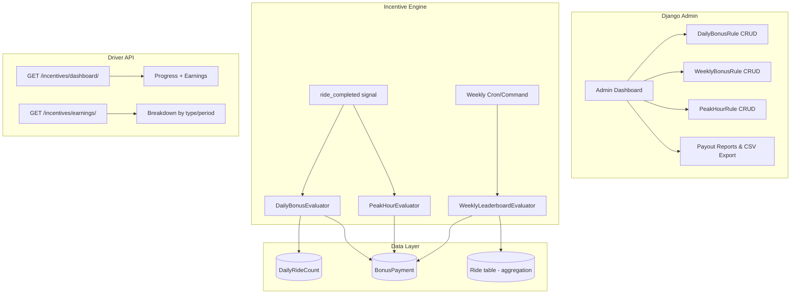
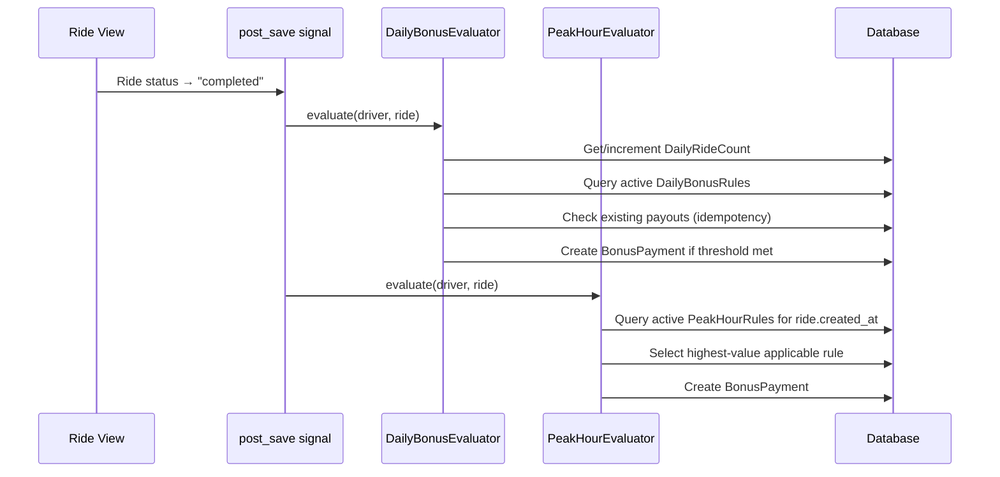
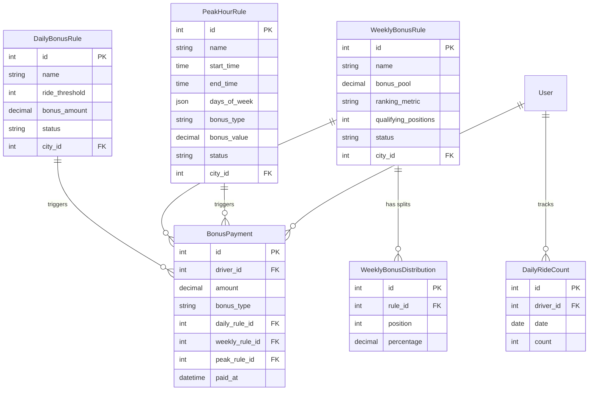

# Design Document: Driver Incentive & Bonus System

## Overview

This design extends the existing `incentives` Django app with three new rule-driven bonus types: **Daily Ride-Count Bonuses**, **Weekly Leaderboard Rewards**, and **Peak-Hour Multipliers**. The system is fully admin-configurable through Django Admin — no code changes are needed to adjust thresholds, amounts, time windows, or distribution splits.

The architecture follows an **event-driven evaluation** pattern: when a ride is completed, the Incentive Engine evaluates applicable daily and peak-hour rules synchronously. Weekly leaderboard payouts are processed by a scheduled management command (invocable via cron or Celery beat).

### Key Design Decisions

1. **New models alongside existing ones**: We add `DailyBonusRule`, `WeeklyBonusRule`, `PeakHourRule`, and `DailyRideCount` as new models rather than overloading the generic `IncentiveProgram`. This gives each rule type its own validation, admin interface, and queryability while keeping the existing system intact.

2. **Reuse `BonusPayment`**: All payouts go through the existing `BonusPayment` model with a new `bonus_type` field and optional FK references to the specific rule that triggered them.

3. **Synchronous evaluation on ride completion**: Daily and peak-hour checks happen in the ride-completion signal handler. This keeps the system simple and avoids eventual-consistency issues for the driver dashboard.

4. **Management command for weekly payouts**: A `process_weekly_leaderboard` command runs at the end of each weekly cycle (Sunday 23:59 or Monday 00:01), callable via cron, Celery beat, or manually.

5. **Platform timezone**: Mauritania uses `Africa/Nouakchott` (UTC+0, no DST), matching the project's `TIME_ZONE` setting. Daily resets and weekly cycles use this timezone.

## Architecture



### Signal Flow for Ride Completion



## Components and Interfaces

### 1. Models (incentives/models.py additions)

| Model | Purpose |
|-------|---------|
| `DailyBonusRule` | Admin-configured daily ride-count tier (threshold + amount) |
| `WeeklyBonusRule` | Admin-configured weekly leaderboard (pool + metric + positions + splits) |
| `WeeklyBonusDistribution` | Inline: percentage split per position for a WeeklyBonusRule |
| `PeakHourRule` | Admin-configured peak-hour window (times + days + bonus type/value) |
| `DailyRideCount` | Per-driver per-day completed ride counter (denormalized for performance) |

### 2. Engine Services (incentives/services/)

| Service | Responsibility |
|---------|---------------|
| `daily_bonus.py` | `evaluate_daily_bonus(driver, ride)` — increment count, check thresholds, award |
| `peak_hour.py` | `evaluate_peak_hour_bonus(driver, ride)` — check time window, apply highest bonus |
| `weekly_leaderboard.py` | `process_weekly_leaderboard(week_start, week_end)` — rank, distribute pool |

### 3. Signal Handler (incentives/signals.py)

Listens to `Ride.post_save` when status transitions to `"completed"`. Calls daily and peak-hour evaluators.

### 4. Management Command (incentives/management/commands/process_weekly_leaderboard.py)

Triggered weekly. Ranks drivers, distributes pool, creates `BonusPayment` records.

### 5. API Endpoints (incentives/api/)

| Endpoint | Method | Description |
|----------|--------|-------------|
| `/api/incentives/dashboard/` | GET | Driver's daily progress, weekly position, peak status |
| `/api/incentives/earnings/` | GET | Earnings breakdown by type and period |
| `/api/incentives/earnings/history/` | GET | Paginated payout history (last 90 days) |

### 6. Django Admin (incentives/admin.py)

- `DailyBonusRuleAdmin` with inline validation
- `WeeklyBonusRuleAdmin` with `WeeklyBonusDistribution` inline
- `PeakHourRuleAdmin` with conflict detection warnings
- Enhanced `BonusPaymentAdmin` with filters, CSV export action

## Data Models

### DailyBonusRule

```python
class DailyBonusRule(models.Model):
    STATUS_CHOICES = [
        ("active", "Active"),
        ("paused", "Paused"),
        ("expired", "Expired"),
    ]

    name = models.CharField(max_length=200)
    ride_threshold = models.PositiveIntegerField()  # e.g., 10
    bonus_amount = models.DecimalField(max_digits=10, decimal_places=2)  # e.g., 500.00
    status = models.CharField(max_length=10, choices=STATUS_CHOICES, default="active")
    city = models.ForeignKey("cities.City", on_delete=models.SET_NULL, null=True, blank=True)
    created_at = models.DateTimeField(auto_now_add=True)
    updated_at = models.DateTimeField(auto_now=True)

    class Meta:
        ordering = ["ride_threshold"]

    def clean(self):
        if self.ride_threshold <= 0:
            raise ValidationError("Ride threshold must be a positive integer.")
        if self.bonus_amount <= 0:
            raise ValidationError("Bonus amount must be positive.")
```

### WeeklyBonusRule

```python
class WeeklyBonusRule(models.Model):
    METRIC_CHOICES = [
        ("ride_count", "Completed Ride Count"),
        ("avg_rating", "Average Rating"),
    ]
    STATUS_CHOICES = [
        ("active", "Active"),
        ("paused", "Paused"),
        ("expired", "Expired"),
    ]

    name = models.CharField(max_length=200)
    bonus_pool = models.DecimalField(max_digits=10, decimal_places=2)  # total to distribute
    ranking_metric = models.CharField(max_length=20, choices=METRIC_CHOICES)
    qualifying_positions = models.PositiveIntegerField()  # e.g., 10
    status = models.CharField(max_length=10, choices=STATUS_CHOICES, default="active")
    city = models.ForeignKey("cities.City", on_delete=models.SET_NULL, null=True, blank=True)
    created_at = models.DateTimeField(auto_now_add=True)
    updated_at = models.DateTimeField(auto_now=True)

    def clean(self):
        if self.bonus_pool <= 0:
            raise ValidationError("Bonus pool must be positive.")
        if self.qualifying_positions <= 0:
            raise ValidationError("Qualifying positions must be a positive integer.")


class WeeklyBonusDistribution(models.Model):
    """Distribution split for a position in the weekly leaderboard."""
    rule = models.ForeignKey(WeeklyBonusRule, on_delete=models.CASCADE, related_name="distributions")
    position = models.PositiveIntegerField()  # 1-based rank
    percentage = models.DecimalField(max_digits=5, decimal_places=2)  # e.g., 40.00

    class Meta:
        ordering = ["position"]
        unique_together = ("rule", "position")
```

### PeakHourRule

```python
class PeakHourRule(models.Model):
    BONUS_TYPE_CHOICES = [
        ("multiplier", "Multiplier (e.g., 1.5x)"),
        ("fixed", "Fixed Amount"),
    ]
    STATUS_CHOICES = [
        ("active", "Active"),
        ("paused", "Paused"),
        ("expired", "Expired"),
    ]
    DAY_CHOICES = [
        (0, "Monday"), (1, "Tuesday"), (2, "Wednesday"),
        (3, "Thursday"), (4, "Friday"), (5, "Saturday"), (6, "Sunday"),
    ]

    name = models.CharField(max_length=200)
    start_time = models.TimeField()  # e.g., 07:00
    end_time = models.TimeField()    # e.g., 09:00
    days_of_week = models.JSONField(default=list)  # e.g., [0, 1, 2, 3, 4]
    bonus_type = models.CharField(max_length=12, choices=BONUS_TYPE_CHOICES)
    bonus_value = models.DecimalField(max_digits=10, decimal_places=2)  # 1.5 or 100.00
    status = models.CharField(max_length=10, choices=STATUS_CHOICES, default="active")
    city = models.ForeignKey("cities.City", on_delete=models.SET_NULL, null=True, blank=True)
    created_at = models.DateTimeField(auto_now_add=True)
    updated_at = models.DateTimeField(auto_now=True)

    class Meta:
        ordering = ["start_time"]

    def clean(self):
        if self.start_time >= self.end_time:
            raise ValidationError("Start time must be before end time.")
        if not self.days_of_week:
            raise ValidationError("At least one day of week must be selected.")
```

### DailyRideCount

```python
class DailyRideCount(models.Model):
    """Denormalized daily ride counter for fast threshold checks."""
    driver = models.ForeignKey(settings.AUTH_USER_MODEL, on_delete=models.CASCADE, related_name="daily_ride_counts")
    date = models.DateField()  # calendar date in platform timezone
    count = models.PositiveIntegerField(default=0)

    class Meta:
        unique_together = ("driver", "date")
        indexes = [
            models.Index(fields=["driver", "date"], name="daily_count_driver_date_idx"),
        ]
```

### BonusPayment Extension

Add a `bonus_type` field and optional FKs to the existing `BonusPayment` model:

```python
# New fields on existing BonusPayment model
BONUS_TYPE_CHOICES = [
    ("daily", "Daily Ride Bonus"),
    ("weekly", "Weekly Leaderboard"),
    ("peak_hour", "Peak Hour Bonus"),
    ("manual", "Manual"),
]

bonus_type = models.CharField(max_length=15, choices=BONUS_TYPE_CHOICES, default="manual")
daily_rule = models.ForeignKey("DailyBonusRule", on_delete=models.SET_NULL, null=True, blank=True)
weekly_rule = models.ForeignKey("WeeklyBonusRule", on_delete=models.SET_NULL, null=True, blank=True)
peak_rule = models.ForeignKey("PeakHourRule", on_delete=models.SET_NULL, null=True, blank=True)
```

### Entity Relationship Diagram



## Correctness Properties

*A property is a characteristic or behavior that should hold true across all valid executions of a system — essentially, a formal statement about what the system should do. Properties serve as the bridge between human-readable specifications and machine-verifiable correctness guarantees.*

### Property 1: Daily rule validation rejects invalid inputs

*For any* `DailyBonusRule` with a ride threshold ≤ 0 or a bonus amount ≤ 0, the model's `clean()` method SHALL raise a `ValidationError`.

**Validates: Requirements 1.2**

### Property 2: Daily bonus awarded iff count reaches threshold

*For any* driver with a daily completed ride count and *for any* set of active `DailyBonusRule` tiers, the Incentive Engine SHALL create a `BonusPayment` for each tier whose threshold is ≤ the driver's count, and SHALL NOT create a payout for tiers whose threshold exceeds the count.

**Validates: Requirements 1.3, 2.1**

### Property 3: Daily tier idempotency

*For any* driver and *for any* `DailyBonusRule` tier, if the bonus for that tier has already been awarded on the current calendar day, subsequent evaluations SHALL NOT create a duplicate payout regardless of how many additional rides are completed.

**Validates: Requirements 2.2**

### Property 4: Only completed rides count toward daily threshold

*For any* set of rides belonging to a driver on a given day with mixed statuses, the daily ride count SHALL equal the number of rides with status `"completed"` and SHALL exclude all other statuses.

**Validates: Requirements 2.3**

### Property 5: Deactivated daily rule isolation

*For any* driver with progress toward multiple active daily rules, deactivating one rule SHALL prevent its bonus from being awarded while all other active rules SHALL continue to evaluate correctly using the same ride count.

**Validates: Requirements 2.5**

### Property 6: Weekly rule validation rejects invalid inputs

*For any* `WeeklyBonusRule` with a bonus pool ≤ 0 or qualifying positions ≤ 0, the model's `clean()` method SHALL raise a `ValidationError`.

**Validates: Requirements 3.2**

### Property 7: Weekly distribution split correctness

*For any* `WeeklyBonusRule` with a bonus pool P and a set of distribution percentages, the sum of all individual payout amounts SHALL equal P (within rounding tolerance), and each driver's payout SHALL equal `P * (their_percentage / 100)`.

**Validates: Requirements 3.3, 4.2**

### Property 8: Weekly ranking correctness

*For any* set of active drivers with metric values (ride count or average rating), the weekly ranking SHALL be sorted in descending order of the configured metric, and ties SHALL be broken deterministically.

**Validates: Requirements 4.1**

### Property 9: Peak hour bonus calculation correctness

*For any* ride with fare F and *for any* active `PeakHourRule`, if the bonus type is "multiplier" with value M then the bonus SHALL equal `F * (M - 1)`, and if the bonus type is "fixed" with value V then the bonus SHALL equal V.

**Validates: Requirements 5.2**

### Property 10: Peak hour rule validation rejects invalid time configuration

*For any* `PeakHourRule` where start_time ≥ end_time OR days_of_week is empty, the model's `clean()` method SHALL raise a `ValidationError`.

**Validates: Requirements 5.3**

### Property 11: Peak hour bonus applied iff ride within active window

*For any* ride with start time T and *for any* set of active `PeakHourRule` entries, a peak-hour bonus SHALL be awarded if and only if T falls within at least one active rule's time window (matching both time-of-day and day-of-week).

**Validates: Requirements 6.1**

### Property 12: Overlapping peak rules select maximum value

*For any* ride eligible for multiple overlapping `PeakHourRule` entries, the Incentive Engine SHALL apply only the single rule with the highest effective bonus value and SHALL NOT apply multiple bonuses.

**Validates: Requirements 6.2**

### Property 13: Deactivated peak rule stops awarding post-deactivation

*For any* `PeakHourRule` that is deactivated (status changed from "active"), rides with a start time after the deactivation SHALL NOT receive a bonus from that rule, regardless of whether the ride's time falls within the rule's configured window.

**Validates: Requirements 6.5**

### Property 14: Progress percentage correctness

*For any* driver with a daily ride count C and *for any* `DailyBonusRule` with threshold T, the progress percentage SHALL equal `min(100, floor(C / T * 100))`.

**Validates: Requirements 7.2**

### Property 15: Payout history returns only last 90 days

*For any* set of `BonusPayment` records for a driver with various `paid_at` dates, the history endpoint SHALL return only records where `paid_at` is within the last 90 calendar days and SHALL exclude all older records.

**Validates: Requirements 8.4**

## Error Handling

| Scenario | Handling Strategy |
|----------|-------------------|
| No active rules exist for a bonus type | Engine skips evaluation silently — no error logged |
| Ride has no driver (edge case) | Signal handler checks `ride.driver` is not None before evaluating |
| Multiple evaluations for same ride (retry/duplicate signal) | Idempotency check via unique constraint on `(driver, daily_rule, date)` for daily payouts |
| Weekly payout fails mid-execution | Transaction wraps entire weekly distribution — all or nothing |
| Division by zero in progress calculation | `target_value == 0` returns 100% (already handled in existing code pattern) |
| `DailyRideCount` race condition (concurrent ride completions) | Use `F()` expressions for atomic increment: `DailyRideCount.objects.filter(...).update(count=F('count') + 1)` |
| Peak hour rule with invalid days_of_week JSON | Model `clean()` validates JSON structure; admin form uses multi-select widget |
| WeeklyBonusDistribution percentages don't sum to 100% | Admin form-level validation warns; engine normalizes at distribution time |
| CSV export with large dataset | Stream response using Django's `StreamingHttpResponse` for memory efficiency |

## Testing Strategy

### Property-Based Testing

The feature contains significant pure business logic (threshold evaluation, distribution calculation, time-window matching) that benefits from property-based testing. We will use **Hypothesis** (Python's PBT library) with a minimum of 100 iterations per property.

Each property test will be tagged with a comment referencing the design property:
```python
# Feature: driver-incentive-system, Property 1: Daily rule validation rejects invalid inputs
```

**PBT Focus Areas:**
- Rule validation logic (Properties 1, 6, 10)
- Daily bonus evaluation and idempotency (Properties 2, 3, 4, 5)
- Weekly distribution calculations (Properties 7, 8)
- Peak hour evaluation and conflict resolution (Properties 9, 11, 12, 13)
- Progress and history calculations (Properties 14, 15)

### Unit Tests (Example-Based)

- Rule CRUD operations via admin
- Signal handler triggers on ride completion
- API endpoint response structure and permissions
- Weekly management command execution
- CSV export format

### Integration Tests

- End-to-end: ride completion → daily bonus payout created
- End-to-end: weekly command → leaderboard payouts distributed
- Dashboard API reflects real-time data after ride completion
- Admin rule update → next evaluation uses new values

### Test Configuration

```python
# pytest.ini / conftest.py
# Hypothesis settings for the incentive property tests
from hypothesis import settings as hyp_settings

hyp_settings.register_profile("ci", max_examples=200, deadline=None)
hyp_settings.register_profile("dev", max_examples=100, deadline=5000)
```

### Test File Structure

```
incentives/
├── tests/
│   ├── __init__.py
│   ├── test_daily_bonus.py          # Properties 1-5 + unit tests
│   ├── test_weekly_leaderboard.py   # Properties 6-8 + unit tests
│   ├── test_peak_hour.py            # Properties 9-13 + unit tests
│   ├── test_dashboard_api.py        # Property 14-15 + endpoint tests
│   ├── test_admin.py                # Admin CRUD, validation, CSV export
│   └── conftest.py                  # Shared fixtures, Hypothesis strategies
```
