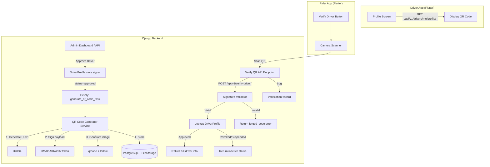
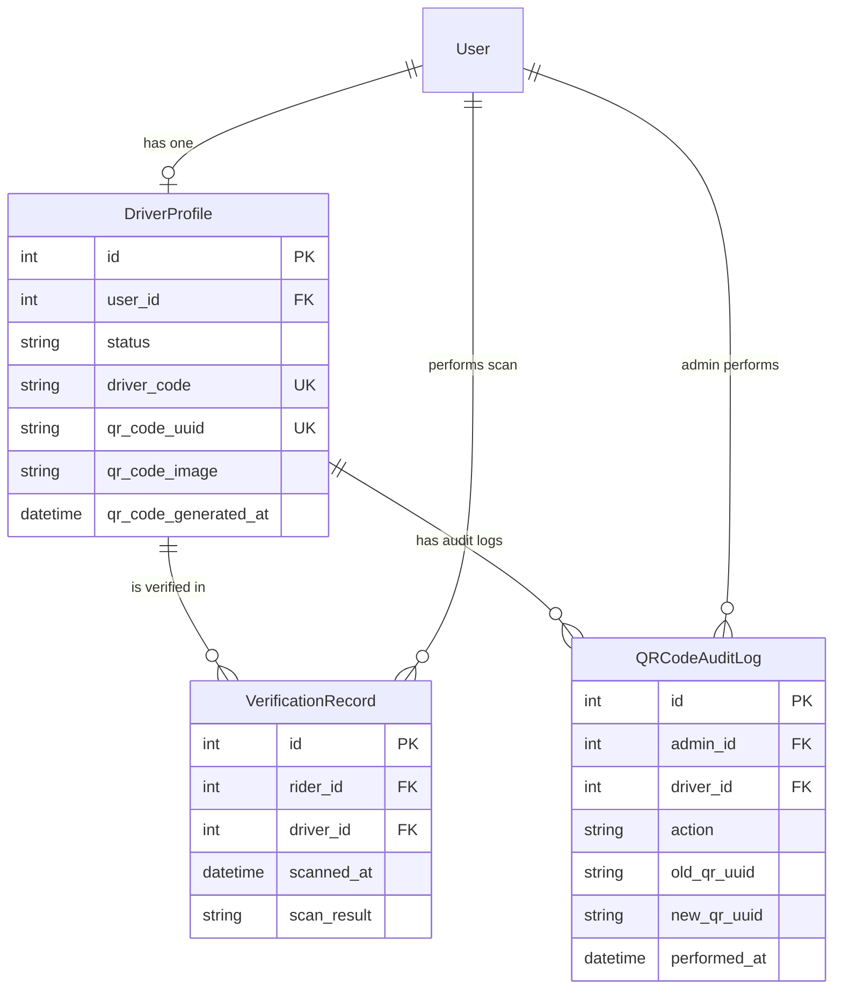

# Design Document: Driver QR Verification

## Overview

The Driver QR Verification system adds a cryptographically signed QR code to each approved driver's profile, enabling riders to scan and verify driver identity before entering a vehicle. The system integrates into the existing Django/DRF backend (`taxi.drivers` app), with Flutter-based mobile apps consuming the API.

Key design decisions:
- **HMAC-SHA256 signing** of QR payloads using Django's `SECRET_KEY` — simple, fast, no key rotation complexity for MVP
- **Celery task** for QR image generation (offloads I/O from the approval signal)
- **Django signals** to trigger generation on `DriverProfile.status` change to "approved"
- **New `VerificationRecord` model** in the `taxi.drivers` app to keep domain cohesion
- **`qrcode` + `Pillow` libraries** for QR image generation (Pillow already in requirements)
- **File storage** for QR images using Django's default storage backend (FileSystemStorage locally, configurable for S3 in production)

## Architecture



## Components and Interfaces

### 1. QR Code Generator Service

**Location:** `taxi/taxi/drivers/services/qr_service.py`

Responsible for:
- Generating a unique UUID4 identifier for each QR code
- Creating an HMAC-SHA256 signed token encoding the UUID and driver_code
- Rendering the signed token into a QR code PNG image
- Storing the image via Django file storage

```python
class QRCodeService:
    def generate_qr_code(self, driver_profile: DriverProfile) -> tuple[str, str]:
        """
        Generate a QR code for a driver.
        Returns (qr_uuid, image_path).
        Raises QRGenerationError after 5 failed uniqueness attempts.
        """
        
    def create_signed_token(self, qr_uuid: str, driver_code: str) -> str:
        """
        Create HMAC-SHA256 signed token: base64(json({uuid, driver_code})).signature
        """
        
    def verify_signed_token(self, token: str) -> dict | None:
        """
        Verify token signature and return payload {uuid, driver_code} or None.
        """
        
    def regenerate_qr_code(self, driver_profile: DriverProfile, admin_user) -> tuple[str, str]:
        """
        Generate new QR code, invalidate old one, log admin action.
        """
```

### 2. Celery Task

**Location:** `taxi/taxi/drivers/tasks.py`

```python
@shared_task(bind=True, max_retries=3)
def generate_qr_code_task(self, driver_profile_id: int) -> None:
    """Async QR code generation triggered by approval signal."""
```

### 3. Django Signal Handler

**Location:** `taxi/taxi/drivers/signals.py`

Listens to `post_save` on `DriverProfile`. When `status` transitions to `"approved"`:
- Validates `driver_code` is present
- Checks if QR code already exists (skip if yes)
- Dispatches `generate_qr_code_task`

### 4. Verification API Endpoint

**Location:** `taxi/taxi/drivers/views_verification.py`

| Method | Path | Auth | Description |
|--------|------|------|-------------|
| POST | `/api/v1/verify-driver/` | Authenticated (Rider) | Scan and verify a driver QR code |
| GET | `/api/v1/drivers/me/qr-code/` | Authenticated (Driver) | Get own QR code details |
| POST | `/api/v1/admin/drivers/{id}/regenerate-qr/` | Admin | Regenerate driver QR code |
| GET | `/api/v1/admin/drivers/{id}/verification-history/` | Admin | Get driver verification history |
| GET | `/api/v1/admin/riders/{id}/verification-history/` | Admin | Get rider verification history |

### 5. Serializers

**Location:** `taxi/taxi/drivers/serializers_verification.py`

```python
class VerifyDriverRequestSerializer(serializers.Serializer):
    token = serializers.CharField(max_length=512)

class VerifyDriverResponseSerializer(serializers.Serializer):
    status = serializers.ChoiceField(choices=["verified", "inactive_driver", "invalid_code", "forged_code"])
    driver_name = serializers.CharField(allow_null=True)
    driver_code = serializers.CharField(allow_null=True)
    driver_photo = serializers.URLField(allow_null=True)
    vehicle_make = serializers.CharField(allow_null=True)
    vehicle_model = serializers.CharField(allow_null=True)
    vehicle_color = serializers.CharField(allow_null=True)
    plate_number = serializers.CharField(allow_null=True)

class VerificationRecordSerializer(serializers.ModelSerializer):
    rider_name = serializers.CharField(source="rider.get_full_name", read_only=True)
    driver_name = serializers.CharField(source="driver.user.get_full_name", read_only=True)
    
    class Meta:
        model = VerificationRecord
        fields = ["id", "rider_name", "driver_name", "scanned_at", "scan_result"]

class QRCodeRegenerationLogSerializer(serializers.ModelSerializer):
    class Meta:
        model = QRCodeAuditLog
        fields = ["id", "admin", "driver", "action", "performed_at"]
```

### 6. Admin Integration

Extend `DriverProfileAdmin` with:
- Read-only display of QR code image and generation timestamp
- "Regenerate QR Code" admin action with confirmation
- Inline display of verification history

## Data Models

### Modified: DriverProfile (add fields)

```python
# New fields on DriverProfile
driver_code = models.CharField(max_length=6, unique=True, null=True, blank=True)
qr_code_uuid = models.CharField(max_length=36, unique=True, null=True, blank=True, db_index=True)
qr_code_image = models.FileField(upload_to="drivers/qr_codes/", null=True, blank=True)
qr_code_generated_at = models.DateTimeField(null=True, blank=True)
```

### New Model: VerificationRecord

```python
class VerificationRecord(models.Model):
    SCAN_RESULT_CHOICES = [
        ("verified", "Verified"),
        ("inactive_driver", "Inactive Driver"),
        ("invalid_code", "Invalid Code"),
        ("forged_code", "Forged Code"),
    ]
    
    rider = models.ForeignKey(settings.AUTH_USER_MODEL, on_delete=models.CASCADE, related_name="verification_scans")
    driver = models.ForeignKey(DriverProfile, on_delete=models.CASCADE, related_name="verification_records")
    scanned_at = models.DateTimeField(auto_now_add=True)
    scan_result = models.CharField(max_length=20, choices=SCAN_RESULT_CHOICES)
    
    class Meta:
        ordering = ["-scanned_at"]
        indexes = [
            models.Index(fields=["-scanned_at"]),
            models.Index(fields=["rider", "-scanned_at"]),
            models.Index(fields=["driver", "-scanned_at"]),
        ]
```

### New Model: QRCodeAuditLog

```python
class QRCodeAuditLog(models.Model):
    ACTION_CHOICES = [
        ("generated", "Generated"),
        ("regenerated", "Regenerated"),
    ]
    
    admin = models.ForeignKey(settings.AUTH_USER_MODEL, on_delete=models.SET_NULL, null=True, related_name="qr_audit_actions")
    driver = models.ForeignKey(DriverProfile, on_delete=models.CASCADE, related_name="qr_audit_logs")
    action = models.CharField(max_length=20, choices=ACTION_CHOICES)
    old_qr_uuid = models.CharField(max_length=36, null=True, blank=True)
    new_qr_uuid = models.CharField(max_length=36)
    performed_at = models.DateTimeField(auto_now_add=True)
```

### Entity Relationship Diagram



## Correctness Properties

*A property is a characteristic or behavior that should hold true across all valid executions of a system — essentially, a formal statement about what the system should do. Properties serve as the bridge between human-readable specifications and machine-verifiable correctness guarantees.*

### Property 1: QR payload signing round-trip

*For any* valid UUID and driver_code pair, creating a signed token and then verifying that token should return the original UUID and driver_code unchanged.

**Validates: Requirements 1.2, 2.1, 7.3**

### Property 2: QR generation produces unique identifiers

*For any* set of N driver profiles that are approved, the N generated QR code UUIDs should all be distinct from each other.

**Validates: Requirements 1.1, 1.3**

### Property 3: Existing QR preserved on re-approval

*For any* driver profile that already has a non-null `qr_code_uuid`, triggering the approval process should leave `qr_code_uuid`, `qr_code_image`, and `qr_code_generated_at` unchanged.

**Validates: Requirements 1.4**

### Property 4: Only approved drivers receive QR codes

*For any* driver profile with a status other than "approved", attempting QR code generation should be rejected and no QR code should be stored.

**Validates: Requirements 2.2**

### Property 5: Scan of approved driver returns complete information

*For any* approved driver profile with a valid QR code, verifying the token should return a response containing the driver's full name, driver_code, profile photo URL, vehicle make, model, color, plate number, and status "verified".

**Validates: Requirements 2.3, 4.3**

### Property 6: Scan of inactive driver returns limited information

*For any* driver profile whose status is "rejected" or suspended after QR code generation, verifying the token should return only the driver's name and driver_code with status "inactive_driver", withholding vehicle details.

**Validates: Requirements 2.4, 4.5**

### Property 7: Invalid or tampered tokens produce error and audit record

*For any* string that is not a valid signed token (malformed, wrong signature, or modified payload), submitting it to the verification endpoint should return status "forged_code" or "invalid_code" and create a VerificationRecord with the corresponding scan result.

**Validates: Requirements 2.5, 7.4, 7.5**

### Property 8: Verification record creation for all scan types

*For any* QR scan event regardless of outcome (verified, inactive_driver, invalid_code, forged_code), the system should create exactly one VerificationRecord containing the rider identifier, driver identifier (when resolvable), scan timestamp, and the correct scan result value.

**Validates: Requirements 4.7, 6.1**

### Property 9: Regeneration produces a new distinct QR code

*For any* driver profile with an existing QR code, regenerating the QR code should produce a `qr_code_uuid` that differs from the previous value and update `qr_code_generated_at` to the current time.

**Validates: Requirements 5.4**

### Property 10: Old QR code invalidated after regeneration

*For any* driver whose QR code has been regenerated, scanning the previous (old) signed token should return "invalid_code" — the old UUID should no longer resolve to an active driver QR record.

**Validates: Requirements 5.6**

### Property 11: QR field is read-only on driver-facing endpoints

*For any* request payload sent to a driver-facing API endpoint that contains `qr_code_uuid`, `qr_code_image`, or `qr_code_generated_at` fields, the stored values on the DriverProfile should remain unchanged after the request completes.

**Validates: Requirements 7.2, 7.7**

### Property 12: UUID format validation

*For any* string that does not match the UUID format (8-4-4-4-12 hexadecimal pattern with hyphens), attempting to store it as a `qr_code_uuid` should be rejected with a validation error.

**Validates: Requirements 8.5**

## Error Handling

| Scenario | Behavior | User-Facing Message |
|----------|----------|---------------------|
| QR generation fails after 5 UUID attempts | Reject approval, log error, status unchanged | "QR code could not be assigned. Please retry." |
| Driver has no `driver_code` at approval | Reject approval transition | "Driver Code must be assigned before approval." |
| Invalid/malformed QR token scanned | Return `invalid_code` status | "This QR code is not recognized as a valid Yala driver." |
| Forged/tampered QR token scanned | Return `forged_code` status, log record | "This QR code may be forged or tampered with." |
| Driver revoked/suspended on scan | Return `inactive_driver` status | "This driver is not currently authorized on Yala." |
| QR regeneration fails after 5 attempts | Preserve existing QR, show error to admin | "Regeneration failed. Existing QR code unchanged." |
| Network timeout on scan (mobile) | Rider app shows retry prompt | "Verification temporarily unavailable. Check connection." |
| Camera permission denied (mobile) | Rider app shows settings guidance | "Camera access is required for QR scanning." |
| Share/Download permission denied (mobile) | Driver app shows settings guidance | "Storage/share permission needed. Check device settings." |

### Error Codes (API responses)

```json
{
  "error_codes": {
    "QR_GENERATION_FAILED": "Could not generate unique QR code after maximum attempts",
    "DRIVER_CODE_MISSING": "Driver code must be assigned before QR generation",
    "INVALID_QR_TOKEN": "QR token is not in a recognized format",
    "FORGED_QR_TOKEN": "QR token signature verification failed",
    "DRIVER_INACTIVE": "Driver is not currently approved",
    "QR_NOT_FOUND": "QR code UUID does not match any driver"
  }
}
```

## Testing Strategy

### Property-Based Tests (using `hypothesis`)

The feature contains significant pure logic (signing, verification, UUID generation, serialization) that benefits from property-based testing. Each correctness property maps to a `hypothesis` test with a minimum of 100 iterations.

**Library:** `hypothesis` (Python PBT library for pytest)
**Configuration:** `@settings(max_examples=100)` minimum per property test
**Tag format:** `# Feature: driver-qr-verification, Property {N}: {title}`

Properties to implement:
1. Signing round-trip (Property 1)
2. UUID uniqueness (Property 2)
3. Existing QR preservation (Property 3)
4. Only approved drivers (Property 4)
5. Full info for approved scan (Property 5)
6. Limited info for inactive scan (Property 6)
7. Invalid token error + record (Property 7)
8. Verification record creation (Property 8)
9. Regeneration distinctness (Property 9)
10. Old code invalidation (Property 10)
11. Read-only QR fields (Property 11)
12. UUID format validation (Property 12)

### Unit Tests (example-based)

- Approval rejection when `driver_code` is missing (Req 1.7)
- QR generation failure after 5 attempts with mocked UUID collision (Req 1.5)
- Admin regeneration failure path (Req 5.5)
- Unique constraint violation on `qr_code_uuid` (Req 7.6, 8.6)
- Admin audit log creation on regeneration (Req 5.7)
- Pagination of verification history (Req 6.2, 6.3, 6.4)
- Empty verification history response (Req 6.5)

### Integration Tests

- Full approval flow: create driver → assign driver_code → approve → verify QR stored
- Full scan flow: scan valid QR → API returns driver info → VerificationRecord created
- Regeneration flow: regenerate → old code invalid → new code valid
- Admin API permissions: non-admin cannot access admin endpoints

### Smoke Tests

- QR code field exists on DriverProfile with correct constraints (Req 8.1-8.4)
- VerificationRecord model matches schema spec (Req 8.7)
- No QR write endpoints exposed on driver-facing API (Req 7.1)
- Database unique index exists on `qr_code_uuid`

### New Dependencies

Add to `requirements.txt`:
```
qrcode[pil]>=7.0
hypothesis>=6.0
celery>=5.0
```

Note: `Pillow` and `celery` are already available. `qrcode` is the new addition. `hypothesis` is for testing only.
