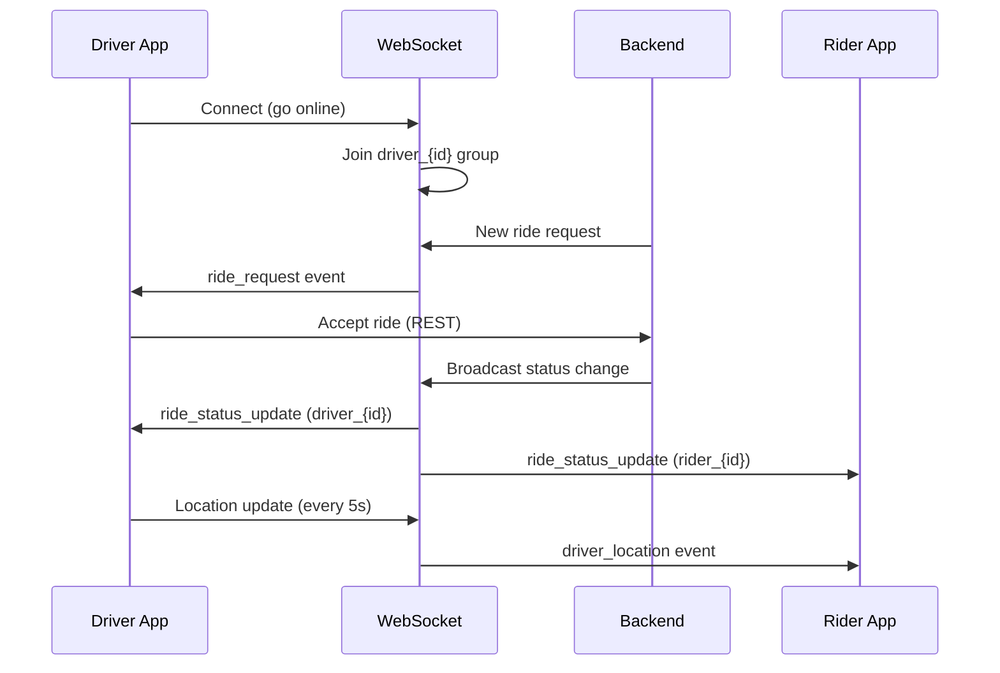
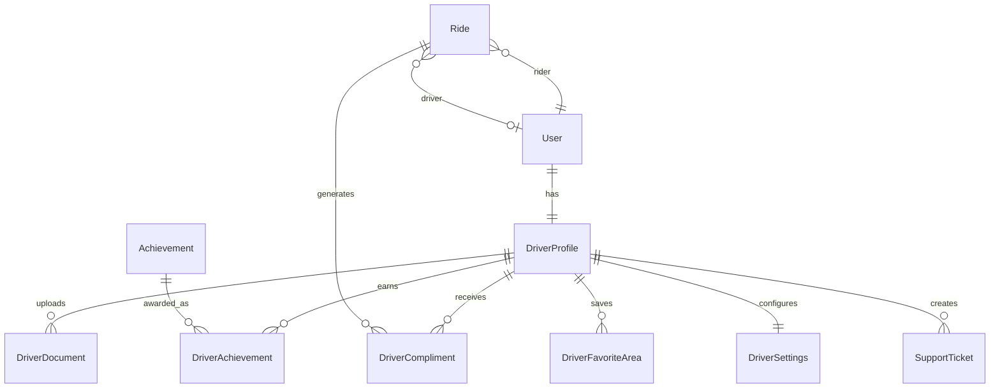

# Design Document: Premium Driver App

## Overview

This design transforms the existing Yala Driver App into a premium ride-hailing experience. The current implementation uses a monolithic `DriverApp.js` component (~2800 lines) with polling-based data fetching and basic ride management. The redesign introduces:

1. **Full-screen map dashboard** with real-time GPS tracking and heatmap overlays
2. **Enhanced ride workflow** with countdown timers, strict state machine enforcement, and contextual action buttons
3. **Driver Level System** replacing the existing `driver_category` (gold/platinum/diamond/elite) with a 5-tier progression system (Bronze → Silver → Gold → Platinum → Elite) based on performance metrics
4. **Earnings Center** with time-period charts, bonus tracking, and detailed breakdowns
5. **Document Center** with upload validation, expiration tracking, and admin review workflow
6. **Feedback Center** with rating history, compliment categories, and review pagination
7. **Support Center** with emergency protocol, live chat, and FAQ
8. **Settings** with language switching (EN/FR/AR), dark mode, GPS accuracy, and privacy controls
9. **Achievements & Rewards** gamification system

The architecture preserves the existing Django REST + Django Channels backend and React frontend patterns while decomposing the monolithic driver component into focused modules.

## Architecture

### High-Level Architecture

```mermaid
graph TB
    subgraph Frontend["React Frontend (Driver App)"]
        DD[DriverDashboard]
        RP[RidePanel]
        EC[EarningsCenter]
        DC[DocumentCenter]
        FC[FeedbackCenter]
        SC[SupportCenter]
        ST[SettingsPage]
        AC[AchievementsPage]
        PP[ProfilePage]
        LS[LevelSystem UI]
    end

    subgraph Backend["Django Backend"]
        subgraph APIs["REST APIs"]
            DA[Driver APIs]
            RA[Ride APIs]
            EA[Earnings APIs]
            DOC[Document APIs]
            FA[Feedback APIs]
            SA[Support APIs]
            SET[Settings APIs]
            LA[Level APIs]
            ACH[Achievement APIs]
        end
        subgraph Services["Business Logic"]
            RWE[Ride Workflow Engine]
            DLS[Driver Level Service]
            ES[Earnings Service]
            HS[Heatmap Service]
            ACS[Achievement Service]
        end
        subgraph RT["Real-Time"]
            WS[WebSocket Consumer]
            CL[Channel Layer]
        end
    end

    subgraph Storage["Data Layer"]
        DB[(SQLite/PostgreSQL)]
        FS[File Storage]
        Cache[Redis Cache]
    end

    DD --> WS
    DD --> DA
    RP --> RA
    RP --> WS
    EC --> EA
    DC --> DOC
    FC --> FA
    SC --> SA
    ST --> SET
    AC --> ACH
    PP --> LA

    RWE --> WS
    DLS --> DB
    ES --> DB
    HS --> Cache
    ACS --> DB

    WS --> CL
    CL --> Cache
```



### Component Decomposition Strategy

The existing monolithic `DriverApp.js` (2800+ lines) will be decomposed into:

| New Component | Responsibility | Route |
|---|---|---|
| `DriverDashboard.js` | Full-screen map, online/offline toggle, ride request cards | `/driver` |
| `DriverProfile.js` | Profile info, stats, level badge | `/driver/profile` |
| `DriverEarnings.js` | Earnings charts, period breakdowns, bonuses | `/driver/earnings` |
| `DriverDocuments.js` | Document upload, status, expiration | `/driver/documents` |
| `DriverFeedback.js` | Ratings, reviews, compliments | `/driver/feedback` |
| `DriverSupport.js` | Help, FAQ, live chat, emergency | `/driver/support` |
| `DriverSettings.js` | Language, notifications, GPS, privacy, dark mode | `/driver/settings` |
| `DriverAchievements.js` | Badges, rewards, points | `/driver/achievements` |
| `DriverRideHistory.js` | Past rides, filters, favorite areas | `/driver/history` |

Navigation uses the existing path-based routing pattern (`window.location.pathname`) with a bottom navigation bar.

### WebSocket Enhancement

The existing single `RideConsumer` broadcasting to a shared "rides" group will be enhanced:

- **Driver-specific groups**: Each online driver joins `driver_{user_id}` group for targeted ride requests
- **Ride-specific groups**: Active rides use `ride_{ride_id}` for status updates between driver and rider
- **Backward compatibility**: The shared "rides" group remains for admin monitoring



## Components and Interfaces

### Backend API Endpoints (New/Modified)

#### Driver Level System
```
GET    /drivers/me/level/              → Current level, progress, benefits
GET    /drivers/me/level/requirements/ → All level thresholds
POST   /drivers/me/level/evaluate/     → Trigger level re-evaluation (internal)
```

#### Driver Statistics & Profile
```
GET    /drivers/me/stats/              → Acceptance rate, completion rate, cancellation rate, total rides
GET    /drivers/me/profile/            → Enhanced profile with level badge, stats summary
```

#### Earnings Center
```
GET    /drivers/me/earnings/           → Enhanced: includes bonus, incentive, referral breakdowns
GET    /drivers/me/earnings/chart/     → Chart data with period param (daily/weekly/monthly/yearly)
```

#### Document Center
```
GET    /drivers/me/documents/          → All documents with status and expiration
POST   /drivers/me/documents/upload/   → Upload document (type, file)
POST   /admin/documents/{id}/approve/  → Admin approve
POST   /admin/documents/{id}/reject/   → Admin reject with reason
```

#### Feedback Center
```
GET    /drivers/me/feedback/           → Average rating, compliment counts
GET    /drivers/me/feedback/reviews/   → Paginated reviews (page_size=20)
GET    /drivers/me/feedback/history/   → Rating history (30-day line chart data)
```

#### Support Center
```
POST   /drivers/me/support/emergency/  → Emergency protocol (sends GPS)
POST   /drivers/me/support/chat/       → Initiate live chat session
GET    /drivers/me/support/faq/        → FAQ articles with search
```

#### Settings
```
GET    /drivers/me/settings/           → Current settings
PATCH  /drivers/me/settings/           → Update settings (language, notifications, GPS, privacy, dark_mode, security)
```

#### Achievements & Rewards
```
GET    /drivers/me/achievements/       → Earned achievements
GET    /drivers/me/rewards/            → Points balance, redemption options
```

#### Ride Workflow (Enhanced)
```
POST   /rides/accept/{id}/             → (existing) Enhanced with countdown validation
POST   /rides/arrived/{id}/            → (existing) Strict state check
POST   /rides/start/{id}/              → (existing) Strict state check
POST   /rides/complete/{id}/           → (existing) Triggers level evaluation + achievement check
POST   /rides/cancel/{id}/             → (existing) Enhanced with cancellation tracking
```

#### Heatmap
```
GET    /drivers/heatmap/               → Busy zone polygons/circles with intensity
```

#### Favorite Areas
```
GET    /drivers/me/favorites/          → List favorite areas (max 5)
POST   /drivers/me/favorites/          → Add favorite area (label, lat, lng)
DELETE /drivers/me/favorites/{id}/     → Remove favorite area
```

### Frontend Component Interfaces

#### DriverDashboard Props/State
```javascript
// State
{
  isOnline: boolean,
  driverLocation: { lat: number, lng: number },
  activeRide: Ride | null,
  rideRequest: RideRequest | null,  // with countdown timer
  heatmapZones: HeatmapZone[],
  notifications: { unreadCount: number },
  todayEarnings: number,
  driverLevel: LevelInfo,
}
```

#### WebSocket Message Types
```javascript
// Inbound (server → driver)
{ type: "ride_request", ride_id, pickup, destination, fare, distance_km, countdown: 30 }
{ type: "ride_status_update", ride_id, status, ... }
{ type: "chat_message", ride_id, sender, text, created_at }
{ type: "document_status", document_type, status, reason? }
{ type: "achievement_unlocked", achievement_id, name, icon }
{ type: "level_change", new_level, previous_level }

// Outbound (driver → server)
{ type: "location_update", lat, lng }
{ type: "ride_accept", ride_id }
{ type: "chat_message", ride_id, text }
```

### Service Layer (Backend)

#### DriverLevelService
```python
class DriverLevelService:
    LEVELS = ['bronze', 'silver', 'gold', 'platinum', 'elite']
    THRESHOLDS = {
        'silver':   {'rides': 50,  'rating': 4.5, 'acceptance': 70, 'completion': 85},
        'gold':     {'rides': 200, 'rating': 4.7, 'acceptance': 80, 'completion': 90},
        'platinum': {'rides': 350, 'rating': 4.8, 'acceptance': 85, 'completion': 93},
        'elite':    {'rides': 500, 'rating': 4.9, 'acceptance': 90, 'completion': 95},
    }

    def evaluate_level(self, driver_profile) -> str: ...
    def get_progress(self, driver_profile) -> dict: ...
    def check_demotion(self, driver_profile) -> bool: ...
    def get_benefits(self, level: str) -> dict: ...
```

#### RideWorkflowEngine (Enhanced)
```python
VALID_TRANSITIONS = {
    'requested': ['driver_arriving', 'cancelled'],
    'driver_arriving': ['driver_arrived', 'cancelled'],
    'driver_arrived': ['in_progress', 'cancelled'],
    'in_progress': ['completed'],
    'completed': [],
    'cancelled': [],
}

def transition_ride(ride, new_status, actor) -> Result: ...
def validate_transition(current_status, new_status) -> bool: ...
def handle_request_timeout(ride) -> None: ...
```

#### EarningsService
```python
class EarningsService:
    def get_period_earnings(self, driver, period: str) -> dict: ...
    def get_chart_data(self, driver, period: str) -> list: ...
    def get_bonus_breakdown(self, driver, period: str) -> dict: ...
    def update_earnings_on_completion(self, ride) -> None: ...
```

## Data Models

### New Models

#### DriverLevel (extends existing DriverProfile)
```python
# Add fields to DriverProfile model
class DriverProfile(models.Model):
    # ... existing fields ...
    
    # Replace driver_category choices with new level system
    DRIVER_LEVEL_CHOICES = [
        ('bronze', 'Bronze'),
        ('silver', 'Silver'),
        ('gold', 'Gold'),
        ('platinum', 'Platinum'),
        ('elite', 'Elite'),
    ]
    
    driver_level = models.CharField(
        max_length=20,
        choices=DRIVER_LEVEL_CHOICES,
        default='bronze',
    )
    
    # Performance metrics (cached for quick access)
    total_rides_completed = models.IntegerField(default=0)
    total_rides_accepted = models.IntegerField(default=0)
    total_rides_received = models.IntegerField(default=0)
    total_rides_cancelled = models.IntegerField(default=0)
    average_rating = models.DecimalField(max_digits=3, decimal_places=2, default=0.00)
    
    # Level demotion tracking
    below_threshold_since = models.DateTimeField(null=True, blank=True)
    demotion_warning_sent = models.BooleanField(default=False)
    
    # Rewards
    reward_points = models.IntegerField(default=0)
```

#### DriverDocument
```python
class DriverDocument(models.Model):
    DOCUMENT_TYPES = [
        ('license', 'Driver License'),
        ('national_id', 'National ID'),
        ('insurance', 'Insurance'),
        ('vehicle_registration', 'Vehicle Registration'),
        ('profile_photo', 'Profile Photo'),
    ]
    
    STATUS_CHOICES = [
        ('pending_review', 'Pending Review'),
        ('approved', 'Approved'),
        ('rejected', 'Rejected'),
    ]
    
    driver = models.ForeignKey(DriverProfile, on_delete=models.CASCADE, related_name='documents')
    document_type = models.CharField(max_length=30, choices=DOCUMENT_TYPES)
    file = models.FileField(upload_to='driver/documents/')
    status = models.CharField(max_length=20, choices=STATUS_CHOICES, default='pending_review')
    rejection_reason = models.TextField(blank=True, default='')
    expires_at = models.DateField(null=True, blank=True)
    uploaded_at = models.DateTimeField(auto_now_add=True)
    reviewed_at = models.DateTimeField(null=True, blank=True)
    reviewed_by = models.ForeignKey(
        settings.AUTH_USER_MODEL, null=True, blank=True,
        on_delete=models.SET_NULL, related_name='reviewed_documents'
    )
```

#### DriverAchievement
```python
class Achievement(models.Model):
    code = models.CharField(max_length=50, unique=True)  # e.g., 'first_ride', '100_rides'
    name = models.CharField(max_length=100)
    description = models.TextField()
    icon = models.CharField(max_length=100)  # icon identifier or URL
    
class DriverAchievement(models.Model):
    driver = models.ForeignKey(DriverProfile, on_delete=models.CASCADE, related_name='achievements')
    achievement = models.ForeignKey(Achievement, on_delete=models.CASCADE)
    earned_at = models.DateTimeField(auto_now_add=True)
    
    class Meta:
        unique_together = ['driver', 'achievement']
```

#### DriverFavoriteArea
```python
class DriverFavoriteArea(models.Model):
    driver = models.ForeignKey(DriverProfile, on_delete=models.CASCADE, related_name='favorite_areas')
    label = models.CharField(max_length=100)
    center_lat = models.FloatField()
    center_lng = models.FloatField()
    radius_km = models.FloatField(default=3.0)
    created_at = models.DateTimeField(auto_now_add=True)
    
    class Meta:
        constraints = [
            models.CheckConstraint(
                check=models.Q(radius_km__gt=0),
                name='positive_radius'
            )
        ]
```

#### DriverSettings
```python
class DriverSettings(models.Model):
    LANGUAGE_CHOICES = [
        ('en', 'English'),
        ('fr', 'French'),
        ('ar', 'Arabic'),
    ]
    
    GPS_ACCURACY_CHOICES = [
        ('high', 'High Accuracy'),
        ('battery_saver', 'Battery Saver'),
    ]
    
    driver = models.OneToOneField(DriverProfile, on_delete=models.CASCADE, related_name='settings')
    language = models.CharField(max_length=5, choices=LANGUAGE_CHOICES, default='en')
    notifications_rides = models.BooleanField(default=True)
    notifications_promotions = models.BooleanField(default=True)
    notifications_system = models.BooleanField(default=True)
    gps_accuracy = models.CharField(max_length=20, choices=GPS_ACCURACY_CHOICES, default='high')
    dark_mode = models.BooleanField(default=False)
    pin_lock = models.CharField(max_length=6, blank=True, default='')  # hashed
    biometric_enabled = models.BooleanField(default=False)
    privacy_show_name = models.BooleanField(default=True)
    privacy_show_photo = models.BooleanField(default=True)
    privacy_show_vehicle = models.BooleanField(default=True)
```

#### DriverCompliment
```python
class DriverCompliment(models.Model):
    CATEGORY_CHOICES = [
        ('professionalism', 'Professionalism'),
        ('clean_vehicle', 'Clean Vehicle'),
        ('safe_driving', 'Safe Driving'),
        ('friendliness', 'Friendliness'),
        ('punctuality', 'Punctuality'),
    ]
    
    driver = models.ForeignKey(DriverProfile, on_delete=models.CASCADE, related_name='compliments')
    ride = models.ForeignKey('rides.Ride', on_delete=models.CASCADE)
    category = models.CharField(max_length=20, choices=CATEGORY_CHOICES)
    created_at = models.DateTimeField(auto_now_add=True)
```

#### SupportTicket
```python
class SupportTicket(models.Model):
    TICKET_TYPES = [
        ('emergency', 'Emergency'),
        ('live_chat', 'Live Chat'),
        ('contact_form', 'Contact Form'),
    ]
    
    STATUS_CHOICES = [
        ('open', 'Open'),
        ('in_progress', 'In Progress'),
        ('resolved', 'Resolved'),
        ('closed', 'Closed'),
    ]
    
    driver = models.ForeignKey(DriverProfile, on_delete=models.CASCADE, related_name='support_tickets')
    ticket_type = models.CharField(max_length=20, choices=TICKET_TYPES)
    status = models.CharField(max_length=20, choices=STATUS_CHOICES, default='open')
    subject = models.CharField(max_length=200, blank=True, default='')
    message = models.TextField(blank=True, default='')
    location_lat = models.FloatField(null=True, blank=True)
    location_lng = models.FloatField(null=True, blank=True)
    created_at = models.DateTimeField(auto_now_add=True)
    resolved_at = models.DateTimeField(null=True, blank=True)
```

#### HeatmapZone
```python
class HeatmapZone(models.Model):
    center_lat = models.FloatField()
    center_lng = models.FloatField()
    radius_km = models.FloatField(default=1.0)
    intensity = models.FloatField(default=0.5)  # 0.0 to 1.0
    active = models.BooleanField(default=True)
    updated_at = models.DateTimeField(auto_now=True)
```

### Model Relationships Diagram



## Correctness Properties

*A property is a characteristic or behavior that should hold true across all valid executions of a system — essentially, a formal statement about what the system should do. Properties serve as the bridge between human-readable specifications and machine-verifiable correctness guarantees.*

### Property 1: Ride state machine enforces valid transitions only

*For any* ride in any status and any attempted state transition, the Ride Workflow Engine SHALL accept the transition if and only if the (current_status, new_status) pair exists in the valid transitions map: {requested → [driver_arriving, cancelled], driver_arriving → [driver_arrived, cancelled], driver_arrived → [in_progress, cancelled], in_progress → [completed], completed → [], cancelled → []}. All other transitions SHALL be rejected.

**Validates: Requirements 3.2, 3.3, 3.4, 3.5, 3.6, 3.10**

### Property 2: Notification count formatting

*For any* non-negative integer notification count, the formatted display SHALL show the numeric count when count ≤ 99, and SHALL show "99+" when count > 99.

**Validates: Requirements 1.3**

### Property 3: Offline drivers excluded from ride matching

*For any* set of drivers where some have is_available=False, the ride matching algorithm SHALL never include a driver whose is_available is False in the results.

**Validates: Requirements 2.4**

### Property 4: Active ride prevents going offline

*For any* driver who has a ride in status "driver_arriving", "driver_arrived", or "in_progress", attempting to set availability to offline SHALL be rejected.

**Validates: Requirements 2.6**

### Property 5: Driver rate calculations are correct ratios

*For any* driver with total_rides_received > 0 and total_rides_accepted > 0, the acceptance_rate SHALL equal (total_rides_accepted / total_rides_received) × 100, the completion_rate SHALL equal (total_rides_completed / total_rides_accepted) × 100, and the cancellation_rate SHALL equal (total_rides_cancelled / total_rides_accepted) × 100.

**Validates: Requirements 5.4, 5.5, 5.6**

### Property 6: Level evaluation assigns highest qualifying level

*For any* driver metrics (completed_rides, average_rating, acceptance_rate, completion_rate), the Driver Level System SHALL assign the highest level whose ALL four thresholds are met. If no thresholds beyond Bronze are met, the level SHALL remain Bronze.

**Validates: Requirements 6.4**

### Property 7: Level progress bar bounded and correct

*For any* driver at any level, the progress percentage toward the next level SHALL be between 0 and 100 inclusive. *For any* driver at Elite level, the progress SHALL always be 100.

**Validates: Requirements 6.3**

### Property 8: Level demotion follows time-based rules

*For any* driver whose metrics fall below their current level's thresholds, a warning SHALL be issued after 7 consecutive days below threshold, and a demotion to the next lower level SHALL occur after 14 consecutive days below threshold.

**Validates: Requirements 6.6**

### Property 9: Earnings period aggregation is correct

*For any* set of completed rides with timestamps and driver_earning values, the today/week/month/lifetime earnings totals SHALL equal the sum of driver_earning for rides whose completed_at falls within the respective time period boundaries.

**Validates: Requirements 7.1, 5.3**

### Property 10: Earnings chart data structure correctness

*For any* earnings data set, the daily chart SHALL produce exactly 7 bars (one per day of the week), the monthly chart SHALL produce exactly 12 bars (one per month of the year), and each bar's value SHALL equal the sum of earnings for rides completed within that bar's time range.

**Validates: Requirements 7.2, 7.3, 7.4**

### Property 11: Monetary formatting in MRU

*For any* non-negative numeric value, formatting as MRU currency SHALL produce a string with exactly two decimal places.

**Validates: Requirements 7.7**

### Property 12: Document upload validation

*For any* file upload, the Document Center SHALL accept the file if and only if the file format is JPEG, PNG, or PDF AND the file size is ≤ 10 MB. Accepted files SHALL have status set to "pending_review".

**Validates: Requirements 8.2, 8.7**

### Property 13: Document expiration warning calculation

*For any* document with an expiration date, if the number of days between today and expires_at is between 0 and 30 (inclusive), the system SHALL display a warning badge showing the exact number of days remaining.

**Validates: Requirements 8.4**

### Property 14: Expired or missing documents trigger dashboard alert

*For any* driver who has at least one required document that is expired (expires_at < today) or missing (no file uploaded), the Driver Dashboard SHALL display a persistent alert identifying the affected document(s).

**Validates: Requirements 8.5**

### Property 15: Average rating calculation

*For any* non-empty list of rider ratings (each between 1 and 5 inclusive), the driver's average rating SHALL equal the arithmetic mean of all ratings, rounded to one decimal place, and the result SHALL be between 1.0 and 5.0.

**Validates: Requirements 9.1**

### Property 16: Reviews pagination and ordering

*For any* set of driver reviews, the paginated response SHALL contain at most 20 reviews per page, and reviews within each page SHALL be in reverse chronological order (most recent first).

**Validates: Requirements 9.3**

### Property 17: Compliment category counts

*For any* set of driver compliments, the count displayed for each category SHALL equal the number of compliments with that category value.

**Validates: Requirements 9.5**

### Property 18: Chat message length validation

*For any* chat message string, the system SHALL accept the message if and only if its length is ≤ 500 characters. The remaining character count displayed SHALL equal 500 minus the current message length.

**Validates: Requirements 12.5**

### Property 19: Communication controls visibility by ride state

*For any* ride state, the Call Rider and Chat Rider buttons SHALL be visible if and only if the ride status is "driver_arriving" or "driver_arrived".

**Validates: Requirements 12.1, 12.2**

### Property 20: Navigation destination by ride state

*For any* ride in "driver_arriving" or "driver_arrived" status, the navigation destination SHALL be the pickup location. *For any* ride in "in_progress" status, the navigation destination SHALL be the drop-off location.

**Validates: Requirements 12.6, 12.7**

### Property 21: Ride history pagination

*For any* number of driver rides, each page of ride history SHALL contain at most 20 rides.

**Validates: Requirements 13.1**

### Property 22: Ride history filtering correctness

*For any* date range and status filter applied to ride history, all returned rides SHALL have a created_at within the specified date range AND a status matching the filter value.

**Validates: Requirements 13.2**

### Property 23: Favorite areas maximum limit

*For any* driver, the system SHALL allow saving at most 5 favorite areas. Attempting to save a 6th SHALL be rejected.

**Validates: Requirements 13.3, 13.4**

### Property 24: Ride queue sorted by scheduled time

*For any* set of upcoming accepted rides, the ride queue SHALL be sorted by scheduled_at in ascending order.

**Validates: Requirements 13.6**

### Property 25: Achievement milestone evaluation

*For any* driver whose completed ride count reaches a milestone threshold (1, 100, or 500 rides), the corresponding achievement SHALL be awarded if not already earned.

**Validates: Requirements 14.1**

### Property 26: Reconnection exponential backoff

*For any* reconnection attempt number n (starting at 0), the delay before the next attempt SHALL be min(2^n × 1000, 16000) milliseconds.

**Validates: Requirements 4.3**

### Property 27: PIN validation

*For any* string input for PIN lock, the system SHALL accept it if and only if it consists of exactly 4 to 6 numeric digits.

**Validates: Requirements 11.6**

### Property 28: Action panel shows contextually appropriate button

*For any* ride state, the Action Panel SHALL display exactly one action button: "Accept" for requested, "Arrived" for driver_arriving, "Start Ride" for driver_arrived, "Complete Ride" for in_progress, and no action button for completed or cancelled.

**Validates: Requirements 3.7**

## Error Handling

### Backend Error Handling

| Scenario | HTTP Status | Response | Recovery |
|---|---|---|---|
| Invalid state transition | 400 | `{"detail": "Invalid transition from {current} to {target}"}` | Frontend keeps current state |
| Driver not approved trying to go online | 400 | `{"error": "Driver must be approved before going online"}` | Show approval message |
| Active ride prevents offline | 400 | `{"error": "Complete active ride before going offline"}` | Show active ride |
| Document upload invalid format | 400 | `{"error": "Accepted formats: JPEG, PNG, PDF. Max size: 10MB"}` | Show format requirements |
| Document upload too large | 400 | `{"error": "File size exceeds 10MB limit"}` | Show size limit |
| Expired documents | 400 | `{"error": "Documents expired: ...", "expired_documents": [...]}` | Redirect to document center |
| Ride request timeout (30s) | N/A (internal) | Ride reassigned, card dismissed | Show "Request expired" |
| Favorite areas limit reached | 400 | `{"error": "Maximum 5 favorite areas. Remove one first."}` | Show removal prompt |
| Authentication expired | 401 | `{"detail": "Token expired"}` | Redirect to login |
| Rate limit exceeded | 429 | `{"detail": "Too many requests"}` | Exponential backoff |

### Frontend Error Handling

| Scenario | Behavior |
|---|---|
| WebSocket disconnection | Auto-reconnect with exponential backoff (1s → 2s → 4s → 8s → 16s max) |
| WebSocket reconnect fails after 30s | Show connection error banner, stop attempts |
| Network offline | Cache active ride data, show stale-data indicator |
| GPS unavailable | Show error message, prompt to enable location services |
| API call failure | Show toast notification, revert optimistic UI updates |
| Toggle online/offline fails | Revert toggle to previous state, show error |
| Chat message delivery failure (>5s) | Show failure indicator, enable retry button |
| Earnings sync failure | Retry 3 times at 5s intervals, show sync notification |

### Emergency Protocol Error Handling

| Scenario | Behavior |
|---|---|
| GPS available | Share current GPS within 5 seconds |
| GPS unavailable | Share last known location, notify driver location may not be current |
| Network unavailable | Queue emergency request, retry when connectivity returns |

## Testing Strategy

### Unit Tests (Example-Based)

Unit tests cover specific scenarios, edge cases, and integration points:

- **Ride state machine**: Test each valid transition individually, test rejection of specific invalid transitions
- **Level assignment**: Test boundary cases (exactly at threshold, one below threshold)
- **Document upload**: Test specific file types (valid JPEG, invalid BMP, exactly 10MB, 10.1MB)
- **Settings defaults**: Verify new driver settings have correct defaults
- **Achievement milestones**: Test specific milestone triggers (1st ride, 100th ride)
- **Emergency protocol**: Test GPS available vs unavailable scenarios
- **Earnings formatting**: Test specific values (0, 1.5, 1000.999 → "1001.00")

### Property-Based Tests

Property-based tests verify universal correctness properties using the `hypothesis` library (Python backend) and `fast-check` (JavaScript frontend):

**Configuration:**
- Minimum 100 iterations per property test
- Each test tagged with: **Feature: premium-driver-app, Property {number}: {property_text}**

**Backend Properties (hypothesis):**
- Property 1: Ride state machine transitions
- Property 3: Offline driver exclusion
- Property 4: Active ride prevents offline
- Property 5: Rate calculations
- Property 6: Level evaluation
- Property 7: Level progress bounds
- Property 9: Earnings aggregation
- Property 10: Chart data structure
- Property 11: MRU formatting
- Property 12: Document upload validation
- Property 13: Expiration warning calculation
- Property 14: Expired document alerts
- Property 15: Average rating calculation
- Property 16: Reviews pagination
- Property 17: Compliment counts
- Property 21: Ride history pagination
- Property 22: Ride history filtering
- Property 23: Favorite areas limit
- Property 24: Ride queue sorting
- Property 25: Achievement evaluation
- Property 27: PIN validation

**Frontend Properties (fast-check):**
- Property 2: Notification count formatting
- Property 18: Chat message length validation
- Property 19: Communication controls visibility
- Property 20: Navigation destination by state
- Property 26: Reconnection backoff calculation
- Property 28: Action panel button mapping

### Integration Tests

- WebSocket connection establishment and message delivery
- Ride workflow end-to-end (request → accept → arrive → start → complete)
- Document upload → admin review → driver notification flow
- Level evaluation triggered after ride completion
- Earnings update after ride completion
- Emergency protocol GPS sharing
- Language switching with i18next

### Performance Tests

- Dashboard initial render time (target: <3s on 3G)
- WebSocket message delivery latency (target: <2s)
- Lazy loading verification (non-critical screens excluded from initial bundle)

