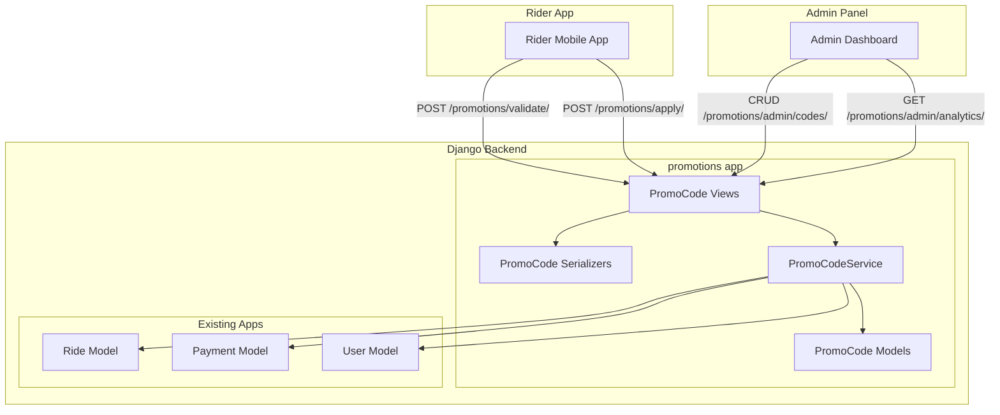
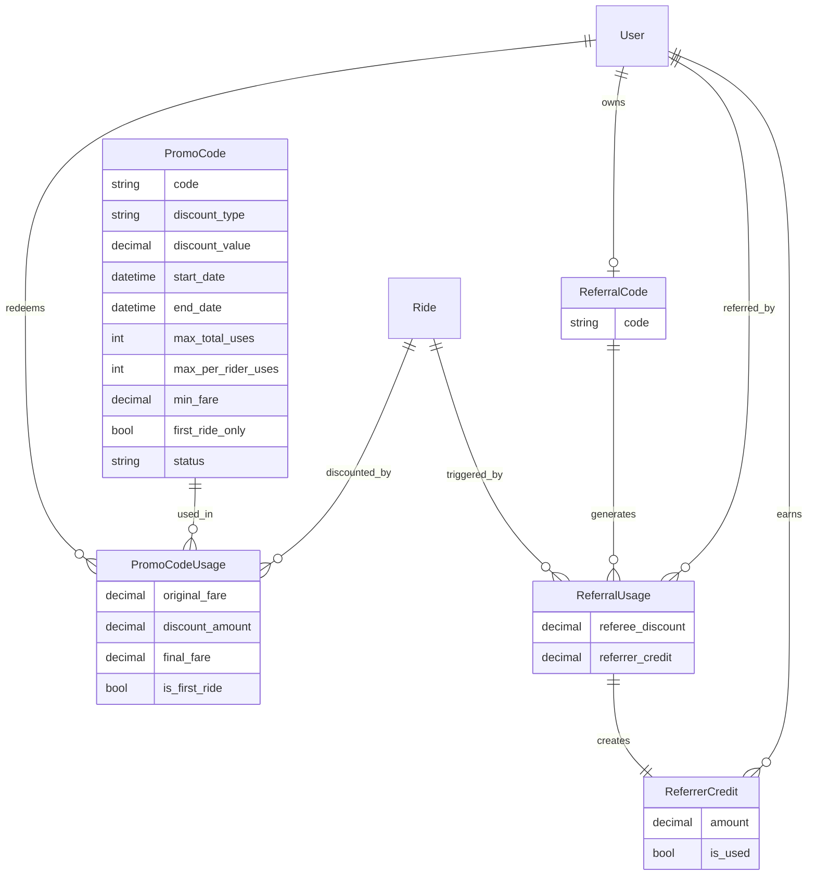

# Design Document: Promo Codes

## Overview

The Promo Codes feature adds a promotional discount system to the Yala taxi booking platform. It enables administrators to create, manage, and analyze promotional codes that riders can apply to receive fare discounts. The system supports three discount types (percentage off, fixed amount off, free ride), configurable usage limits, date-based expiration, first-ride-only restrictions, and a referral code program.

The feature integrates with the existing `Payment` model to ensure discounts are applied before payment capture while preserving driver earnings based on the original fare. A new Django app (`promotions`) will house all promo code logic, exposing REST API endpoints for both admin management and rider-facing validation/application.

## Architecture

The promo codes system follows the existing project conventions: a dedicated Django app with models, serializers, views, and URL routing registered under the main `taxi` project.



**Key architectural decisions:**

1. **Dedicated `promotions` app** — Keeps promo logic isolated from payments and rides, following the existing app-per-domain pattern.
2. **Service layer (`PromoCodeService`)** — Encapsulates validation, discount calculation, and usage tracking logic in a testable service class rather than embedding it in views.
3. **Validation at apply-time** — The promo code is validated when the rider enters it (preview) and re-validated when the ride completes (final application), guarding against race conditions with usage limits.

## Components and Interfaces

### REST API Endpoints

| Endpoint | Method | Auth | Description |
|----------|--------|------|-------------|
| `/promotions/admin/codes/` | GET | Admin | List all promo codes with filters |
| `/promotions/admin/codes/` | POST | Admin | Create a new promo code |
| `/promotions/admin/codes/{id}/` | GET | Admin | Retrieve promo code details |
| `/promotions/admin/codes/{id}/` | PATCH | Admin | Update promo code fields |
| `/promotions/admin/codes/{id}/deactivate/` | POST | Admin | Deactivate a promo code |
| `/promotions/admin/analytics/` | GET | Admin | Overall promo analytics |
| `/promotions/admin/codes/{id}/analytics/` | GET | Admin | Per-code analytics |
| `/promotions/validate/` | POST | Rider | Validate a code and preview discount |
| `/promotions/apply/` | POST | Rider | Apply code to a completed ride |
| `/promotions/referral/` | GET | Rider | Get rider's own referral code |

### Service Layer

```python
class PromoCodeService:
    def validate_code(self, code: str, rider: User, estimated_fare: Decimal) -> ValidationResult  # Returns discount_amount=0 for invalid codes
    def apply_code(self, code: str, rider: User, ride: Ride, actual_fare: Decimal) -> ApplicationResult  # Ride completion proceeds even if usage record creation fails
    def calculate_discount(self, promo: PromoCode, fare: Decimal) -> Decimal
    def check_eligibility(self, promo: PromoCode, rider: User, fare: Decimal) -> EligibilityResult
    def generate_referral_code(self, rider: User) -> str
    def apply_referral(self, referral_code: str, referee: User, ride: Ride, fare: Decimal) -> ReferralResult
```

### Serializers

- `PromoCodeAdminSerializer` — Full CRUD serializer for admin endpoints
- `PromoCodeListSerializer` — Lightweight serializer for list views with usage stats
- `PromoCodeValidateSerializer` — Input: code string + estimated fare; Output: discount preview
- `PromoCodeApplySerializer` — Input: code string + ride ID; Output: final fare details
- `PromoCodeAnalyticsSerializer` — Analytics response with aggregated stats
- `ReferralCodeSerializer` — Referral code display and sharing info

### Permissions

- Admin endpoints: `IsAdminUser` (Django's built-in)
- Rider endpoints: `IsAuthenticated` + `user_type == "rider"`

## Data Models

### PromoCode

```python
class PromoCode(models.Model):
    DISCOUNT_TYPE_CHOICES = [
        ("percentage", "Percentage Off"),
        ("fixed", "Fixed Amount Off"),
        ("free_ride", "Free Ride"),
    ]

    STATUS_CHOICES = [
        ("active", "Active"),
        ("inactive", "Inactive"),
    ]

    code = models.CharField(max_length=30, unique=True)  # stored uppercase
    discount_type = models.CharField(max_length=20, choices=DISCOUNT_TYPE_CHOICES)
    discount_value = models.DecimalField(max_digits=10, decimal_places=2)
    # For percentage: 1-100; For fixed: positive MRU amount; For free_ride: 0 (ignored)

    start_date = models.DateTimeField()
    end_date = models.DateTimeField()

    max_total_uses = models.PositiveIntegerField(null=True, blank=True)  # null = unlimited
    max_per_rider_uses = models.PositiveIntegerField(null=True, blank=True)  # null = unlimited
    min_fare = models.DecimalField(max_digits=10, decimal_places=2, default=0)

    first_ride_only = models.BooleanField(default=False)
    status = models.CharField(max_length=20, choices=STATUS_CHOICES, default="active")

    created_at = models.DateTimeField(auto_now_add=True)
    updated_at = models.DateTimeField(auto_now=True)

    class Meta:
        ordering = ["-created_at"]

    def save(self, *args, **kwargs):
        self.code = self.code.upper()
        super().save(*args, **kwargs)
```

### PromoCodeUsage

```python
class PromoCodeUsage(models.Model):
    promo_code = models.ForeignKey(PromoCode, on_delete=models.CASCADE, related_name="usages")
    rider = models.ForeignKey(settings.AUTH_USER_MODEL, on_delete=models.CASCADE, related_name="promo_usages")
    ride = models.ForeignKey("taxi.Ride", on_delete=models.CASCADE, related_name="promo_usages")

    original_fare = models.DecimalField(max_digits=10, decimal_places=2)
    discount_amount = models.DecimalField(max_digits=10, decimal_places=2)
    final_fare = models.DecimalField(max_digits=10, decimal_places=2)

    is_first_ride = models.BooleanField(default=False)
    created_at = models.DateTimeField(auto_now_add=True)

    class Meta:
        unique_together = []  # A rider can use the same code multiple times if allowed
```

### ReferralCode

```python
class ReferralCode(models.Model):
    rider = models.OneToOneField(settings.AUTH_USER_MODEL, on_delete=models.CASCADE, related_name="referral_code")
    code = models.CharField(max_length=20, unique=True)
    created_at = models.DateTimeField(auto_now_add=True)
```

### ReferralUsage

```python
class ReferralUsage(models.Model):
    referral_code = models.ForeignKey(ReferralCode, on_delete=models.CASCADE, related_name="usages")
    referee = models.ForeignKey(settings.AUTH_USER_MODEL, on_delete=models.CASCADE, related_name="referral_as_referee")
    ride = models.ForeignKey("taxi.Ride", on_delete=models.CASCADE, related_name="referral_usages")

    referee_discount = models.DecimalField(max_digits=10, decimal_places=2)
    referrer_credit = models.DecimalField(max_digits=10, decimal_places=2)

    created_at = models.DateTimeField(auto_now_add=True)

    class Meta:
        unique_together = [("referral_code", "referee")]  # One referral per referee
```

### ReferrerCredit

```python
class ReferrerCredit(models.Model):
    referrer = models.ForeignKey(settings.AUTH_USER_MODEL, on_delete=models.CASCADE, related_name="referrer_credits")
    referral_usage = models.OneToOneField(ReferralUsage, on_delete=models.CASCADE)
    amount = models.DecimalField(max_digits=10, decimal_places=2)
    is_used = models.BooleanField(default=False)
    used_on_ride = models.ForeignKey("taxi.Ride", on_delete=models.SET_NULL, null=True, blank=True)
    created_at = models.DateTimeField(auto_now_add=True)
```

### Entity Relationship Diagram



## Correctness Properties

*A property is a characteristic or behavior that should hold true across all valid executions of a system — essentially, a formal statement about what the system should do. Properties serve as the bridge between human-readable specifications and machine-verifiable correctness guarantees.*

### Property 1: Percentage discount calculation

*For any* valid percentage value P (1–100) and any positive fare F, the calculated discount amount SHALL equal `round(F * P / 100, 2)` and the result SHALL be less than or equal to F.

**Validates: Requirements 8.2**

### Property 2: Fixed amount discount capping

*For any* fixed discount value D and any positive fare F where D > F, the discount amount SHALL be capped at F and the final fare SHALL be zero.

**Validates: Requirements 8.3**

### Property 3: Final fare invariant

*For any* promo code application with an original fare and a computed discount amount, the final fare SHALL equal `original_fare - discount_amount`, and the final fare SHALL be greater than or equal to zero.

**Validates: Requirements 8.4**

### Property 4: Driver earning independence from discount

*For any* ride where a promo code discount is applied, the driver earning SHALL be calculated based on the original fare, not the final (discounted) fare.

**Validates: Requirements 8.7**

### Property 5: Usage limit enforcement

*For any* promo code with a maximum total redemption count N, after exactly N successful redemptions the service SHALL reject the (N+1)th attempt. Similarly, for any promo code with a per-rider limit M, after a single rider redeems it M times, the service SHALL reject that rider's (M+1)th attempt.

**Validates: Requirements 2.5, 2.6**

### Property 6: Inactive code rejection

*For any* promo code that has been deactivated (status = "inactive"), all subsequent validation and redemption attempts SHALL always be rejected regardless of the code's other parameters (dates, limits) or system conditions, and the returned Discount_Amount SHALL be zero.

**Validates: Requirements 3.2, 3.3**

### Property 7: Usage record preservation

*For any* promo code with existing usage records, editing or deactivating the promo code SHALL not alter, delete, or modify any existing usage records.

**Validates: Requirements 3.4**

### Property 8: Temporal validity enforcement

*For any* promo code with a start_date and end_date, validation attempts before start_date SHALL be rejected with a "not yet active" reason, and validation attempts after end_date SHALL be rejected with an "expired" reason.

**Validates: Requirements 5.2, 5.3**

### Property 9: Expiration status derivation

*For any* promo code, the computed display status SHALL be "scheduled" when current time < start_date, "active" when start_date <= current time <= end_date and status is active, and "expired" when current time > end_date.

**Validates: Requirements 5.4**

### Property 10: First-ride eligibility

*For any* promo code marked as first-ride-only, the service SHALL accept redemption only when the rider has zero completed rides. For any rider with one or more completed rides, the service SHALL reject the attempt with a "valid for first rides only" message. This message SHALL also be shown to eligible first-time riders when their redemption is rejected for other reasons.

**Validates: Requirements 6.1, 6.2**

### Property 11: Referral code uniqueness

*For any* set of generated referral codes across all riders, no two codes SHALL be identical.

**Validates: Requirements 7.1**

### Property 12: Self-referral and inactive referrer prevention

*For any* referral code submission, the service SHALL reject the attempt if the code belongs to the submitting rider (self-referral) or if the code's owner is not an active rider.

**Validates: Requirements 7.3, 7.7**

### Property 13: Referral credits both parties

*For any* valid referral where the referee completes their first ride, the referee SHALL receive a fare reduction equal to the configured referee discount, and the referrer SHALL receive a stored credit equal to the configured referrer discount.

**Validates: Requirements 7.4, 7.5**

### Property 14: Code format validation

*For any* string, the promo code service SHALL accept it if and only if it matches the pattern `[A-Za-z0-9_-]{3,30}`. Strings outside this pattern SHALL be rejected with a validation error.

**Validates: Requirements 10.4, 10.5**

### Property 15: Date range validation

*For any* promo code creation request where end_date <= start_date, the service SHALL reject the request with a validation error.

**Validates: Requirements 10.1**

### Property 16: Discount value validation

*For any* percentage discount type, values outside [1, 100] SHALL be rejected. *For any* fixed amount discount type, values <= 0 SHALL be rejected.

**Validates: Requirements 1.3, 1.4, 10.2, 10.3**

### Property 17: Free ride discount equals fare

*For any* promo code with discount type "free_ride" and any positive original fare F, the discount amount SHALL equal F (making the final fare zero).

**Validates: Requirements 1.5**

### Property 18: Minimum fare enforcement

*For any* promo code with a minimum fare requirement M and any ride with a fare F < M, the service SHALL reject the promo code application.

**Validates: Requirements 4.5**

### Property 19: Analytics aggregation correctness

*For any* promo code with N usage records, the analytics SHALL report total_redemptions = N, total_discount = sum of all discount_amounts, and unique_riders = count of distinct riders across usage records.

**Validates: Requirements 9.1**

### Property 20: Filter correctness

*For any* filter query (by status, discount type, or date range), the returned promo codes SHALL include only codes matching all specified filter criteria, and SHALL include all codes that match.

**Validates: Requirements 9.3**

## Error Handling

### Validation Errors

| Scenario | HTTP Status | Error Code | Message |
|----------|-------------|------------|---------|
| Duplicate code string | 400 | `code_exists` | "A promo code with this code already exists." |
| Invalid percentage value | 400 | `invalid_percentage` | "Percentage must be between 1 and 100." |
| Invalid fixed amount | 400 | `invalid_amount` | "Fixed discount amount must be greater than zero." |
| End date <= start date | 400 | `invalid_date_range` | "End date must be after start date." |
| Invalid code format | 400 | `invalid_code_format` | "Code must be 3-30 characters, alphanumeric, hyphens, or underscores only." |

### Redemption Errors

| Scenario | HTTP Status | Error Code | Message |
|----------|-------------|------------|---------|
| Code not found | 404 | `code_not_found` | "Promo code not found." |
| Code inactive | 400 | `code_inactive` | "This promo code is no longer valid." |
| Code not yet active | 400 | `code_not_active_yet` | "This promo code is not yet active." |
| Code expired | 400 | `code_expired` | "This promo code has expired." |
| Total usage limit reached | 400 | `total_limit_reached` | "This promo code has reached its maximum number of uses." |
| Per-rider limit reached | 400 | `rider_limit_reached` | "You have already used this promo code the maximum number of times." |
| Minimum fare not met | 400 | `min_fare_not_met` | "Your fare does not meet the minimum requirement of {min_fare} MRU for this code." |
| First-ride-only violation | 400 | `first_ride_only` | "This promo code is valid for first rides only." |
| Self-referral | 400 | `self_referral` | "You cannot use your own referral code." |
| Inactive referrer | 400 | `inactive_referrer` | "This referral code is no longer valid." |

### Error Response Format

All error responses follow a consistent JSON structure:

```json
{
  "error": {
    "code": "error_code_string",
    "message": "Human-readable error message.",
    "field": "field_name"  // optional, for field-level validation errors
  }
}
```

### Race Condition Handling

- Usage limit checks use `select_for_update()` to prevent concurrent over-redemption.
- The service re-validates the code at ride completion (apply time), not just at preview time, to catch limit changes between preview and completion.

## Testing Strategy

### Property-Based Testing

The feature's core logic (discount calculation, validation rules, eligibility checks) is well-suited for property-based testing. The service layer contains pure functions with clear input/output behavior and universal properties that hold across wide input spaces.

**Library:** [Hypothesis](https://hypothesis.readthedocs.io/) for Python

**Configuration:**
- Minimum 100 iterations per property test
- Each test tagged with: `Feature: promo-codes, Property {number}: {property_text}`

**Properties to implement as PBT:**
- Properties 1–6, 8, 10, 14–18 (core calculation and validation logic)

### Unit Tests (Example-Based)

Unit tests cover specific scenarios, integration points, and edge cases:

- CRUD operations for promo codes (create, read, update, deactivate)
- Each discount type creation (percentage, fixed, free_ride)
- Code uniqueness and case-insensitivity
- Usage record creation on successful application
- Referral code generation on user creation
- Referral credit storage for referrer
- Analytics response format and field presence
- Error message specificity for each rejection reason

### Integration Tests

- Payment integration: verify `Final_Fare` is passed to payment authorization
- Payment record: verify `discount_amount` stored in Payment model
- Ride completion flow: end-to-end from code validation → ride complete → usage recorded → payment adjusted
- Referral flow: new user signup → first ride with referral → both parties credited
- Admin list with filters: verify Django ORM filter queries return correct results

### Test Organization

```
backend/taxi/tests/
├── test_promo_codes/
│   ├── __init__.py
│   ├── test_discount_calculation.py      # Properties 1-4, 17
│   ├── test_validation_rules.py          # Properties 14-16, 18
│   ├── test_eligibility.py               # Properties 5, 6, 8, 10
│   ├── test_referral.py                  # Properties 11-13
│   ├── test_analytics.py                 # Properties 19-20
│   ├── test_admin_api.py                 # CRUD unit tests
│   ├── test_rider_api.py                 # Rider endpoint unit tests
│   └── test_integration.py              # End-to-end flows
```

