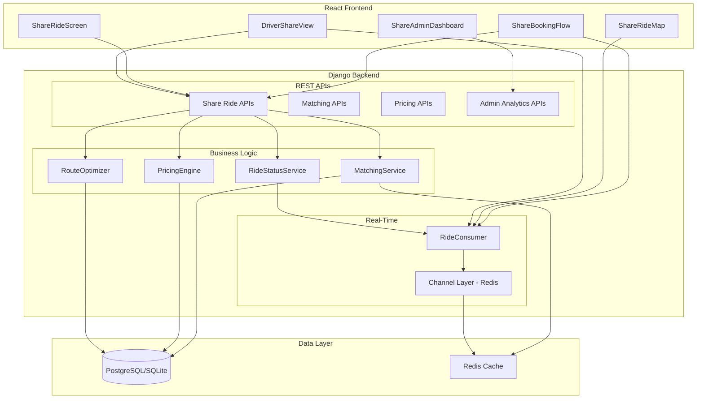
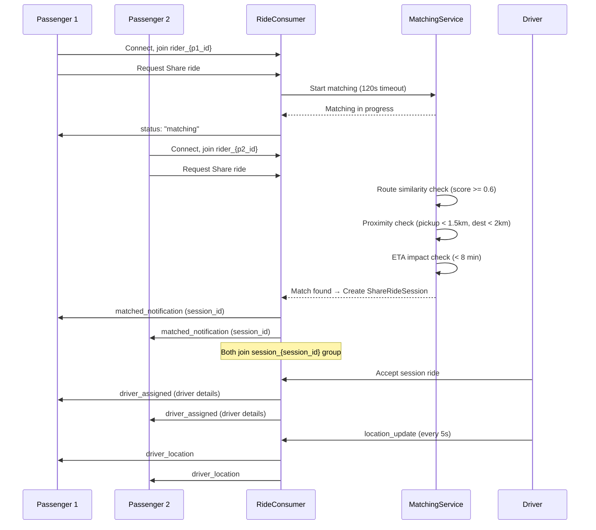
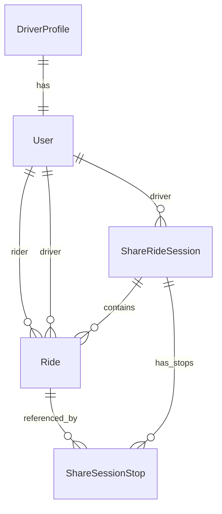

# Design Document: Yala Share Ride

## Overview

This design introduces the Yala Share Ride feature — a shared ride system where up to 3 passengers traveling similar routes share a single vehicle and split costs. The feature integrates with the existing Django REST + Django Channels backend and React frontend, extending the current Ride model (which already has a "Share" ride_type) with new models for session management, passenger matching, dynamic pricing, and route optimization.

Key capabilities:
1. **Passenger Matching** — Real-time matching of riders with similar routes using route similarity scoring, proximity checks, and ETA impact constraints
2. **Share Ride Sessions** — A session container grouping multiple Share bookings assigned to the same driver
3. **Dynamic Pricing Engine** — 30-50% discount off Economy fare based on route overlap, with driver earnings protection
4. **Route Optimization** — Optimal pickup/drop-off ordering for multi-passenger trips
5. **Real-Time Tracking** — Live map with all participants, WebSocket-driven status updates
6. **Admin Analytics** — Dashboard with Share ride metrics, revenue, and efficiency data

The architecture preserves existing patterns (RideConsumer WebSocket groups, REST API views, broadcast_ride_update utility) while adding Share-specific services and models.

## Architecture

### High-Level Architecture



### Integration with Existing System

The Share Ride feature extends the existing architecture:

| Existing Component | Extension |
|---|---|
| `Ride` model (ride_type="Share") | Add `share_session` FK linking to `ShareRideSession` |
| `RideConsumer` WebSocket | Add `session_{id}` group for multi-passenger broadcasts |
| `broadcast_ride_update()` | Extended to notify all session participants |
| `request_ride` view | New `request_share_ride` endpoint with matching trigger |
| `accept_ride` view | Extended to handle session-based acceptance |
| `DriverProfile` (is_available, current_lat/lng) | Used by MatchingService for driver assignment |
| Redis Channel Layer | Used for matching timeout scheduling and session state caching |

### WebSocket Group Strategy



## Components and Interfaces

### Frontend Components

| Component | Responsibility | Route |
|---|---|---|
| `ShareBookingFlow.js` | Step-by-step booking: location → ride type → review → confirm | `/ride/share` |
| `ShareRideScreen.js` | Active ride view: driver card, fare, status, safety actions | `/ride/share/{id}` |
| `ShareRideMap.js` | Live map with driver, passengers, route polyline | Embedded in ShareRideScreen |
| `ShareMatchingStatus.js` | "Finding riders..." overlay with countdown | Embedded in ShareBookingFlow |
| `ShareRideComplete.js` | Completion screen: savings summary, rating prompt | `/ride/share/{id}/complete` |
| `ShareAdminDashboard.js` | Admin analytics: metrics, charts, date filters | `/admin/share-analytics` |
| `DriverShareView.js` | Driver's multi-stop navigation, passenger list, earnings | Embedded in DriverDashboard |

### Backend Service Layer

#### MatchingService

```python
class MatchingService:
    """Finds compatible passengers for Share rides."""

    ROUTE_SIMILARITY_THRESHOLD = 0.6
    MAX_PICKUP_DISTANCE_KM = 1.5
    MAX_DESTINATION_DISTANCE_KM = 2.0
    MAX_ETA_IMPACT_MINUTES = 8
    MATCHING_TIMEOUT_SECONDS = 120
    MAX_PASSENGERS_PER_SESSION = 3

    def find_compatible_passengers(self, ride: Ride) -> list[Ride]:
        """Search for rides with compatible routes."""
        ...

    def calculate_route_similarity(self, ride_a: Ride, ride_b: Ride) -> float:
        """Calculate route overlap score (0.0 to 1.0)."""
        ...

    def calculate_eta_impact(self, session: ShareRideSession, new_ride: Ride) -> dict:
        """Calculate ETA impact on all existing passengers if new ride is added."""
        ...

    def create_session(self, rides: list[Ride]) -> ShareRideSession:
        """Group matched rides into a session."""
        ...

    def add_to_session(self, session: ShareRideSession, ride: Ride) -> bool:
        """Add a new passenger to existing session. Returns False if constraints violated."""
        ...
```

#### PricingEngine

```python
class PricingEngine:
    """Calculates dynamic Share ride fares and driver earnings."""

    MIN_DISCOUNT_PERCENT = 30  # Minimum discount off Economy fare
    MAX_DISCOUNT_PERCENT = 50  # Maximum discount off Economy fare
    DEFAULT_COMMISSION_RATE = 0.20  # 20% platform commission

    def calculate_share_fare(self, economy_fare: Decimal, similarity_score: float, seats: int = 1) -> Decimal:
        """
        Calculate Share fare based on Economy fare and route similarity.
        Discount ranges from 30% (score=0.6) to 50% (score=1.0).
        Result is multiplied by seat count and rounded to nearest whole MRU.
        """
        ...

    def calculate_savings(self, economy_fare: Decimal, share_fare: Decimal) -> Decimal:
        """Calculate amount saved compared to Economy."""
        ...

    def calculate_driver_earnings(self, session: ShareRideSession) -> Decimal:
        """Sum of all passenger fares minus platform commission."""
        ...

    def calculate_platform_commission(self, total_fares: Decimal, rate: float = None) -> Decimal:
        """Calculate platform commission from total fares."""
        ...

    def recalculate_on_cancellation(self, session: ShareRideSession, cancelled_ride: Ride) -> dict:
        """Recalculate fares for remaining passengers after a cancellation."""
        ...

    def validate_driver_earnings_protection(self, session: ShareRideSession, economy_fare: Decimal) -> bool:
        """Ensure driver earns >= single Economy ride earnings."""
        ...
```

#### RouteOptimizer

```python
class RouteOptimizer:
    """Calculates optimal stop order for multi-passenger trips."""

    def calculate_optimal_order(self, session: ShareRideSession) -> list[dict]:
        """
        Returns ordered list of stops: all pickups before drop-offs.
        Each stop: {type: 'pickup'|'dropoff', ride_id, lat, lng, passenger_name}
        """
        ...

    def recalculate_on_change(self, session: ShareRideSession) -> list[dict]:
        """Recalculate stop order after passenger addition/removal."""
        ...

    def calculate_eta_for_stops(self, driver_location: tuple, stops: list[dict]) -> list[dict]:
        """Calculate ETA for each remaining stop from driver's current position."""
        ...
```

#### RideStatusService

```python
class RideStatusService:
    """Manages Share ride state transitions and broadcasts."""

    SHARE_RIDE_STATUSES = [
        'requested', 'matching', 'driver_assigned',
        'driver_arriving', 'passenger_pickup', 'additional_pickup',
        'in_progress', 'drop_off_stop', 'completed', 'cancelled'
    ]

    VALID_TRANSITIONS = {
        'requested': ['matching', 'cancelled'],
        'matching': ['driver_assigned', 'cancelled'],
        'driver_assigned': ['driver_arriving', 'cancelled'],
        'driver_arriving': ['passenger_pickup', 'cancelled'],
        'passenger_pickup': ['additional_pickup', 'in_progress'],
        'additional_pickup': ['in_progress', 'passenger_pickup'],
        'in_progress': ['drop_off_stop', 'completed'],
        'drop_off_stop': ['in_progress', 'completed'],
        'completed': [],
        'cancelled': [],
    }

    def transition(self, session: ShareRideSession, new_status: str) -> bool:
        """Transition session status. Returns False if invalid."""
        ...

    def broadcast_status_update(self, session: ShareRideSession) -> None:
        """Notify all session participants via WebSocket."""
        ...

    def notify_passenger(self, ride: Ride, message: dict) -> None:
        """Send targeted notification to a specific passenger."""
        ...
```

### API Endpoints

#### Share Ride Booking

```
POST   /api/rides/share/request/           → Request a Share ride (triggers matching)
GET    /api/rides/share/{id}/              → Get Share ride details (fare, savings, session info)
POST   /api/rides/share/{id}/cancel/       → Cancel a Share ride (fee logic by status)
POST   /api/rides/share/{id}/rate/         → Rate completed Share ride (1-5 stars + optional review)
```

#### Share Ride Session (Driver)

```
POST   /api/rides/share/session/{id}/accept/    → Driver accepts Share session
POST   /api/rides/share/session/{id}/pickup/    → Driver confirms passenger pickup
POST   /api/rides/share/session/{id}/dropoff/   → Driver confirms passenger drop-off
POST   /api/rides/share/session/{id}/complete/  → Driver completes session (all dropped off)
GET    /api/rides/share/session/{id}/stops/     → Get optimized stop sequence
```

#### Share Ride Matching

```
GET    /api/rides/share/{id}/matching-status/   → Get current matching status and countdown
```

#### Share Admin Analytics

```
GET    /api/admin/share/analytics/              → Aggregated metrics (with date_from, date_to params)
GET    /api/admin/share/analytics/chart/        → Share vs Economy volume comparison chart data
```

#### Request Payload: `POST /api/rides/share/request/`

```json
{
    "pickup": "Tevragh Zeina, Nouakchott",
    "destination": "Ksar, Nouakchott",
    "pickup_lat": 18.0935,
    "pickup_lng": -15.9728,
    "destination_lat": 18.0856,
    "destination_lng": -15.9654,
    "seats": 1,
    "distance_km": 3.5
}
```

#### Response: Share Ride Details

```json
{
    "id": 42,
    "ride_type": "Share",
    "status": "matching",
    "fare": 150,
    "economy_fare": 250,
    "savings": 100,
    "seats": 1,
    "session_id": 7,
    "passengers_count": 2,
    "other_passengers": ["Aminata"],
    "driver": {
        "name": "Mohamed Ould Ahmed",
        "photo_url": "/media/drivers/photos/mohamed.jpg",
        "vehicle": "Toyota Corolla White",
        "plate_number": "1234 AB 01",
        "rating": 4.8
    },
    "stops": [
        {"type": "pickup", "name": "Pickup #1 (You)", "lat": 18.0935, "lng": -15.9728, "eta_minutes": 3},
        {"type": "pickup", "name": "Pickup #2 (Aminata)", "lat": 18.0912, "lng": -15.9701, "eta_minutes": 5},
        {"type": "dropoff", "name": "Drop-off #1 (You)", "lat": 18.0856, "lng": -15.9654, "eta_minutes": 12},
        {"type": "dropoff", "name": "Drop-off #2 (Aminata)", "lat": 18.0830, "lng": -15.9620, "eta_minutes": 15}
    ],
    "eta_impact_minutes": 3,
    "created_at": "2026-01-15T10:30:00Z"
}
```

### WebSocket Events

#### Session-Level Events (server → all session participants)

```javascript
// Match found notification
{ type: "share_matched", session_id, passengers_count, other_passengers: ["Aminata"] }

// Driver assigned to session
{ type: "share_driver_assigned", session_id, driver: { name, photo_url, vehicle, plate, rating, eta_minutes } }

// Status update for entire session
{ type: "share_status_update", session_id, status, updated_eta_minutes }

// New passenger added to active session
{ type: "share_passenger_added", session_id, passenger_name, new_stops, updated_etas }

// Passenger cancelled/removed
{ type: "share_passenger_removed", session_id, updated_stops, updated_fares }

// Session completed
{ type: "share_session_completed", session_id, total_earnings, individual_fare, savings }
```

#### Passenger-Specific Events (server → specific passenger)

```javascript
// Your pickup is next
{ type: "share_your_pickup", session_id, ride_id, message: "Driver is here" }

// Your drop-off is next
{ type: "share_your_dropoff", session_id, ride_id, message: "Arriving at your destination" }

// Fare recalculated (after cancellation)
{ type: "share_fare_updated", session_id, ride_id, new_fare, new_savings }
```

#### Driver-Specific Events (server → driver)

```javascript
// New Share session request
{ type: "share_ride_request", session_id, passengers_count, stops, total_earnings, countdown: 30 }

// Stop sequence updated (new passenger added/removed)
{ type: "share_stops_updated", session_id, stops, passenger_count }
```

#### Client → Server Events

```javascript
// Driver location (existing, reused for Share)
{ type: "location_update", lat, lng }

// Join session group
{ type: "join_session", session_id }

// Leave session group
{ type: "leave_session", session_id }

// Chat message (existing, reused)
{ type: "chat_message", ride_id, text }
```

## Data Models

### New Models

#### ShareRideSession

```python
class ShareRideSession(models.Model):
    """Groups multiple Share rides assigned to the same driver."""

    STATUS_CHOICES = [
        ('matching', 'Matching'),
        ('driver_assigned', 'Driver Assigned'),
        ('driver_arriving', 'Driver Arriving'),
        ('in_progress', 'In Progress'),
        ('completed', 'Completed'),
        ('cancelled', 'Cancelled'),
    ]

    driver = models.ForeignKey(
        settings.AUTH_USER_MODEL,
        on_delete=models.SET_NULL,
        null=True, blank=True,
        related_name='share_sessions_as_driver',
    )
    status = models.CharField(max_length=30, choices=STATUS_CHOICES, default='matching')
    total_fare = models.DecimalField(max_digits=10, decimal_places=2, default=0)
    platform_commission = models.DecimalField(max_digits=10, decimal_places=2, default=0)
    driver_earnings = models.DecimalField(max_digits=10, decimal_places=2, default=0)
    commission_rate = models.DecimalField(max_digits=4, decimal_places=2, default=0.20)
    route_similarity_score = models.FloatField(default=0.0)
    created_at = models.DateTimeField(auto_now_add=True)
    completed_at = models.DateTimeField(null=True, blank=True)

    class Meta:
        indexes = [
            models.Index(fields=['status'], name='share_session_status_idx'),
            models.Index(fields=['driver', 'status'], name='share_session_driver_idx'),
            models.Index(fields=['-created_at'], name='share_session_created_idx'),
        ]

    def __str__(self):
        return f"ShareSession #{self.id} ({self.status})"

    @property
    def passengers_count(self):
        return self.rides.exclude(status='cancelled').count()

    @property
    def active_rides(self):
        return self.rides.exclude(status='cancelled')
```

#### ShareRideSession Stop (Optimized Order)

```python
class ShareSessionStop(models.Model):
    """Ordered stop in a Share session's optimized route."""

    STOP_TYPE_CHOICES = [
        ('pickup', 'Pickup'),
        ('dropoff', 'Drop-off'),
    ]

    session = models.ForeignKey(
        ShareRideSession,
        on_delete=models.CASCADE,
        related_name='stops',
    )
    ride = models.ForeignKey(
        'rides.Ride',
        on_delete=models.CASCADE,
        related_name='share_stops',
    )
    stop_type = models.CharField(max_length=10, choices=STOP_TYPE_CHOICES)
    stop_order = models.IntegerField()
    location_name = models.CharField(max_length=255)
    latitude = models.FloatField()
    longitude = models.FloatField()
    eta_minutes = models.IntegerField(default=0)
    completed_at = models.DateTimeField(null=True, blank=True)

    class Meta:
        ordering = ['stop_order']
        unique_together = ['session', 'stop_order']
        indexes = [
            models.Index(fields=['session', 'stop_order'], name='share_stop_order_idx'),
        ]

    def __str__(self):
        return f"Stop #{self.stop_order} ({self.stop_type}) - Session #{self.session_id}"
```

### Extended Ride Model

The existing `Ride` model gains a nullable FK to `ShareRideSession`:

```python
# Add to Ride model
share_session = models.ForeignKey(
    'ShareRideSession',
    on_delete=models.SET_NULL,
    null=True, blank=True,
    related_name='rides',
)
economy_fare = models.DecimalField(
    max_digits=10, decimal_places=2, null=True, blank=True,
    help_text="The equivalent Economy fare for savings calculation."
)
seats = models.IntegerField(default=1, help_text="Number of seats booked (1 or 2 for Share rides).")
share_status = models.CharField(
    max_length=30, blank=True, default='',
    help_text="Share-specific passenger status within a session."
)
```

### Extended STATUS_CHOICES for Share Rides

The existing Ride STATUS_CHOICES remain unchanged. Share-specific statuses are tracked at the session level (`ShareRideSession.status`) and per-passenger level (`Ride.share_status`):

```python
SHARE_PASSENGER_STATUS_CHOICES = [
    ('waiting_match', 'Waiting for Match'),
    ('matched', 'Matched'),
    ('waiting_pickup', 'Waiting for Pickup'),
    ('picked_up', 'Picked Up'),
    ('dropped_off', 'Dropped Off'),
    ('cancelled', 'Cancelled'),
]
```

### Model Relationships



### Admin Analytics (Computed, not stored)

Admin analytics are computed via aggregation queries over `ShareRideSession` and `Ride` tables filtered by date range. No separate analytics model is needed — the existing data supports all required metrics:

- **Total Share rides**: `Ride.objects.filter(ride_type='Share', status='completed', completed_at__range=...)`
- **Total savings**: `SUM(economy_fare - fare)` for completed Share rides in range
- **Platform revenue**: `SUM(platform_commission)` from ShareRideSession in range
- **Average occupancy**: `AVG(passengers_count)` from ShareRideSession in range
- **Driver earnings**: `SUM(driver_earnings)` from ShareRideSession in range
- **Route efficiency**: `AVG(route_similarity_score)` from ShareRideSession in range

## Correctness Properties

*A property is a characteristic or behavior that should hold true across all valid executions of a system — essentially, a formal statement about what the system should do. Properties serve as the bridge between human-readable specifications and machine-verifiable correctness guarantees.*

### Property 1: Share fare is always discounted between 30-50% of Economy fare

*For any* route distance and route similarity score (0.6 to 1.0), the calculated Share fare SHALL be between 50% and 70% of the Economy fare (i.e., a 30-50% discount), and the discount percentage SHALL be monotonically non-decreasing as the similarity score increases.

**Validates: Requirements 1.3, 8.1**

### Property 2: Service area validation accepts/rejects correctly

*For any* coordinate pair (latitude, longitude), the service area validator SHALL return true if and only if the point falls within the defined service area boundaries. Points outside the boundary SHALL always be rejected.

**Validates: Requirements 2.4, 2.5**

### Property 3: Seat count multiplier

*For any* per-seat Share fare and seat count (1 or 2), the total fare charged to the passenger SHALL equal per_seat_fare × seats.

**Validates: Requirements 2.6**

### Property 4: Matching compatibility enforces all constraints

*For any* two rides, the MatchingService SHALL consider them compatible if and only if ALL of the following hold: route_similarity_score >= 0.6, haversine distance between pickups <= 1.5 km, haversine distance between destinations <= 2.0 km, and ETA_Impact for each existing passenger <= 8 minutes.

**Validates: Requirements 3.1, 3.2, 3.8**

### Property 5: Session passenger limit invariant

*For any* ShareRideSession, the number of non-cancelled rides in the session SHALL never exceed 3. Any attempt to add a passenger beyond 3 SHALL be rejected.

**Validates: Requirements 3.7**

### Property 6: Share ride state machine enforces valid transitions

*For any* ShareRideSession in any status and any attempted transition, the RideStatusService SHALL accept the transition if and only if the (current_status, new_status) pair exists in the valid transitions map. All other transitions SHALL be rejected.

**Validates: Requirements 5.1**

### Property 7: Driver assignment notification contains all required fields

*For any* driver profile assigned to a ShareRideSession, the notification payload sent to passengers SHALL contain: driver name, vehicle make, vehicle model, vehicle color, plate number, and estimated arrival time (all non-empty).

**Validates: Requirements 5.3, 6.1**

### Property 8: Communication controls visibility by ride state

*For any* Share ride status, the Call Driver and Chat Driver buttons SHALL be visible if and only if the status is "driver_arriving" or "driver_arrived". In all other statuses, these controls SHALL be hidden.

**Validates: Requirements 6.3, 6.4, 12.1, 12.5**

### Property 9: Other passengers display first name only

*For any* passenger full name in a ShareRideSession, the displayed name to other passengers SHALL be exactly the first name (text before the first space), never the full name.

**Validates: Requirements 6.8**

### Property 10: Route optimizer produces pickups before drop-offs

*For any* ShareRideSession with N passengers, the optimized stop order SHALL place all pickup stops before their corresponding drop-off stops. Specifically, for each passenger, their pickup stop_order SHALL be less than their drop-off stop_order.

**Validates: Requirements 7.1**

### Property 11: Passenger count in vehicle is correct

*For any* ShareRideSession state, the displayed passenger count SHALL equal the number of passengers whose share_status is "picked_up" (picked up but not yet dropped off).

**Validates: Requirements 7.6**

### Property 12: Session completes when all passengers dropped off

*For any* ShareRideSession where all non-cancelled rides have share_status "dropped_off", the session status SHALL transition to "completed".

**Validates: Requirements 7.7**

### Property 13: Driver earnings protection

*For any* ShareRideSession with 2 or more passengers, the driver's total earnings (sum of all passenger fares minus platform commission) SHALL be greater than or equal to the driver's earnings for a single Economy ride on the same base route (economy_fare × (1 - commission_rate)).

**Validates: Requirements 8.5**

### Property 14: Platform commission calculation

*For any* set of passenger fares in a ShareRideSession and a commission rate, the platform_commission SHALL equal the sum of all fares multiplied by the commission rate, and driver_earnings SHALL equal the sum of all fares minus the platform_commission.

**Validates: Requirements 8.3, 8.4**

### Property 15: Fare rounding to whole MRU

*For any* calculated fare value, the displayed fare SHALL be rounded to the nearest whole number (integer MRU). No decimal places SHALL appear in user-facing fare displays.

**Validates: Requirements 8.6**

### Property 16: Savings calculation correctness

*For any* completed Share ride with an economy_fare and a share fare, the displayed savings SHALL equal economy_fare - share_fare, and this value SHALL always be positive.

**Validates: Requirements 8.2**

### Property 17: Admin analytics date-range aggregation

*For any* set of completed Share rides and a date range (start, end), the total rides count SHALL equal the count of rides where completed_at falls within [start, end], and the total savings SHALL equal the sum of (economy_fare - fare) for those rides.

**Validates: Requirements 9.1, 9.2, 9.3, 9.4, 9.5, 9.6**

### Property 18: Cancellation eligibility by ride state

*For any* Share ride, cancellation without fee SHALL be allowed if and only if the status is "requested", "matching", or "driver_assigned". Cancellation with fee SHALL be allowed if status is "driver_arriving". Cancellation SHALL be rejected if status is "in_progress", "completed", or "cancelled".

**Validates: Requirements 10.1, 10.2, 10.6**

### Property 19: Session cancellation when last passenger leaves

*For any* ShareRideSession, if a passenger cancels and the remaining non-cancelled ride count becomes 0, the entire session SHALL be cancelled.

**Validates: Requirements 10.5**

### Property 20: Text length validation (reviews and chat)

*For any* text input for reviews or chat messages, the system SHALL accept the text if and only if its length is between 1 and 500 characters (inclusive). The remaining character count SHALL equal 500 minus the current text length.

**Validates: Requirements 11.2, 12.4**

### Property 21: WebSocket reconnection exponential backoff

*For any* reconnection attempt number n (starting at 0), the delay before the next attempt SHALL be min(2^n × 1000, 16000) milliseconds.

**Validates: Requirements 5.7**

### Property 22: Stop advancement on completion

*For any* ShareSessionStop sequence, when a stop is marked as completed, the next stop in order SHALL become the active navigation destination. The completed stop SHALL have a non-null completed_at timestamp.

**Validates: Requirements 7.3**

## Error Handling

### Backend Error Handling

| Scenario | HTTP Status | Response | Recovery |
|---|---|---|---|
| Pickup outside service area | 400 | `{"error": "Pickup location is outside the supported service area"}` | Show error, prompt re-selection |
| Destination outside service area | 400 | `{"error": "Destination is outside the supported service area"}` | Show error, prompt re-selection |
| Existing open ride prevents Share request | 400 | `{"error": "Complete or cancel your current ride before requesting a Share ride", "ride_id": N}` | Show existing ride |
| Invalid seat count (not 1 or 2) | 400 | `{"error": "Seat count must be 1 or 2"}` | Show seat selector |
| Session full (3 passengers) | 400 | `{"error": "This Share session is full (maximum 3 passengers)"}` | Continue matching for new session |
| ETA impact exceeds 8 minutes | 400 | `{"error": "Adding this passenger would exceed the maximum ETA impact for existing riders"}` | Skip match, continue searching |
| Invalid state transition | 400 | `{"error": "Invalid transition from {current} to {target}"}` | Keep current state |
| Cancellation not allowed (in_progress) | 400 | `{"error": "Cannot cancel a ride that is already in progress"}` | Show ride screen |
| Driver not available | 400 | `{"error": "No available drivers for this Share session"}` | Retry matching or cancel |
| Rating out of range | 400 | `{"error": "Rating must be between 1 and 5"}` | Show rating UI |
| Review too long | 400 | `{"error": "Review must be 500 characters or fewer"}` | Show character count |
| Chat message too long | 400 | `{"error": "Message must be 500 characters or fewer"}` | Show character count |
| Matching timeout (120s) | N/A (internal) | Proceed with single-passenger assignment | Auto-assign driver |
| Authentication expired | 401 | `{"detail": "Token expired"}` | Redirect to login |
| Rate limit exceeded | 429 | `{"detail": "Too many requests"}` | Exponential backoff |

### Frontend Error Handling

| Scenario | Behavior |
|---|---|
| WebSocket disconnection during Share ride | Auto-reconnect with exponential backoff (1s → 2s → 4s → 8s → 16s max) |
| WebSocket reconnect fails after 30s | Show connection error banner, display last known status with stale-data indicator |
| Matching timeout (120s, no match found) | Dismiss "Finding riders..." overlay, proceed with single-passenger ride |
| Chat message delivery failure (>5s) | Show failure indicator, enable retry button |
| GPS unavailable for emergency | Share last known location, show warning that location may not be current |
| Network offline during active ride | Cache ride state locally, show stale-data indicator, queue actions for retry |
| Map fails to load | Show text-based stop list as fallback, retry map load on reconnect |
| Driver cancels session | Notify all passengers, offer to re-request Share ride |
| Fare recalculation notification | Show updated fare with brief animation, highlight savings change |

### Emergency Protocol

| Scenario | Behavior |
|---|---|
| GPS available | Share current GPS coordinates with support within 5 seconds |
| GPS unavailable | Share last known location, notify support that location may be stale |
| Network unavailable | Queue emergency request, retry when connectivity returns |

## Testing Strategy

### Property-Based Tests

Property-based tests verify universal correctness properties using the `hypothesis` library (Python backend) and `fast-check` (JavaScript frontend).

**Configuration:**
- Minimum 100 iterations per property test
- Each test tagged with: **Feature: ride-sharing, Property {number}: {property_text}**
- Library: `hypothesis` for Python, `fast-check` for JavaScript

**Backend Properties (hypothesis):**
- Property 1: Share fare discount range and monotonicity (PricingEngine)
- Property 2: Service area validation (location validator)
- Property 3: Seat count multiplier (PricingEngine)
- Property 4: Matching compatibility constraints (MatchingService)
- Property 5: Session passenger limit (MatchingService)
- Property 6: State machine valid transitions (RideStatusService)
- Property 7: Driver assignment notification payload completeness
- Property 10: Route optimizer pickup-before-dropoff invariant (RouteOptimizer)
- Property 11: Passenger count calculation
- Property 12: Session completion condition
- Property 13: Driver earnings protection (PricingEngine)
- Property 14: Commission calculation (PricingEngine)
- Property 15: Fare rounding (PricingEngine)
- Property 16: Savings calculation (PricingEngine)
- Property 17: Admin analytics aggregation
- Property 18: Cancellation eligibility by state
- Property 19: Session cancellation on last passenger
- Property 22: Stop advancement logic

**Frontend Properties (fast-check):**
- Property 8: Communication controls visibility by ride state
- Property 9: First name only display
- Property 20: Text length validation (chat/review)
- Property 21: Reconnection exponential backoff

### Unit Tests (Example-Based)

Unit tests cover specific scenarios, edge cases, and integration points:

- **Matching timeout**: Test that after 120s with no match, single-passenger assignment proceeds
- **Cancellation fee**: Test specific fee amounts for "driver_arriving" cancellation
- **Fare recalculation on cancellation**: Test that remaining passengers get updated fares
- **WebSocket notification delivery**: Test that all session participants receive status updates
- **Driver assignment**: Test that only available drivers within range are assigned
- **Rating submission**: Test 1-5 star rating with optional review
- **Admin analytics**: Test specific date range queries with known data
- **Emergency GPS sharing**: Test GPS available vs unavailable scenarios
- **Session creation**: Test grouping of 2 and 3 passengers into a session
- **Route similarity edge cases**: Test identical routes (score=1.0), completely different routes (score=0.0)

### Integration Tests

- **Full booking flow**: Request → Match → Assign → Pickup → Drop-off → Complete
- **WebSocket real-time updates**: Verify all participants receive status changes
- **Cancellation mid-ride**: Verify fare recalculation and route update propagation
- **Concurrent matching**: Multiple passengers requesting simultaneously
- **Driver location broadcasting**: Verify 5-second interval updates reach all session participants
