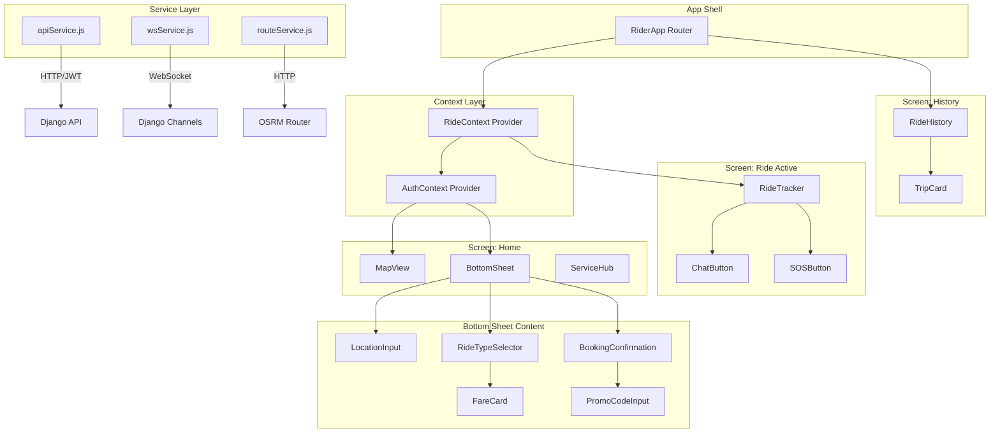
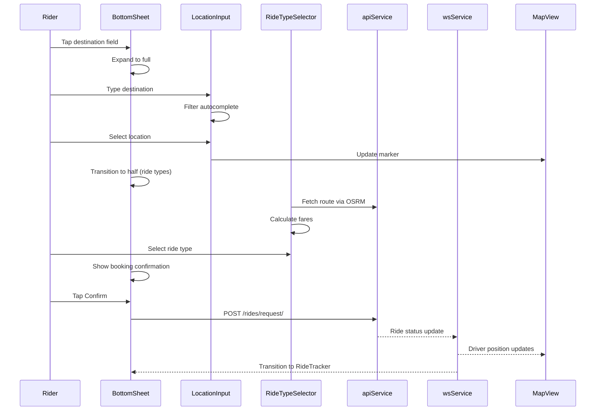

# Design Document: Rider App UI Refresh

## Overview

This design decomposes the monolithic `RiderDashboard.js` (~1700 lines) and `RiderApp.js` (~500 lines) into a focused, component-driven architecture with a map-first experience. The redesign replaces Google Maps with Leaflet (already in `package.json`), introduces a gesture-driven bottom sheet interaction model, and applies consistent Yala design tokens across all rider-facing UI.

The architecture preserves all existing backend integration (Django REST ride endpoints, OSRM routing, Django Channels WebSocket) while restructuring the frontend into small, testable components with centralized state management via React Context.

### Key Design Decisions

1. **Leaflet over Google Maps** — The project already depends on `leaflet` and `react-leaflet`. Leaflet is free, open-source, and works without API key restrictions in Mauritania's low-connectivity environment.
2. **CSS Custom Properties for Design Tokens** — A single `tokens.css` file defines all brand values. Components reference variables, not hardcoded hex strings.
3. **Bottom Sheet as primary interaction surface** — Rather than page transitions, the bottom sheet slides between states (collapsed → half → full), keeping the map always visible for spatial context.
4. **React Context for state** — A `RideContext` provides shared ride/booking state. No external state library needed given the app's scope.
5. **Dedicated API and WebSocket service modules** — Centralized modules replace scattered `fetch`/`axios` calls throughout components.

## Architecture



### Component Interaction Flow



## Components and Interfaces

### 1. MapView

**Path:** `frontend/src/rider/components/MapView.js`

```typescript
interface MapViewProps {
  center: [number, number];          // [lat, lng] - city center or rider location
  zoom?: number;                     // default 13
  markers?: MapMarker[];             // pickup, destination, driver, stops
  routePath?: [number, number][];    // polyline coordinates from OSRM
  fitBounds?: boolean;               // auto-fit to show all markers
  onMapClick?: (latlng: [number, number]) => void;
}

interface MapMarker {
  id: string;
  position: [number, number];
  type: 'pickup' | 'destination' | 'stop' | 'driver';
  label?: string;
  animate?: boolean;                 // smooth position transitions for driver
}
```

**Responsibilities:**
- Render full-screen Leaflet map via `react-leaflet`
- Display route polylines between pickup, stops, and destination
- Animate driver marker position using CSS transitions (updated every 2s via WebSocket)
- Fit bounds to show complete route when both pickup and destination are set
- Use Yala-branded map tile styling

### 2. BottomSheet

**Path:** `frontend/src/rider/components/BottomSheet.js`

```typescript
interface BottomSheetProps {
  state: 'collapsed' | 'half' | 'full';
  onStateChange: (state: 'collapsed' | 'half' | 'full') => void;
  children: React.ReactNode;
}
```

**Responsibilities:**
- Three snap positions: collapsed (80px peek), half (50% viewport), full (90% viewport)
- Touch/pointer gesture detection for swipe up/down
- CSS `transform: translateY()` with `transition: transform 300ms ease-out`
- Pass-through pointer events to map when collapsed
- Manage content visibility based on current state

### 3. LocationInput

**Path:** `frontend/src/rider/components/LocationInput.js`

```typescript
interface LocationInputProps {
  label: string;                     // "Pickup" or "Destination"
  value: string;
  city: string;
  savedPlaces?: SavedPlace[];
  onSelect: (location: Location) => void;
  onFocus?: () => void;
}

interface Location {
  label: string;
  position: [number, number];
  city: string;
}

interface SavedPlace {
  key: 'home' | 'work';
  label: string;
  position: [number, number];
}
```

**Responsibilities:**
- Text input with debounced filtering against `getLocationsByCity()`
- Display autocomplete dropdown sorted by relevance (starts-with first, then contains)
- Show saved places (Home, Work) as quick-select chips above results
- Emit selected location to parent for map marker update

### 4. RideTypeSelector

**Path:** `frontend/src/rider/components/RideTypeSelector.js`

```typescript
interface RideTypeSelectorProps {
  distance: number;                  // km from route
  etaMinutes?: number;               // from OSRM
  selectedType: RideTypeKey;
  onSelect: (type: RideTypeKey) => void;
}

type RideTypeKey = 'regular' | 'comfort' | 'xl' | 'share';
```

**Responsibilities:**
- Horizontal scroll container with `overflow-x: auto` and `scroll-snap-type: x mandatory`
- Render a `FareCard` for each ride type
- Highlight selected card with brand green border
- Calculate fare per type using `calculateFare()` from `marketConfig.js`

### 5. FareCard

**Path:** `frontend/src/rider/components/FareCard.js`

```typescript
interface FareCardProps {
  rideType: RideTypeKey;
  label: string;                     // "Sakho", "Comfort", "XL", "Share"
  fare: number;                      // calculated MRU amount
  discountedFare?: number;           // if promo applied
  eta: string;                       // e.g. "3 min"
  capacity: string;                  // e.g. "1-4" or "Shared"
  selected: boolean;
  onSelect: () => void;
}
```

**Responsibilities:**
- Display ride type icon, name, fare (with strikethrough if discounted), ETA, and capacity
- Visual highlight when `selected` is true
- Apply `scroll-snap-align: start` for scroll snapping

### 6. BookingConfirmation

**Path:** `frontend/src/rider/components/BookingConfirmation.js`

```typescript
interface BookingConfirmationProps {
  pickup: Location;
  destination: Location;
  stops: Location[];
  rideType: RideTypeKey;
  fare: number;
  discountedFare?: number;
  promoCode?: string;
  onConfirm: () => void;
  onPromoApply: (code: string) => void;
  loading: boolean;
  error?: string;
}
```

**Responsibilities:**
- Display summary of pickup, destination, stops, ride type, and fare
- Include `PromoCodeInput` component for discount application
- Confirm button with loading spinner and duplicate-submission prevention
- Profile completeness check before allowing confirmation
- Show error notification on failure

### 7. RideTracker

**Path:** `frontend/src/rider/components/RideTracker.js`

```typescript
interface RideTrackerProps {
  ride: ActiveRide;
  driverPosition?: [number, number];
}

interface ActiveRide {
  id: number;
  status: RideStatus;
  driver_name: string;
  driver_picture?: string;
  vehicle: string;
  plate_number: string;
  pickup: Location;
  destination: Location;
  stops: Location[];
  fare: number;
  pin_code: string;
  eta_minutes?: number;
}

type RideStatus = 'requested' | 'pending' | 'accepted' | 'driver_arriving' |
                  'driver_arrived' | 'in_progress' | 'completed' | 'cancelled';
```

**Responsibilities:**
- Display driver info (name, photo, vehicle, plate)
- Step-by-step progress indicator (Driver Arriving → Arrived → In Progress → Completed)
- Live ETA display updated via WebSocket
- Ride PIN code display
- Cancel button (visible when status is cancellable)
- Chat button and SOS button access

### 8. ServiceHub

**Path:** `frontend/src/rider/components/ServiceHub.js`

```typescript
interface ServiceHubProps {
  onNavigate: (path: string) => void;
}
```

**Responsibilities:**
- Three service tiles: Delivery, Intercity, Schedule
- Each tile is a 44x44px minimum tap target with icon and label
- Horizontal layout fitting within 360px viewport without scroll
- Navigate to respective booking flows on tap

### 9. TripCard

**Path:** `frontend/src/rider/components/TripCard.js`

```typescript
interface TripCardProps {
  trip: TripSummary;
  onExpand: (tripId: number) => void;
  expanded: boolean;
}

interface TripSummary {
  id: number;
  date: string;
  pickup_address: string;
  destination_address: string;
  fare: number;
  ride_type: RideTypeKey;
  status: RideStatus;
  driver_name?: string;
  rating?: number;
  route_path?: [number, number][];
}
```

### 10. RideHistory

**Path:** `frontend/src/rider/components/RideHistory.js`

```typescript
interface RideHistoryProps {}
// Fetches data internally via apiService
```

**Responsibilities:**
- Fetch ride history from `/rides/history/` with JWT auth
- Render list of `TripCard` components ordered by most recent
- Expandable detail view with route map, driver info, rating
- Empty state message when no history

### Service Modules

#### apiService.js

**Path:** `frontend/src/rider/services/apiService.js`

```typescript
// Centralized API client - replaces scattered fetch/axios calls
const apiService = {
  getToken: () => string | null,
  requestRide: (params: RideRequestParams) => Promise<RideResponse>,
  cancelRide: (rideId: number, reason: string) => Promise<CancelResponse>,
  getRideHistory: () => Promise<TripSummary[]>,
  validatePromo: (code: string) => Promise<PromoResult>,
  getActiveRide: () => Promise<ActiveRide | null>,
  getRiderProfile: () => Promise<RiderProfile>,
};
```

#### wsService.js

**Path:** `frontend/src/rider/services/wsService.js`

```typescript
// Wraps existing socket.js with typed subscription interface
const wsService = {
  subscribeRideUpdates: (callback: (data: RideUpdate) => void) => () => void,
  subscribeDriverPosition: (rideId: number, callback: (pos: [number, number]) => void) => () => void,
};
```

#### routeService.js

**Path:** `frontend/src/rider/services/routeService.js`

```typescript
// OSRM routing - extracted from RiderDashboard.js fetchDrivingRoute
const routeService = {
  getRoute: (points: [number, number][]) => Promise<RouteResult | null>,
};

interface RouteResult {
  points: [number, number][];
  distanceKm: number;
  etaMinutes: number;
}
```

## Data Models

### RideContext State

```typescript
interface RideState {
  // Booking state
  city: string;
  pickup: Location | null;
  destination: Location | null;
  stops: Location[];                 // max 3 intermediate stops
  rideType: RideTypeKey;
  fare: number;
  discountedFare?: number;
  promoCode?: string;
  routePath: [number, number][];
  routeInfo: RouteResult | null;

  // Active ride state
  currentRide: ActiveRide | null;
  driverPosition: [number, number] | null;

  // UI state
  bookingStep: 'idle' | 'location' | 'rideType' | 'confirm' | 'searching' | 'tracking';
  bottomSheetState: 'collapsed' | 'half' | 'full';
  loading: boolean;
  error: string | null;
}
```

### RideContext Actions

```typescript
type RideAction =
  | { type: 'SET_PICKUP'; payload: Location }
  | { type: 'SET_DESTINATION'; payload: Location }
  | { type: 'ADD_STOP'; payload: Location }
  | { type: 'REMOVE_STOP'; payload: number }
  | { type: 'SET_RIDE_TYPE'; payload: RideTypeKey }
  | { type: 'SET_ROUTE'; payload: RouteResult }
  | { type: 'SET_FARE'; payload: { fare: number; discountedFare?: number } }
  | { type: 'SET_PROMO'; payload: string }
  | { type: 'REQUEST_RIDE' }
  | { type: 'RIDE_ACCEPTED'; payload: ActiveRide }
  | { type: 'RIDE_UPDATE'; payload: Partial<ActiveRide> }
  | { type: 'DRIVER_POSITION'; payload: [number, number] }
  | { type: 'RIDE_COMPLETED' }
  | { type: 'RIDE_CANCELLED' }
  | { type: 'SET_BOOKING_STEP'; payload: RideState['bookingStep'] }
  | { type: 'SET_ERROR'; payload: string | null }
  | { type: 'RESET_BOOKING' };
```

### API Request/Response Models

```typescript
interface RideRequestParams {
  pickup_latitude: number;
  pickup_longitude: number;
  destination_latitude: number;
  destination_longitude: number;
  stops: { latitude: number; longitude: number }[];
  ride_type: RideTypeKey;
  distance_km: number;
  estimated_fare: number;
  promo_code?: string;
}

interface RideResponse {
  id: number;
  status: RideStatus;
  pin_code: string;
  estimated_fare: number;
  pickup_address: string;
  destination_address: string;
}

interface CancelResponse {
  success: boolean;
  cancellation_fee?: number;
  message?: string;
}

interface PromoResult {
  valid: boolean;
  discount_percent?: number;
  discount_amount?: number;
  message?: string;
}

interface RideUpdate {
  type: 'status_change' | 'driver_location' | 'eta_update';
  ride_id: number;
  status?: RideStatus;
  driver_latitude?: number;
  driver_longitude?: number;
  eta_minutes?: number;
}
```

### Design Tokens

```css
/* frontend/src/rider/tokens.css */
:root {
  /* Brand Colors */
  --yala-green: #00A651;
  --yala-green-soft: rgba(0, 166, 81, 0.14);
  --yala-green-border: rgba(0, 166, 81, 0.35);
  --yala-gold: #D4AF37;
  --yala-gold-soft: rgba(212, 175, 55, 0.14);
  --yala-navy: #0B1220;
  --yala-navy-soft: rgba(11, 18, 32, 0.7);
  --yala-white: #FFFFFF;
  --yala-gray-50: #F8FAFC;
  --yala-gray-100: #F1F5F9;
  --yala-gray-300: #CBD5E1;
  --yala-gray-500: #64748B;
  --yala-gray-700: #334155;

  /* Spacing */
  --space-xs: 4px;
  --space-sm: 8px;
  --space-md: 16px;
  --space-lg: 24px;
  --space-xl: 32px;
  --space-2xl: 48px;

  /* Typography */
  --font-family: -apple-system, BlinkMacSystemFont, 'Segoe UI', Roboto, sans-serif;
  --font-size-xs: 11px;
  --font-size-sm: 13px;
  --font-size-md: 15px;
  --font-size-lg: 18px;
  --font-size-xl: 22px;
  --font-size-2xl: 28px;
  --font-weight-regular: 400;
  --font-weight-medium: 500;
  --font-weight-semibold: 600;
  --font-weight-bold: 700;

  /* Radii */
  --radius-sm: 6px;
  --radius-md: 12px;
  --radius-lg: 20px;
  --radius-full: 9999px;

  /* Shadows */
  --shadow-sm: 0 1px 3px rgba(0, 0, 0, 0.08);
  --shadow-md: 0 4px 12px rgba(0, 0, 0, 0.12);
  --shadow-lg: 0 8px 24px rgba(0, 0, 0, 0.16);
  --shadow-sheet: 0 -4px 20px rgba(0, 0, 0, 0.1);

  /* Transitions */
  --transition-fast: 150ms ease-out;
  --transition-normal: 300ms ease-out;
  --transition-slow: 500ms ease-out;

  /* Layout */
  --bottom-sheet-peek: 80px;
  --bottom-sheet-half: 50vh;
  --bottom-sheet-full: 90vh;
  --tap-target-min: 44px;
  --safe-area-bottom: env(safe-area-inset-bottom, 0px);
}
```

## Correctness Properties

*A property is a characteristic or behavior that should hold true across all valid executions of a system — essentially, a formal statement about what the system should do. Properties serve as the bridge between human-readable specifications and machine-verifiable correctness guarantees.*

### Property 1: Location autocomplete filter correctness

*For any* query string and city, all locations returned by the autocomplete filter SHALL contain the query as a case-insensitive substring of the location label, AND no location in the city's dataset that contains the query shall be excluded from the results.

**Validates: Requirements 2.2**

### Property 2: Stops constraint invariant

*For any* sequence of add-stop actions applied to the booking state, the stops array length SHALL never exceed 3, and any attempt to add a 4th stop SHALL be rejected without modifying the existing stops.

**Validates: Requirements 2.4**

### Property 3: Fare calculation correctness

*For any* valid ride type (regular, comfort, xl, share) and any positive distance in kilometers, `calculateFare(rideType, distance)` SHALL return `round((base + distance * perKm) * 100) / 100` where base and perKm are the configured values for that ride type.

**Validates: Requirements 3.5**

### Property 4: Booking state to API payload transformation

*For any* valid booking state with pickup coordinates, destination coordinates, 0-3 stops, a ride type, distance, and fare, the ride request payload sent to `/rides/request/` SHALL contain all of: pickup_latitude, pickup_longitude, destination_latitude, destination_longitude, stops array with correct length, ride_type matching selection, distance_km, and estimated_fare — with values matching the booking state.

**Validates: Requirements 4.1, 4.2**

### Property 5: Profile completeness guard

*For any* rider profile object, if either `profile_picture` is empty/null OR `phone_number` is empty/null, then the booking confirmation SHALL be blocked and a profile completion prompt SHALL be displayed. If both are present, booking SHALL proceed.

**Validates: Requirements 4.3**

### Property 6: Ride status to UI state mapping

*For any* ride status value, `getStatusStepIndex(status)` SHALL return a deterministic step index, AND the cancel button SHALL be visible if and only if the status is in the set {requested, pending, accepted, driver_arriving, driver_arrived}.

**Validates: Requirements 5.4, 6.1**

### Property 7: Bottom sheet state machine transitions

*For any* current bottom sheet state (collapsed, half, full), a swipe-up gesture SHALL transition to the next higher state (collapsed→half, half→full, full→full), and a swipe-down gesture SHALL transition to the next lower state (full→half, half→collapsed, collapsed→collapsed). The resulting state SHALL always be one of the three valid states.

**Validates: Requirements 11.1, 11.2, 11.3**

### Property 8: Ride history sort order

*For any* list of trip records with date fields, the rendered ride history SHALL display trips in strictly descending chronological order (most recent first).

**Validates: Requirements 8.1**

### Property 9: Discount fare computation

*For any* original fare amount and valid promo discount (either a percentage 1-100 or a fixed amount less than the fare), the discounted fare SHALL equal `originalFare - discountAmount` (or `originalFare * (1 - discountPercent/100)`) and both the original and discounted values SHALL be present in the fare display.

**Validates: Requirements 15.2, 15.4**

### Property 10: Trip card content completeness

*For any* valid trip summary object containing date, pickup_address, destination_address, fare, ride_type, and status, the rendered TripCard SHALL include all six data fields in its output.

**Validates: Requirements 8.2**

## Error Handling

### API Errors

| Scenario | Behavior |
|----------|----------|
| Ride request fails (network/server) | Display error message from API response in dismissible toast notification. Keep booking state intact for retry. |
| Promo code invalid/expired | Display specific rejection reason from API. Clear promo input but preserve fare at original amount. |
| Cancellation fails | Display error message. Keep ride in active state without status change. |
| Ride history fetch fails | Display error state with retry button. Cache last successful response for offline display. |
| JWT token expired | Redirect to login screen. Clear stale token from localStorage. |

### WebSocket Errors

| Scenario | Behavior |
|----------|----------|
| Connection lost | Auto-reconnect with exponential backoff (1s → 1.5s → ... → 10s max). Show subtle "Reconnecting..." indicator. |
| Invalid message format | Silently ignore malformed messages. Log to console in development. |
| Connection timeout | Fall back to polling `/rides/history/` every 4 seconds (existing pattern from RiderDashboard.js). |

### Map Errors

| Scenario | Behavior |
|----------|----------|
| OSRM route fetch fails | Display straight-line distance estimate. Show "Route unavailable" notice. Use haversine distance for fare calculation. |
| Tile loading failure | Display fallback gray background with location markers still visible. |
| Geolocation denied | Default to city center (MARKET.defaultCity). Prompt user to enable location for better experience. |

### Input Validation

| Scenario | Behavior |
|----------|----------|
| Empty destination | Prevent progression past location step. Show placeholder prompt. |
| Location outside service area | Display "Location not in service area" using `isPointInServiceArea()`. Prevent booking. |
| Stop duplicate of pickup/destination | Reject addition silently. Show brief feedback "Stop already in route." |

## Testing Strategy

### Property-Based Testing

**Library:** [fast-check](https://github.com/dubzzz/fast-check) (JavaScript property-based testing library compatible with Jest/React Testing Library already configured in the project).

**Configuration:**
- Minimum 100 iterations per property test
- Each test tagged with: `Feature: rider-app-ui-refresh, Property {N}: {title}`
- Tests run with `react-scripts test` (existing Jest setup)

**Property tests to implement (10 properties):**

1. `filterLocations` — generates random query strings and verifies filter correctness
2. `addStop` reducer — generates random stop sequences, verifies max-3 invariant
3. `calculateFare` — generates random ride types and distances, verifies formula
4. `buildRideRequest` — generates random booking states, verifies payload structure
5. `isProfileComplete` — generates random profile objects, verifies guard behavior
6. `getStatusStepIndex` / `isCancellable` — generates random statuses, verifies mapping
7. `bottomSheetTransition` — generates random state + gesture sequences, verifies transitions
8. `sortTripsByDate` — generates random trip lists, verifies sort order
9. `applyDiscount` — generates random fares and discounts, verifies computation
10. `renderTripCard` — generates random trip data, verifies all fields present

### Unit Tests (Example-Based)

- MapView renders with correct center and markers
- BottomSheet pointer events pass-through when collapsed
- ServiceHub renders all 3 service tiles with correct navigation
- RideTracker shows PIN code
- SOS button styling is visually distinct
- Saved places quick-select populates correct addresses
- Booking confirmation blocks when profile incomplete
- Cancel modal requires reason selection

### Integration Tests

- WebSocket ride status updates flow through to RideTracker UI
- Driver position updates animate marker on MapView
- API error responses display in notification component
- Full booking flow: location → ride type → confirm → tracking transition
- Chat message delivery via WebSocket

### Visual / Layout Tests

- Responsive rendering at 320px, 375px, 414px, 428px without horizontal overflow
- Design tokens applied consistently (no hardcoded brand colors)
- 44px minimum tap targets on all interactive elements
- Side panel layout activates at 768px+ breakpoint
- CSS transition durations ≤ 300ms

