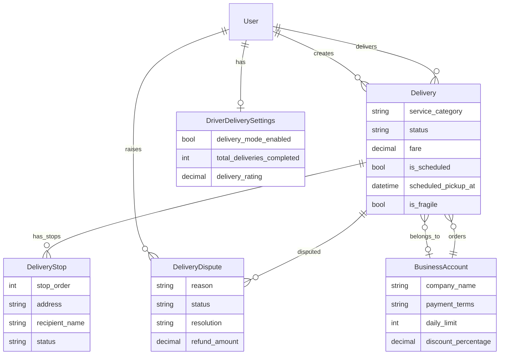
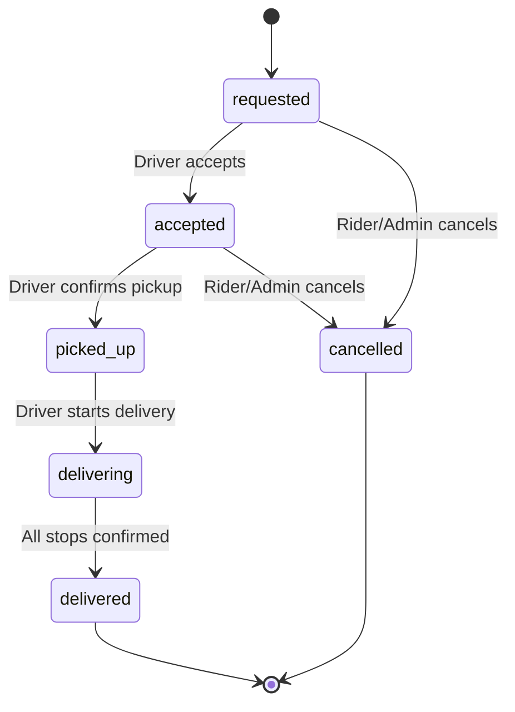

# Design Document: Yala Delivery Service

## Overview

The Yala Delivery Service expands the existing basic delivery system into a multi-service platform supporting Food, Package, Document, Pharmacy, and Shopping delivery. The design extends the current `deliveries` Django app (which already has a `Delivery` model, serializers, views, and URLs) with service categories, delivery stops, scheduling, disputes, real-time tracking via WebSocket, proof of delivery (photo + signature), and business accounts.

The feature integrates with the existing Rider App (delivery button on home screen), Driver App (delivery mode toggle), and Admin Dashboard (analytics and dispute management).

## Architecture

The delivery service builds on the existing `deliveries` app and integrates with other existing apps.

```mermaid
graph TD
    subgraph "Rider App"
        RC[DeliveryCustomerApp]
        RT[Delivery Tracking]
        RD[Dispute Form]
    end

    subgraph "Driver App"
        DM[Delivery Mode Toggle]
        DW[Delivery Workflow]
        DP[Proof of Delivery]
    end

    subgraph "Admin Dashboard"
        AA[Delivery Analytics]
        AD[Dispute Management]
        AB[Business Accounts]
    end

    subgraph "Django Backend"
        subgraph "deliveries app (extended)"
            DV[Delivery Views]
            DS[Delivery Serializers]
            DModels[Delivery Models]
            DSvc[DeliveryService]
            DPrice[PricingService]
            DDispute[DisputeService]
        end

        subgraph "Existing Apps"
            WS[WebSocket Consumer]
            NOTIF[Notifications App]
            DRIVER[DriverProfile]
            AUTH[AuthApp / User]
        end
    end

    RC -->|POST /deliveries/request/| DV
    RT -->|WebSocket delivery_{id}| WS
    RD -->|POST /deliveries/{id}/dispute/| DV
    DM -->|PATCH /deliveries/driver/mode/| DV
    DW -->|POST /deliveries/{id}/pickup/| DV
    DP -->|POST /deliveries/{id}/confirm/| DV
    AA -->|GET /deliveries/admin/analytics/| DV
    AD -->|GET/POST /deliveries/admin/disputes/| DV
    AB -->|CRUD /deliveries/admin/business-accounts/| DV

    DV --> DS
    DV --> DSvc
    DSvc --> DModels
    DSvc --> DPrice
    DSvc --> DDispute
    DSvc --> WS
    DSvc --> NOTIF
    DSvc --> DRIVER
    DModels --> AUTH
```

**Key architectural decisions:**

1. **Extend existing `deliveries` app** — The app already has models, views, and URLs. We add new models and extend existing ones rather than creating a new app.
2. **Service layer** — `DeliveryService`, `PricingService`, and `DisputeService` encapsulate business logic.
3. **WebSocket reuse** — Use the existing channel layer infrastructure with delivery-specific groups.
4. **Multi-stop via `DeliveryStop` model** — Separate model for stops, linked to the Delivery via FK.
5. **Backward compatibility** — Existing single-stop deliveries continue to work; stops are optional.

## Components and Interfaces

### REST API Endpoints (New/Modified)

| Endpoint | Method | Auth | Description |
|----------|--------|------|-------------|
| `POST /deliveries/request/` | POST | Rider | Create delivery (extended with category, stops, schedule) |
| `GET /deliveries/mine/` | GET | Any | List user's deliveries (existing, extended response) |
| `GET /deliveries/available/` | GET | Driver | Available delivery requests (existing) |
| `GET /deliveries/{id}/` | GET | Auth | Delivery detail with stops and tracking |
| `POST /deliveries/{id}/accept/` | POST | Driver | Accept delivery (existing) |
| `POST /deliveries/{id}/pickup/` | POST | Driver | Confirm pickup (existing) |
| `POST /deliveries/{id}/start/` | POST | Driver | Start delivering (existing) |
| `POST /deliveries/{id}/confirm/` | POST | Driver | Confirm delivery with code + proof (extended) |
| `POST /deliveries/{id}/cancel/` | POST | Rider/Admin | Cancel delivery (existing) |
| `POST /deliveries/{id}/stops/{stop_id}/confirm/` | POST | Driver | Confirm individual stop delivery |
| `POST /deliveries/{id}/dispute/` | POST | Rider | Raise a dispute |
| `GET /deliveries/{id}/tracking/` | GET | Rider | Get current driver location and ETA |
| `PATCH /deliveries/driver/mode/` | PATCH | Driver | Toggle delivery mode on/off |
| `GET /deliveries/admin/analytics/` | GET | Admin | Delivery analytics with filters |
| `GET /deliveries/admin/disputes/` | GET | Admin | List open disputes |
| `POST /deliveries/admin/disputes/{id}/resolve/` | POST | Admin | Resolve a dispute |
| `CRUD /deliveries/admin/business-accounts/` | CRUD | Admin | Business account management |
| `GET /deliveries/categories/` | GET | Public | List available service categories with pricing |

### Service Layer

```python
class DeliveryPricingService:
    def calculate_fare(self, category: str, distance_km: Decimal, stops_count: int,
                       fragile: bool, express: bool, business_account: BusinessAccount = None) -> FareBreakdown
    def get_category_base_fee(self, category: str) -> Decimal
    def calculate_driver_earning(self, fare: Decimal) -> Decimal  # 80% of fare
    def calculate_platform_commission(self, fare: Decimal) -> Decimal  # 20% of fare

class DeliveryService:
    def create_delivery(self, rider, data) -> Delivery
    def assign_driver(self, delivery, driver) -> None
    def transition_status(self, delivery, new_status, **kwargs) -> None
    def verify_recipient_code(self, delivery_or_stop, code: str) -> bool
    def broadcast_status_update(self, delivery) -> None
    def broadcast_location(self, delivery, lat, lng) -> None
    def handle_scheduled_deliveries() -> None  # Celery task
    def calculate_eta(self, delivery) -> int  # minutes

class DisputeService:
    def create_dispute(self, delivery, rider, reason, description, photo=None) -> DeliveryDispute
    def resolve_dispute(self, dispute, admin, action, notes) -> None
    def get_analytics(self, date_from, date_to) -> dict
```

### WebSocket Events

| Event | Direction | Payload |
|-------|-----------|---------|
| `delivery_status_update` | Server → Rider/Driver | `{delivery_id, status, timestamp}` |
| `delivery_location_update` | Server → Rider | `{delivery_id, lat, lng, eta_minutes}` |
| `delivery_assigned` | Server → Rider | `{delivery_id, driver_name, driver_photo, vehicle, plate}` |
| `delivery_new_request` | Server → Drivers | `{delivery_id, pickup, destination, fare, category, distance}` |
| `delivery_stop_completed` | Server → Rider | `{delivery_id, stop_id, stop_order, remaining_stops}` |

## Data Models

### Extended Delivery Model (modify existing)

```python
# Add new fields to existing Delivery model
class Delivery(models.Model):
    # ... existing fields remain unchanged ...

    # NEW fields
    SERVICE_CATEGORY_CHOICES = [
        ("food", "Food Delivery"),
        ("package", "Package Delivery"),
        ("document", "Document Delivery"),
        ("pharmacy", "Pharmacy Delivery"),
        ("shopping", "Shopping Delivery"),
    ]

    service_category = models.CharField(max_length=20, choices=SERVICE_CATEGORY_CHOICES, default="package")
    is_fragile = models.BooleanField(default=False)
    weight_kg = models.DecimalField(max_digits=5, decimal_places=2, null=True, blank=True)
    scheduled_pickup_at = models.DateTimeField(null=True, blank=True)
    is_scheduled = models.BooleanField(default=False)
    business_account = models.ForeignKey("BusinessAccount", null=True, blank=True, on_delete=models.SET_NULL)

    # Category-specific fields
    restaurant_name = models.CharField(max_length=150, blank=True, default="")  # Food
    preparation_time_minutes = models.PositiveIntegerField(null=True, blank=True)  # Food
    prescription_reference = models.CharField(max_length=100, blank=True, default="")  # Pharmacy
    is_temperature_sensitive = models.BooleanField(default=False)  # Pharmacy
    shopping_list = models.TextField(blank=True, default="")  # Shopping
    max_budget_mru = models.DecimalField(max_digits=10, decimal_places=2, null=True, blank=True)  # Shopping

    # Proof of delivery
    recipient_signature = models.ImageField(upload_to="deliveries/signatures/", null=True, blank=True)

    # Pricing breakdown
    base_fee = models.DecimalField(max_digits=10, decimal_places=2, default=0)
    distance_fee = models.DecimalField(max_digits=10, decimal_places=2, default=0)
    category_surcharge = models.DecimalField(max_digits=10, decimal_places=2, default=0)
    extra_stop_fee = models.DecimalField(max_digits=10, decimal_places=2, default=0)
    express_surcharge = models.DecimalField(max_digits=10, decimal_places=2, default=0)
    fragile_surcharge = models.DecimalField(max_digits=10, decimal_places=2, default=0)
    discount_amount = models.DecimalField(max_digits=10, decimal_places=2, default=0)
    driver_earning = models.DecimalField(max_digits=10, decimal_places=2, default=0)
    platform_commission = models.DecimalField(max_digits=10, decimal_places=2, default=0)
```

### DeliveryStop (new model)

```python
class DeliveryStop(models.Model):
    STOP_STATUS_CHOICES = [
        ("pending", "Pending"),
        ("arrived", "Arrived"),
        ("delivered", "Delivered"),
    ]

    delivery = models.ForeignKey(Delivery, on_delete=models.CASCADE, related_name="stops")
    stop_order = models.PositiveIntegerField()
    address = models.CharField(max_length=255)
    latitude = models.FloatField()
    longitude = models.FloatField()
    recipient_name = models.CharField(max_length=120)
    recipient_phone = models.CharField(max_length=30)
    recipient_code_hash = models.CharField(max_length=255)
    package_description = models.TextField(blank=True, default="")
    status = models.CharField(max_length=20, choices=STOP_STATUS_CHOICES, default="pending")
    arrived_at = models.DateTimeField(null=True, blank=True)
    delivered_at = models.DateTimeField(null=True, blank=True)
    proof_photo = models.ImageField(upload_to="deliveries/stop_proofs/", null=True, blank=True)

    class Meta:
        ordering = ["stop_order"]
        unique_together = [("delivery", "stop_order")]
        indexes = [
            models.Index(fields=["delivery", "status"], name="stop_delivery_status_idx"),
        ]
```

### DeliveryDispute (new model)

```python
class DeliveryDispute(models.Model):
    REASON_CHOICES = [
        ("damaged", "Package Damaged"),
        ("lost", "Package Lost"),
        ("late", "Delivery Too Late"),
        ("wrong_item", "Wrong Item Delivered"),
        ("other", "Other"),
    ]

    RESOLUTION_CHOICES = [
        ("refund_full", "Full Refund"),
        ("refund_partial", "Partial Refund"),
        ("reject", "Dispute Rejected"),
        ("warn_driver", "Driver Warning Issued"),
    ]

    STATUS_CHOICES = [
        ("open", "Open"),
        ("in_review", "In Review"),
        ("resolved", "Resolved"),
    ]

    delivery = models.ForeignKey(Delivery, on_delete=models.CASCADE, related_name="disputes")
    rider = models.ForeignKey(settings.AUTH_USER_MODEL, on_delete=models.CASCADE, related_name="delivery_disputes")
    reason = models.CharField(max_length=20, choices=REASON_CHOICES)
    description = models.TextField(max_length=500)
    photo_evidence = models.ImageField(upload_to="deliveries/disputes/", null=True, blank=True)
    status = models.CharField(max_length=20, choices=STATUS_CHOICES, default="open")
    resolution = models.CharField(max_length=20, choices=RESOLUTION_CHOICES, null=True, blank=True)
    resolution_notes = models.TextField(blank=True, default="")
    resolved_by = models.ForeignKey(settings.AUTH_USER_MODEL, null=True, blank=True, on_delete=models.SET_NULL, related_name="resolved_disputes")
    refund_amount = models.DecimalField(max_digits=10, decimal_places=2, null=True, blank=True)
    created_at = models.DateTimeField(auto_now_add=True)
    resolved_at = models.DateTimeField(null=True, blank=True)

    class Meta:
        ordering = ["-created_at"]
        indexes = [
            models.Index(fields=["status", "-created_at"], name="dispute_status_created_idx"),
        ]
```

### BusinessAccount (new model)

```python
class BusinessAccount(models.Model):
    PAYMENT_TERMS_CHOICES = [
        ("prepaid", "Prepaid"),
        ("monthly", "Monthly Invoice"),
    ]

    company_name = models.CharField(max_length=200)
    tax_id = models.CharField(max_length=50, blank=True, default="")
    billing_address = models.TextField()
    contact_person = models.CharField(max_length=120)
    contact_phone = models.CharField(max_length=30)
    contact_email = models.EmailField()
    payment_terms = models.CharField(max_length=20, choices=PAYMENT_TERMS_CHOICES, default="prepaid")
    discount_percentage = models.DecimalField(max_digits=5, decimal_places=2, default=10)
    daily_limit = models.PositiveIntegerField(default=50)
    is_active = models.BooleanField(default=True)
    created_at = models.DateTimeField(auto_now_add=True)
    updated_at = models.DateTimeField(auto_now=True)

    class Meta:
        ordering = ["-created_at"]
```

### DriverDeliveryProfile (extend DriverProfile)

```python
# Add to existing DriverProfile or create a linked model
class DriverDeliverySettings(models.Model):
    driver = models.OneToOneField(settings.AUTH_USER_MODEL, on_delete=models.CASCADE, related_name="delivery_settings")
    delivery_mode_enabled = models.BooleanField(default=False)
    max_package_size = models.CharField(max_length=20, default="large")  # Largest they'll accept
    accepts_food = models.BooleanField(default=True)
    accepts_pharmacy = models.BooleanField(default=True)
    accepts_fragile = models.BooleanField(default=True)
    total_deliveries_completed = models.PositiveIntegerField(default=0)
    average_delivery_time_minutes = models.PositiveIntegerField(default=0)
    delivery_rating = models.DecimalField(max_digits=3, decimal_places=1, default=5.0)

    class Meta:
        indexes = [
            models.Index(fields=["delivery_mode_enabled"], name="driver_delivery_mode_idx"),
        ]
```

### Entity Relationship Diagram



## Pricing Engine

### Category Base Fees

| Category | Base Fee (MRU) |
|----------|---------------|
| Document | 40 |
| Small Package | 60 |
| Medium Package | 100 |
| Large Package | 180 |
| Food | 80 |
| Pharmacy | 70 |
| Shopping | 90 |

### Fare Formula

```
total_fare = base_fee + (distance_km × 22) + fragile_surcharge + express_surcharge + extra_stop_fee - discount
driver_earning = total_fare × 0.80
platform_commission = total_fare × 0.20
```

- **Fragile surcharge**: 30 MRU
- **Express surcharge**: 50 MRU (scheduled < 2 hours ahead)
- **Extra stop fee**: 25 MRU per additional stop beyond the first
- **Business discount**: 10% off total fare

## State Machine



Valid transitions remain backward-compatible with existing code.

## Error Handling

### Delivery Errors

| Scenario | HTTP Status | Error Code | Message |
|----------|-------------|------------|---------|
| Active delivery exists | 400 | `active_delivery_exists` | "Complete or cancel your active delivery before requesting another." |
| Invalid recipient code | 400 | `invalid_code` | "Recipient confirmation code is incorrect." |
| Invalid service category | 400 | `invalid_category` | "Invalid service category." |
| Too many stops | 400 | `max_stops_exceeded` | "Maximum 4 delivery stops allowed." |
| Schedule too soon | 400 | `schedule_too_soon` | "Scheduled pickup must be at least 30 minutes in the future." |
| Schedule too far | 400 | `schedule_too_far` | "Scheduled pickup cannot be more than 7 days ahead." |
| Business daily limit | 400 | `daily_limit_reached` | "Daily delivery limit reached for this business account." |
| Dispute window expired | 400 | `dispute_window_expired` | "Disputes must be raised within 48 hours of delivery." |
| Driver not approved | 403 | `driver_not_approved` | "Your driver application must be approved before accepting deliveries." |

## Testing Strategy

### Property-Based Testing (Hypothesis)

| Property | Description | Requirements |
|----------|-------------|--------------|
| P1 | Fare calculation: base + distance + surcharges = total | 6.1, 6.2, 6.3 |
| P2 | Driver earning = 80% of fare, commission = 20% | 6.7 |
| P3 | Multi-stop fare: each additional stop adds exactly 25 MRU | 8.4 |
| P4 | Business discount: always 10% off total fare | 11.3 |
| P5 | Scheduled delivery: pickup_time ∈ [now+30min, now+7days] | 7.3 |
| P6 | State machine: only valid transitions accepted | 5.3-5.9 |
| P7 | Recipient code verification: correct code → success, wrong → fail | 5.6 |
| P8 | Dispute window: only within 48 hours of delivery | 10.1 |
| P9 | Max stops: never more than 4 | 8.1 |
| P10 | Delivery complete: only when all stops confirmed | 8.7 |

### Integration Tests

- Full delivery flow: request → accept → pickup → deliver → confirm
- Multi-stop flow: request with 3 stops → confirm each → delivery complete
- Scheduled delivery: create → wait → broadcast → accept → complete
- Dispute flow: complete delivery → raise dispute → admin resolves
- Business account: create account → request delivery → verify discount applied
- WebSocket: verify events broadcast on each status change

### Test Organization

```
backend/taxi/tests/test_deliveries/
├── __init__.py
├── test_pricing.py          # Properties P1-P4
├── test_state_machine.py    # Property P6
├── test_scheduling.py       # Property P5
├── test_multi_stop.py       # Properties P3, P9, P10
├── test_disputes.py         # Property P8
├── test_verification.py     # Property P7
├── test_admin_api.py        # Admin endpoints
├── test_rider_api.py        # Rider endpoints
├── test_driver_api.py       # Driver endpoints
└── test_integration.py      # End-to-end flows
```
