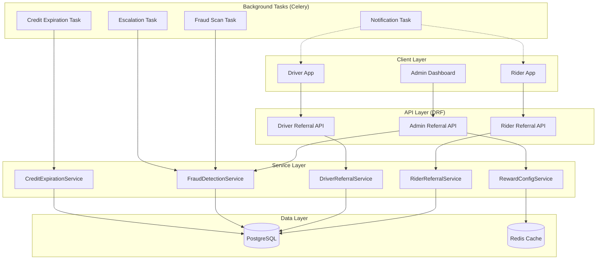
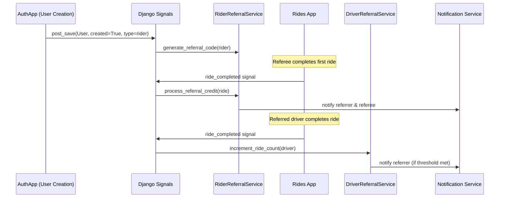
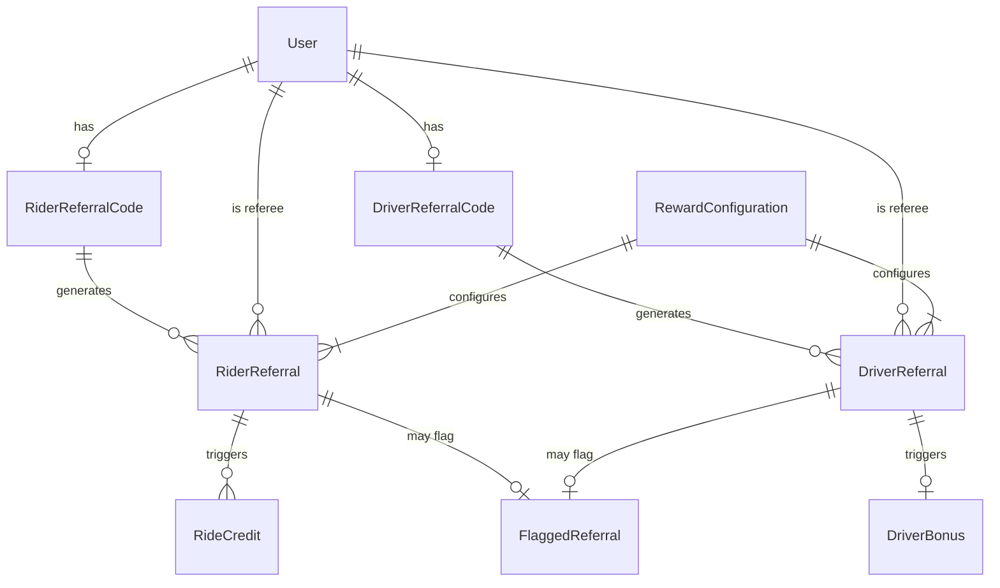

# Design Document

## Overview

The Yala Referral Program extends the existing `promotions` app into a dedicated `referrals` Django app that provides a comprehensive, configurable referral system for both Riders and Drivers. The system handles referral code generation, validation, tracking, credit/bonus issuance, fraud detection, analytics, and credit expiration.

**Key Design Decisions:**
- **New `referrals` app**: While `promotions` has basic referral code infrastructure, the requirements demand significantly richer functionality (driver referrals, fraud detection, admin analytics, configurable rewards, credit expiration). A dedicated app avoids bloating `promotions` and provides clean separation of concerns.
- **Reuse existing patterns**: Follows the project's established Django patterns (service layer with dataclasses, signals for event-driven logic, DRF serializers/views, `notifications.services` for push).
- **Celery for async tasks**: Time-based operations (expiration checks, fraud scans, delayed notifications) use Celery periodic tasks to avoid blocking request handling.
- **Admin via Django Admin + DRF endpoints**: The Admin Dashboard is implemented as Django Admin pages for configuration and custom DRF endpoints for analytics, consistent with existing admin patterns (e.g., `share_analytics`).

## Architecture



**Signal-based Event Flow:**



## Components and Interfaces

### 1. RiderReferralService

Handles all rider-to-rider referral logic.

```python
class RiderReferralService:
    MAX_CODE_ATTEMPTS = 5
    CODE_LENGTH = 8
    CODE_CHARSET = "ABCDEFGHIJKLMNOPQRSTUVWXYZ0123456789"

    def generate_referral_code(self, rider: User) -> str:
        """Generate or return existing 8-char alphanumeric code."""

    def get_referral_info(self, rider: User) -> RiderReferralInfo:
        """Return code, successful referral count, total credits earned."""

    def get_share_content(self, rider: User) -> ShareContent:
        """Return plain-text code and pre-formatted share message."""

    def validate_referral_code(self, code: str, referee: User) -> ValidationResult:
        """Validate code format, existence, referrer eligibility, self-referral."""

    def record_referral_signup(self, referee: User, code: str) -> None:
        """Record referral relationship after successful registration."""

    def process_first_ride_credit(self, ride) -> CreditIssuanceResult:
        """Issue credits to referrer and referee after referee's first ride."""

    def apply_credit_to_fare(self, rider: User, fare: Decimal) -> CreditApplicationResult:
        """Apply available ride credits as discount, reducing payment to >= 0."""

    def revoke_credits_for_ride(self, ride) -> None:
        """Revoke credits if referee's first ride is cancelled/reversed."""
```

### 2. DriverReferralService

Handles driver-to-driver referral logic.

```python
class DriverReferralService:
    MAX_CODE_ATTEMPTS = 5
    CODE_LENGTH = 8
    CODE_CHARSET = "ABCDEFGHIJKLMNOPQRSTUVWXYZ0123456789"

    def generate_referral_code(self, driver: User) -> str:
        """Generate code when driver reaches approved status."""

    def validate_referral_code(self, code: str, referee: User) -> ValidationResult:
        """Validate driver referral code."""

    def record_referral_signup(self, referee: User, code: str) -> None:
        """Record driver referral relationship with current threshold config."""

    def increment_ride_count(self, driver: User) -> None:
        """Increment referred driver's completed ride count."""

    def check_and_issue_bonus(self, referral: DriverReferral) -> BonusIssuanceResult:
        """Check threshold and issue bonus if met."""

    def get_referral_status(self, referrer: User) -> list[DriverReferralStatus]:
        """Return list of referred drivers with progress."""

    def expire_stale_referrals(self) -> int:
        """Mark referrals with 90 days of inactivity as expired."""

    def release_pending_bonuses(self, driver: User) -> int:
        """Release withheld bonuses when account is reinstated."""
```

### 3. FraudDetectionService

Analyzes referral activity for suspicious patterns.

```python
class FraudDetectionService:
    def check_device_fraud(self, device_id: str, timestamp: datetime) -> list[FlaggedReferral]:
        """Flag if 3+ signups from same device in 24h."""

    def check_velocity_fraud(self, referrer: User) -> Optional[FlaggedReferral]:
        """Flag if referrer exceeds daily credit threshold."""

    def check_ghost_account_fraud(self, referral: RiderReferral) -> Optional[FlaggedReferral]:
        """Flag if referee has no activity 48h after qualifying ride."""

    def approve_referral(self, flagged_id: int, admin: User) -> None:
        """Release withheld rewards."""

    def reject_referral(self, flagged_id: int, admin: User) -> None:
        """Revoke/deduct rewards."""

    def escalate_stale_flags(self) -> int:
        """Escalate flags unanswered for 30 days."""
```

### 4. RewardConfigService

Manages configurable reward parameters.

```python
class RewardConfigService:
    def get_active_config(self) -> RewardConfiguration:
        """Get current active config, cached in Redis."""

    def update_config(self, admin: User, **kwargs) -> RewardConfiguration:
        """Validate and update configuration, invalidate cache."""

    def validate_config_values(self, **kwargs) -> list[str]:
        """Return list of validation errors for proposed config values."""
```

### 5. CreditExpirationService

Handles time-based credit lifecycle.

```python
class CreditExpirationService:
    def expire_credits(self) -> int:
        """Mark expired credits, set remaining value to zero."""

    def send_expiration_reminders(self) -> int:
        """Send reminders for credits expiring in 7 days."""

    def is_credit_usable(self, credit: RideCredit) -> bool:
        """Check if credit is not expired and has remaining value."""
```

### 6. API Endpoints

| Endpoint | Method | Auth | Description |
|----------|--------|------|-------------|
| `/referrals/rider/code/` | GET | Rider | Get referral code + stats |
| `/referrals/rider/share/` | GET | Rider | Get shareable message |
| `/referrals/rider/validate/` | POST | Public | Validate code during signup |
| `/referrals/driver/code/` | GET | Driver | Get driver referral code |
| `/referrals/driver/status/` | GET | Driver | Get referred drivers progress |
| `/referrals/driver/validate/` | POST | Public | Validate driver referral code |
| `/referrals/admin/config/` | GET/PUT | Admin | View/update reward config |
| `/referrals/admin/analytics/` | GET | Admin | Get referral analytics |
| `/referrals/admin/flagged/` | GET | Admin | List flagged referrals |
| `/referrals/admin/flagged/<id>/approve/` | POST | Admin | Approve flagged referral |
| `/referrals/admin/flagged/<id>/reject/` | POST | Admin | Reject flagged referral |

## Data Models



### Models

```python
class RiderReferralCode(models.Model):
    """Unique referral code for a rider."""
    rider = models.OneToOneField(settings.AUTH_USER_MODEL, on_delete=models.CASCADE,
                                  related_name="rider_referral_code")
    code = models.CharField(max_length=8, unique=True, db_index=True)
    created_at = models.DateTimeField(auto_now_add=True)

    class Meta:
        constraints = [
            models.UniqueConstraint(fields=["code"], name="unique_rider_referral_code")
        ]


class DriverReferralCode(models.Model):
    """Unique referral code for a driver."""
    driver = models.OneToOneField(settings.AUTH_USER_MODEL, on_delete=models.CASCADE,
                                   related_name="driver_referral_code")
    code = models.CharField(max_length=8, unique=True, db_index=True)
    created_at = models.DateTimeField(auto_now_add=True)


class RiderReferral(models.Model):
    """Records a rider-to-rider referral relationship."""
    STATUS_CHOICES = [
        ("pending", "Pending"),        # Signed up, first ride not yet completed
        ("completed", "Completed"),    # First ride completed, credits issued
        ("revoked", "Revoked"),        # Credits revoked (ride cancelled)
        ("flagged", "Flagged"),        # Suspected fraud, rewards withheld
    ]

    referral_code = models.ForeignKey(RiderReferralCode, on_delete=models.CASCADE,
                                       related_name="referrals")
    referee = models.OneToOneField(settings.AUTH_USER_MODEL, on_delete=models.CASCADE,
                                    related_name="rider_referral_as_referee")
    status = models.CharField(max_length=20, choices=STATUS_CHOICES, default="pending")
    device_id = models.CharField(max_length=255, blank=True, default="")
    created_at = models.DateTimeField(auto_now_add=True)
    completed_at = models.DateTimeField(null=True, blank=True)

    class Meta:
        indexes = [
            models.Index(fields=["device_id", "created_at"]),
        ]


class DriverReferral(models.Model):
    """Records a driver-to-driver referral relationship."""
    STATUS_CHOICES = [
        ("pending", "Pending"),
        ("completed", "Completed"),
        ("expired", "Expired"),
    ]

    referral_code = models.ForeignKey(DriverReferralCode, on_delete=models.CASCADE,
                                       related_name="referrals")
    referee = models.OneToOneField(settings.AUTH_USER_MODEL, on_delete=models.CASCADE,
                                    related_name="driver_referral_as_referee")
    status = models.CharField(max_length=20, choices=STATUS_CHOICES, default="pending")
    ride_threshold = models.PositiveIntegerField()  # Snapshot from config at signup time
    completed_rides = models.PositiveIntegerField(default=0)
    last_ride_at = models.DateTimeField(null=True, blank=True)
    created_at = models.DateTimeField(auto_now_add=True)
    completed_at = models.DateTimeField(null=True, blank=True)
    expired_at = models.DateTimeField(null=True, blank=True)


class RideCredit(models.Model):
    """Referral credit for a rider, with expiration support."""
    STATUS_CHOICES = [
        ("active", "Active"),
        ("used", "Used"),
        ("expired", "Expired"),
        ("revoked", "Revoked"),
        ("withheld", "Withheld"),  # Fraud hold
    ]

    rider = models.ForeignKey(settings.AUTH_USER_MODEL, on_delete=models.CASCADE,
                               related_name="ride_credits")
    referral = models.ForeignKey(RiderReferral, on_delete=models.CASCADE,
                                  related_name="credits")
    original_amount = models.DecimalField(max_digits=10, decimal_places=2)
    remaining_amount = models.DecimalField(max_digits=10, decimal_places=2)
    status = models.CharField(max_length=20, choices=STATUS_CHOICES, default="active")
    credit_type = models.CharField(max_length=20,
                                    choices=[("referrer", "Referrer"), ("referee", "Referee")])
    expires_at = models.DateTimeField()
    reminder_sent = models.BooleanField(default=False)
    issued_at = models.DateTimeField(auto_now_add=True)
    used_at = models.DateTimeField(null=True, blank=True)
    revoked_at = models.DateTimeField(null=True, blank=True)

    class Meta:
        indexes = [
            models.Index(fields=["rider", "status"]),
            models.Index(fields=["expires_at", "status"]),
        ]


class DriverBonus(models.Model):
    """Bonus payment for driver referral."""
    STATUS_CHOICES = [
        ("issued", "Issued"),
        ("withheld", "Withheld"),     # Referrer suspended
        ("released", "Released"),      # Reinstated
        ("revoked", "Revoked"),        # Fraud
    ]

    referral = models.OneToOneField(DriverReferral, on_delete=models.CASCADE,
                                     related_name="bonus")
    referrer = models.ForeignKey(settings.AUTH_USER_MODEL, on_delete=models.CASCADE,
                                  related_name="driver_referral_bonuses")
    amount = models.DecimalField(max_digits=10, decimal_places=2)
    status = models.CharField(max_length=20, choices=STATUS_CHOICES, default="issued")
    issued_at = models.DateTimeField(auto_now_add=True)
    released_at = models.DateTimeField(null=True, blank=True)
    revoked_at = models.DateTimeField(null=True, blank=True)


class RewardConfiguration(models.Model):
    """Admin-configurable referral reward parameters. Only one active at a time."""
    rider_referrer_credit = models.DecimalField(max_digits=10, decimal_places=2, default=50.00)
    rider_referee_credit = models.DecimalField(max_digits=10, decimal_places=2, default=50.00)
    driver_bonus_amount = models.DecimalField(max_digits=10, decimal_places=2, default=500.00)
    driver_ride_threshold = models.PositiveIntegerField(default=20)
    rider_credit_cap_count = models.PositiveIntegerField(default=10)
    rider_credit_cap_days = models.PositiveIntegerField(default=30)
    driver_bonus_cap_count = models.PositiveIntegerField(default=5)
    driver_bonus_cap_days = models.PositiveIntegerField(default=30)
    credit_expiration_days = models.PositiveIntegerField(default=90)
    is_active = models.BooleanField(default=True)
    updated_by = models.ForeignKey(settings.AUTH_USER_MODEL, on_delete=models.SET_NULL,
                                    null=True, blank=True)
    updated_at = models.DateTimeField(auto_now=True)
    created_at = models.DateTimeField(auto_now_add=True)

    class Meta:
        ordering = ["-updated_at"]


class FlaggedReferral(models.Model):
    """Fraud-flagged referral awaiting admin review."""
    FLAG_REASONS = [
        ("device_abuse", "Multiple signups from same device"),
        ("velocity_abuse", "Exceeds daily credit threshold"),
        ("ghost_account", "No activity after qualifying ride"),
    ]
    STATUS_CHOICES = [
        ("pending", "Pending Review"),
        ("approved", "Approved"),
        ("rejected", "Rejected"),
        ("escalated", "Escalated"),
    ]

    rider_referral = models.ForeignKey(RiderReferral, on_delete=models.CASCADE,
                                        null=True, blank=True, related_name="flags")
    driver_referral = models.ForeignKey(DriverReferral, on_delete=models.CASCADE,
                                         null=True, blank=True, related_name="flags")
    referrer = models.ForeignKey(settings.AUTH_USER_MODEL, on_delete=models.CASCADE,
                                  related_name="flagged_as_referrer")
    referee = models.ForeignKey(settings.AUTH_USER_MODEL, on_delete=models.CASCADE,
                                 related_name="flagged_as_referee")
    reason = models.CharField(max_length=30, choices=FLAG_REASONS)
    status = models.CharField(max_length=20, choices=STATUS_CHOICES, default="pending")
    flagged_at = models.DateTimeField(auto_now_add=True)
    resolved_at = models.DateTimeField(null=True, blank=True)
    resolved_by = models.ForeignKey(settings.AUTH_USER_MODEL, on_delete=models.SET_NULL,
                                     null=True, blank=True, related_name="resolved_flags")
    escalated_at = models.DateTimeField(null=True, blank=True)

    class Meta:
        indexes = [
            models.Index(fields=["status", "flagged_at"]),
        ]
```

## Correctness Properties

*A property is a characteristic or behavior that should hold true across all valid executions of a system — essentially, a formal statement about what the system should do. Properties serve as the bridge between human-readable specifications and machine-verifiable correctness guarantees.*

### Property 1: Referral code format invariant

*For any* generated referral code (rider or driver), the code SHALL consist of exactly 8 characters where each character is drawn from the set [A-Z, 0-9].

**Validates: Requirements 1.1, 5.1**

### Property 2: Referral code generation idempotence

*For any* user (rider or driver) who already has a referral code, calling the code generation function again SHALL return the identical previously-generated code.

**Validates: Requirements 1.2, 5.2**

### Property 3: Referral code case-insensitive lookup

*For any* referral code stored in the system, looking up that code using any case variation (e.g., "aBc123Xy" vs "ABC123XY") SHALL resolve to the same referral code record.

**Validates: Requirements 1.3, 5.3**

### Property 4: Invalid format rejection without database query

*For any* string that does not match the pattern of exactly 8 alphanumeric characters [A-Za-z0-9], the validation function SHALL reject it at the format level and SHALL NOT execute any database query.

**Validates: Requirements 3.7**

### Property 5: Referral code validation correctness

*For any* referral code string matching the valid format, the validation result SHALL be: accepted if the code exists AND the referrer is active AND it is not the referee's own code; rejected otherwise with the appropriate error reason (not found, inactive referrer, or self-referral).

**Validates: Requirements 3.1, 3.2, 3.3, 3.6, 6.6**

### Property 6: One referral per account

*For any* account registration (rider or driver), at most one referral relationship SHALL be recorded, regardless of how many referral codes are submitted in the request.

**Validates: Requirements 3.5, 6.2**

### Property 7: Credit issuance on first ride completion

*For any* referee who completes their first ride and whose referral is not flagged and whose referrer is active and below the credit cap, both the referrer and the referee SHALL receive ride credits equal to the amounts specified in the active RewardConfiguration.

**Validates: Requirements 4.1, 4.2**

### Property 8: Credit application invariant

*For any* ride fare F and available credit balance B, applying credits SHALL reduce the payment by min(F, B) and the resulting payment SHALL always be greater than or equal to zero.

**Validates: Requirements 4.3**

### Property 9: Suspended referrer credit withholding

*For any* referral where the referrer's account is suspended at the time of credit issuance, the credit SHALL be withheld (status="withheld") rather than issued.

**Validates: Requirements 4.4, 7.4**

### Property 10: Referral credit cap enforcement

*For any* referrer who has already earned the maximum number of referral credits within the configured time period, any new credit issuance attempt SHALL be withheld.

**Validates: Requirements 4.7**

### Property 11: Credit revocation on ride cancellation

*For any* referral where the qualifying first ride is subsequently cancelled or reversed, all credits issued for that referral (both referrer and referee) SHALL be revoked with status="revoked" and remaining_amount set to zero.

**Validates: Requirements 4.8**

### Property 12: Driver ride count increment

*For any* referred driver whose referral status is "pending" (below threshold), completing a ride SHALL increment their completed_rides count by exactly 1.

**Validates: Requirements 6.3**

### Property 13: Driver referral threshold snapshot

*For any* driver referral created during signup, the ride_threshold field SHALL equal the driver_ride_threshold value from the active RewardConfiguration at the time of signup.

**Validates: Requirements 6.1**

### Property 14: Driver bonus exactly-once issuance

*For any* driver referral that reaches the ride threshold, exactly one DriverBonus record SHALL be created. Any subsequent attempt to issue a bonus for the same referral SHALL be rejected.

**Validates: Requirements 7.1**

### Property 15: Driver bonus cap enforcement

*For any* referrer who has already earned the maximum number of driver bonuses within the configured time period, any new bonus issuance attempt SHALL be withheld.

**Validates: Requirements 7.5**

### Property 16: Pending bonus release on reinstatement

*For any* referrer whose account is reinstated from suspended status and who has N withheld bonuses, all N bonuses SHALL be released (status changed to "released").

**Validates: Requirements 7.6**

### Property 17: Reward configuration range validation

*For any* reward configuration field and any proposed value, the save operation SHALL succeed if and only if the value falls within the allowed range for that field. Values outside the range SHALL be rejected and the previously active configuration SHALL remain unchanged.

**Validates: Requirements 8.1, 8.2, 8.3, 8.4, 8.5, 8.6, 8.8, 8.9**

### Property 18: Configuration change isolation

*For any* configuration update, all previously-issued credits and bonuses SHALL retain their original amounts, while all subsequent referral events SHALL use the new configuration values.

**Validates: Requirements 8.7**

### Property 19: Analytics aggregation correctness

*For any* set of referral records and any date range, the reported total referral signups SHALL equal the count of referral records within that range, and the reported total credits/bonuses issued SHALL equal the sum of credit/bonus amounts within that range.

**Validates: Requirements 9.1, 9.2**

### Property 20: Conversion rate calculation

*For any* set of referral signups where T is the total count and C is the count of referees who completed their first ride, the displayed conversion rate SHALL equal round(C / T * 100, 1) when T > 0, and 0.0 when T = 0.

**Validates: Requirements 9.3**

### Property 21: Top referrers ranking

*For any* dataset of referrals, the top referrers list SHALL contain at most 10 entries, sorted in descending order by the number of successful referrals (referee completed first ride).

**Validates: Requirements 9.4**

### Property 22: Device-based fraud detection

*For any* device identifier with N referral signups within a 24-hour window where N >= 3, all those referrals SHALL be flagged as suspicious with reason="device_abuse".

**Validates: Requirements 10.1**

### Property 23: Velocity-based fraud detection

*For any* referrer who accumulates referral credits exceeding the configured daily threshold within a 24-hour period, the referrer's account SHALL be flagged for review with reason="velocity_abuse".

**Validates: Requirements 10.2**

### Property 24: Ghost account fraud detection

*For any* referred account that completes a qualifying ride and records no login or ride activity within 48 hours after that ride, the referral SHALL be flagged with reason="ghost_account".

**Validates: Requirements 10.3**

### Property 25: Fraud flag escalation

*For any* flagged referral in "pending" status where no administrator action has been taken within 30 calendar days of flagging, the status SHALL be escalated to "escalated".

**Validates: Requirements 10.4**

### Property 26: Fraud rejection reward revocation

*For any* rejected flagged referral, all pending credits/bonuses associated with that referral SHALL be revoked, and if rewards were already disbursed, the equivalent amount SHALL be deducted from the referrer's available balance.

**Validates: Requirements 10.6**

### Property 27: Fraud approval reward release

*For any* approved flagged referral with withheld rewards, those rewards SHALL be released to the appropriate accounts.

**Validates: Requirements 10.7**

### Property 28: Credit expiration and balance exclusion

*For any* ride credit whose issuance date plus the configured expiration period has passed, the credit SHALL be marked as expired with remaining_amount set to zero, and SHALL be excluded from the rider's available balance and prevented from being applied to future rides.

**Validates: Requirements 11.1, 11.3**

### Property 29: Expiration reminder uniqueness

*For any* ride credit that reaches exactly 7 days before its expiration date, a single reminder notification SHALL be sent. No additional reminders SHALL be sent for the same credit.

**Validates: Requirements 11.2**

### Property 30: Referral statistics accuracy

*For any* rider with N referrals where M are successful (referee completed first ride), the reported statistics SHALL show exactly M successful referrals and the sum of all issued (non-revoked, non-expired) credits as total credits earned.

**Validates: Requirements 2.3**

### Property 31: Share content contains code and link

*For any* rider with a referral code, the generated share content SHALL contain the referral code string and a valid signup URL.

**Validates: Requirements 2.1**

### Property 32: Driver referral expiration on inactivity

*For any* driver referral in "pending" status where the referred driver's last completed ride (or signup date if no rides) is more than 90 days ago and the ride count is below the threshold, the referral SHALL be marked as expired.

**Validates: Requirements 6.5**

## Error Handling

### Error Categories and Responses

| Error | HTTP Status | Error Code | User Message |
|-------|-------------|------------|--------------|
| Invalid referral code format | 400 | `invalid_format` | "Referral code must be exactly 8 alphanumeric characters." |
| Code not found | 404 | `code_not_found` | "This referral code is not recognized." |
| Inactive referrer | 422 | `referrer_inactive` | "This referral code is no longer valid." |
| Self-referral attempt | 422 | `self_referral` | "You cannot use your own referral code." |
| Code generation failed | 500 | `generation_failed` | "Unable to generate referral code. Please try again." |
| Referral cap reached | 422 | `cap_reached` | "You have reached the maximum number of referral rewards for this period." |
| Credit expired | 422 | `credit_expired` | "This credit has expired and can no longer be used." |
| Config value out of range | 400 | `invalid_config` | "Field {field} must be between {min} and {max}." |
| Unauthenticated request | 401 | `authentication_required` | "Authentication is required to access this resource." |

### Failure Modes

1. **Code generation collision**: Retry up to 5 times. On exhaustion, return error and do not assign a code. Log event for monitoring.
2. **Race conditions on credit issuance**: Use `select_for_update()` within atomic transactions to prevent double-issuance.
3. **Notification delivery failure**: Non-blocking. Log the failure, do not roll back the credit/bonus issuance. Retry via Celery with exponential backoff (3 attempts).
4. **Celery task failure**: All periodic tasks are idempotent. Safe to retry. Dead letter queue for persistent failures with admin alerting.
5. **Configuration cache miss**: Fall back to database query. Rebuild cache entry.

## Testing Strategy

### Unit Tests (Example-Based)

- Referral code generation with mocked random (collision scenarios, 5-retry exhaustion)
- Notification dispatch verification (mock notification service)
- Admin config save/display confirmation
- API endpoint authentication enforcement (401 response)
- API response shape verification

### Property-Based Tests

**Library**: [Hypothesis](https://hypothesis.readthedocs.io/) (Python property-based testing)

**Configuration**:
- Minimum 100 iterations per property (via `@settings(max_examples=100)`)
- Each test tagged with: `# Feature: yala-referral-program, Property {N}: {title}`

**Properties to implement as PBT**:
- Property 1: Code format invariant
- Property 2: Code generation idempotence
- Property 3: Case-insensitive lookup
- Property 4: Invalid format rejection
- Property 5: Validation correctness
- Property 8: Credit application invariant (pure math, ideal for PBT)
- Property 10: Cap enforcement
- Property 12: Ride count increment
- Property 14: Exactly-once bonus issuance
- Property 17: Config range validation
- Property 18: Configuration change isolation
- Property 19: Analytics aggregation correctness
- Property 20: Conversion rate calculation
- Property 21: Top referrers ranking
- Property 22: Device fraud detection threshold
- Property 28: Credit expiration and balance exclusion
- Property 30: Statistics accuracy

### Integration Tests

- Full referral flow: signup → first ride → credit issuance → credit application
- Driver referral flow: signup → ride completions → threshold → bonus
- Fraud detection pipeline: signup patterns → flagging → admin resolution
- Credit expiration lifecycle: issuance → reminder → expiration
- Config update propagation to new events

### Edge Cases (Covered by Property Generators)

- Empty/whitespace referral codes
- Unicode characters in code input
- Exactly-at-cap boundary (cap = N, current = N-1 then N)
- Credit expiration during active ride
- Simultaneous first-ride completion (race condition)
- Referrer suspended between signup and first ride
- Zero-fare ride with credits
- Maximum-value fares with credits

