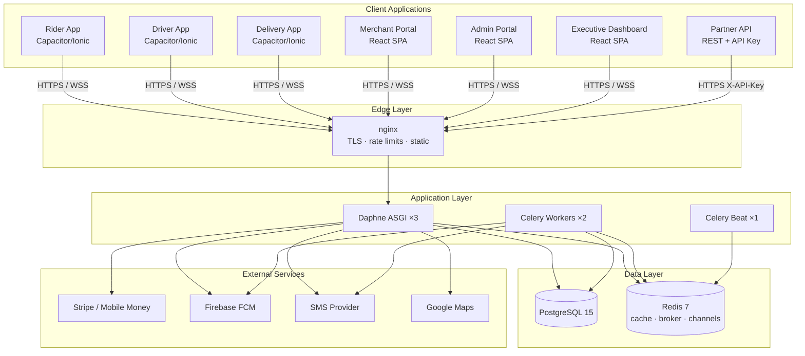
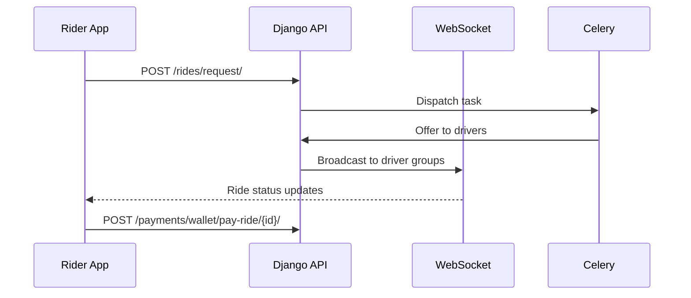
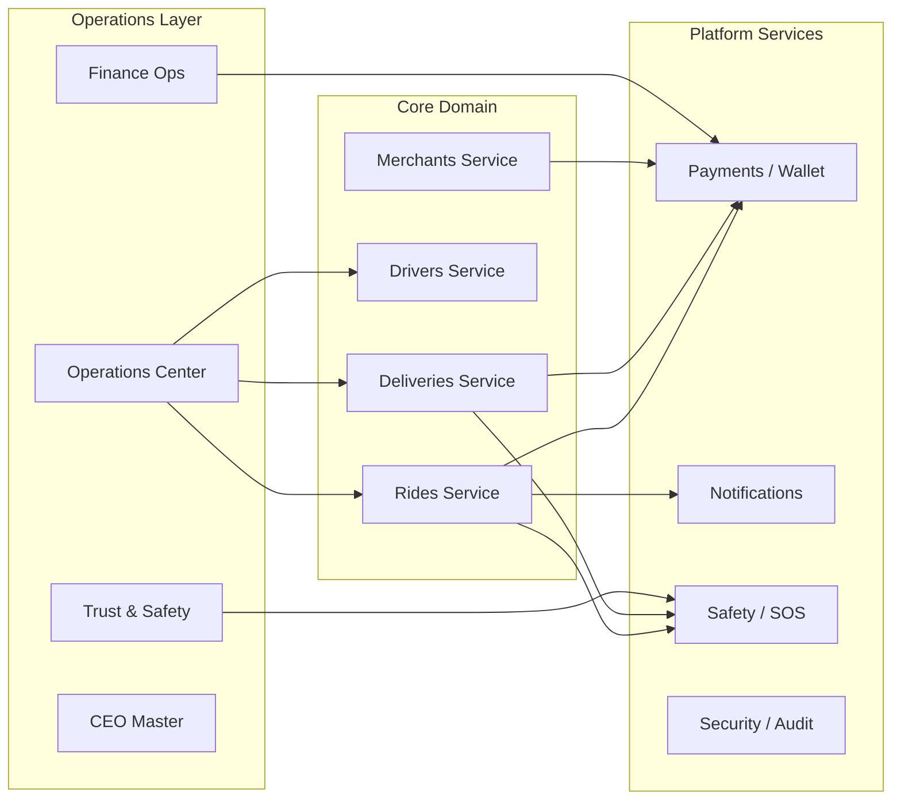
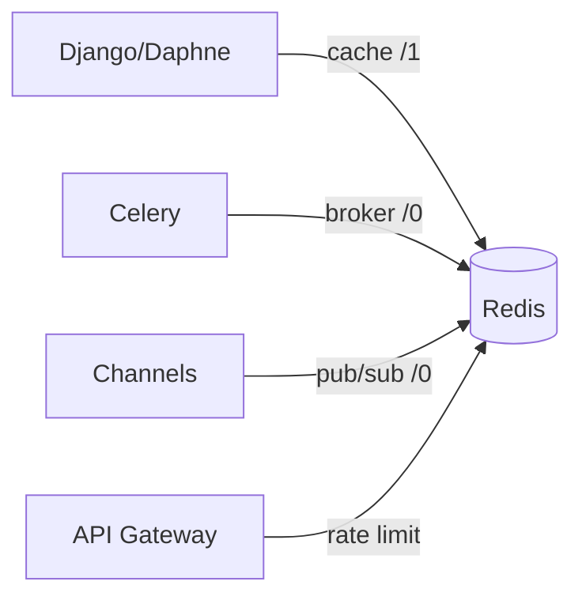
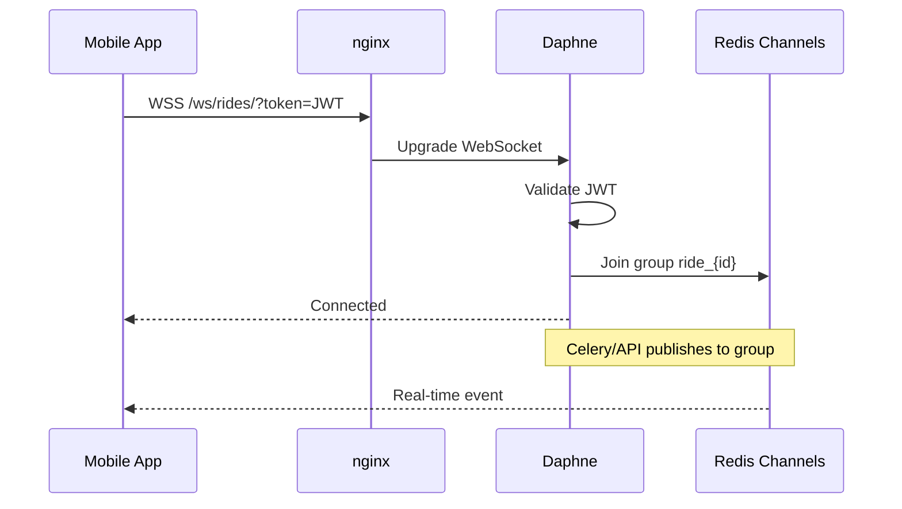
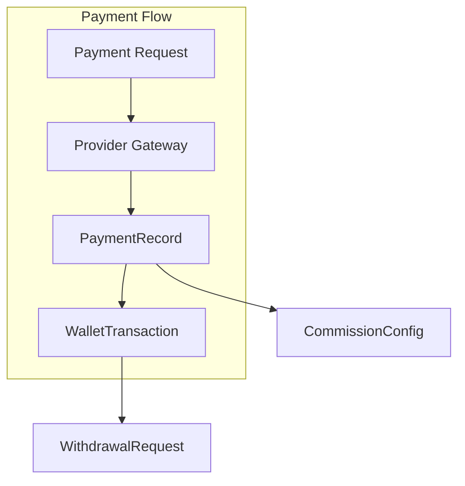

# YALA — System Architecture

**Document ID:** YALA-ENG-ARCH-001  
**Version:** 1.0.0  
**Effective:** 2026-07-21

---

## 1. Platform overview

Yala is a multi-vertical mobility platform for Mauritania covering **rides**, **deliveries**, **merchant commerce**, **corporate accounts**, and **partner/franchise** operations. A single Django backend serves mobile apps (Capacitor), a merchant portal, and a React admin/executive dashboard.

### High-level architecture



### Design principles

| Principle | Implementation |
|-----------|----------------|
| Single backend | One Django project, domain-separated apps |
| JWT auth | Stateless API auth; WebSocket via query token |
| Real-time | Channels + Redis for rides, deliveries, ops |
| Async work | Celery for dispatch, notifications, reports |
| Role-based admin | Django groups + custom DRF permission classes |
| Mobile unchanged | Admin/backend only changes for v1.0; apps consume existing APIs |

---

## 2. Client applications

### Rider App

| Attribute | Detail |
|-----------|--------|
| **Codebase** | `frontend/src/rider/` + `rider-app/` (Capacitor) |
| **Build** | Ionic/Capacitor Android (Play closed testing 1.2.7) |
| **Auth** | JWT via `/auth/login/` |
| **Primary APIs** | `/rides/`, `/payments/`, `/safety/`, `/loyalty/`, `/promotions/` |
| **Real-time** | WebSocket `wss://api.yalataxi.live/ws/rides/?token=<jwt>` |
| **Features** | Request/schedule rides, wallet pay, SOS, trip share, referrals, loyalty |



### Driver App

| Attribute | Detail |
|-----------|--------|
| **Codebase** | `frontend/src/driver/` + `driver-app/` |
| **Build** | Play closed testing 1.2.23 |
| **Auth** | JWT; driver profile via `/drivers/me/` |
| **Primary APIs** | `/drivers/`, `/rides/accept/`, `/shifts/`, `/incentives/` |
| **Real-time** | WebSocket ride offers, location updates |
| **Features** | Accept/complete rides, earnings, documents, QR verification, incentives |

### Delivery App

| Attribute | Detail |
|-----------|--------|
| **Codebase** | `frontend/src/delivery/` + `delivery-app/` |
| **Build** | Play 1.0.4 |
| **Auth** | JWT; courier onboarding via `/deliveries/courier/` |
| **Primary APIs** | `/deliveries/`, `/payments/courier/` |
| **Real-time** | WebSocket delivery tracking and chat |
| **Features** | Courier mode, pickup/delivery flow, COD, in-app chat |

### Merchant Portal

| Attribute | Detail |
|-----------|--------|
| **Codebase** | `frontend/src/merchant/` |
| **Route** | `/merchant` in React SPA |
| **Auth** | `/merchants/login/` or shared JWT |
| **Primary APIs** | `/merchants/products/`, `/merchants/orders/`, `/merchants/settlements/` |
| **Features** | Menu/catalog, order management, analytics, settlements |

### Admin Portal

| Attribute | Detail |
|-----------|--------|
| **Codebase** | `frontend/src/admin/` |
| **URL** | https://www.yalataxi.live/admin |
| **Auth** | Staff JWT + optional TOTP 2FA |
| **Modules** | 20+ centers (operations, finance, fleet, trust & safety, etc.) |

| Module | Route | Backend service |
|--------|-------|-----------------|
| Operations Command Center | `/admin/operations-command` | `operations/launch_command_service.py` |
| Operations Center | `/admin/operations` | `operations/operations_center_service.py` |
| Finance Operations | `/admin/finance-ops` | `operations/finance_operations_service.py` |
| Trust & Safety | `/admin/trust-safety` | `operations/trust_safety_service.py` |
| CEO Master | `/admin/ceo-master` | `operations/ceo_master_command_service.py` |
| Merchant Platform | `/admin/merchant-platform` | `operations/merchant_platform_service.py` |
| Partner Platform | `/admin/partner-platform` | `operations/partner_platform_service.py` |
| Customer Growth | `/admin/customer-growth` | `operations/customer_growth_service.py` |

### Executive Dashboard

| Attribute | Detail |
|-----------|--------|
| **Route** | `/admin/executive`, `/admin/ceo-master` |
| **Audience** | CEO, executive staff |
| **API prefix** | `/operations/executive/`, `/operations/ceo-master/` |
| **Features** | Revenue KPIs, maintenance mode, live map, security/fraud, report exports |

---

## 3. Backend services

### Django project structure

```
backend/taxi/
├── taxi/           # Project settings, ASGI, routing, consumers
├── authapp/        # User, JWT auth, device sessions
├── taxi/rides/     # Ride lifecycle, dispatch, share rides
├── taxi/drivers/   # Driver profiles, documents, gamification
├── deliveries/     # Delivery lifecycle, courier, chat
├── merchants/      # Catalog, orders, settlements
├── payments/       # Wallet, withdrawals, refunds
├── operations/     # Admin/executive dashboards (~220 endpoints)
├── safety/         # SOS, incidents, trip monitoring
├── security/       # Audit logs, fraud flags
├── notifications/  # FCM, push subscriptions
├── loyalty/        # Rider loyalty tiers
├── partners/       # Franchise partners
├── api_gateway/    # B2B partner API
└── ...             # features, referrals, incentives, legal, etc.
```

### Service map



### Key backend services

| Service | Location | Responsibility |
|---------|----------|----------------|
| Ride dispatch | `taxi/rides/dispatch*.py` | Smart dispatch, offer scoring |
| Finance reconciliation | `operations/finance_operations_service.py` | Daily reconciliation, withdrawals |
| Trust & Safety | `operations/trust_safety_service.py` | Incident queue, monitoring scan |
| Launch command | `operations/launch_command_service.py` | Live ops, CEO summary, incidents |
| Smart pricing | `operations/smart_pricing_dispatch_service.py` | Surge, dispatch rules |
| Customer growth | `operations/customer_growth_service.py` | Loyalty, promos, referrals |
| Audit | `security/services/audit_service.py` | Platform audit trail |

---

## 4. Database

| Attribute | Detail |
|-----------|--------|
| **Engine** | PostgreSQL 15 (`postgres:15-alpine`) |
| **Connection** | `DATABASE_URL` via `dj-database-url` |
| **Max connections** | 250 |
| **Dev fallback** | SQLite when `DATABASE_URL` unset |
| **Migrations** | Per-app under `*/migrations/` |

**~130 models** across 25+ apps. Canonical ride model: `taxi.rides.models.Ride` (not legacy `taxi.models.Ride`).

See [03_DATABASE_REFERENCE.md](./03_DATABASE_REFERENCE.md) for ER diagrams and table details.

---

## 5. Redis

| Use | Redis DB | Config |
|-----|----------|--------|
| Celery broker | `/0` | `CELERY_BROKER_URL` |
| Celery results | `/0` | `CELERY_RESULT_BACKEND` |
| Django cache | `/1` | `REDIS_URL` |
| Channels layer | `/0` | `CHANNEL_LAYERS` |
| Rate limiting | cache | API gateway per-key counters |

**Persistence:** AOF enabled (`appendonly yes`). Volume: `redis_data`.



---

## 6. Celery

| Component | Detail |
|-----------|--------|
| **Workers** | 2 replicas, 4 concurrency each |
| **Beat** | `django_celery_beat.schedulers:DatabaseScheduler` |
| **Serialization** | JSON |
| **Timezone** | `Africa/Nouakchott` |

### Scheduled tasks (representative)

| Task area | Examples |
|-----------|----------|
| Dispatch | Ride/delivery offer timeouts, reassignment |
| Documents | Driver document expiry checks |
| Referrals | Referral completion processing |
| Reports | Soft launch daily reports |
| Notifications | Push delivery retries |

---

## 7. WebSockets

| Attribute | Detail |
|-----------|--------|
| **Protocol** | Django Channels over ASGI (Daphne) |
| **Auth** | JWT access token as `?token=` query param |
| **Routing** | `taxi/routing.py` |
| **Consumer** | `taxi/rides/consumers.py` → `RideConsumer` |

### WebSocket routes

| Path | Purpose |
|------|---------|
| `ws/rides/` | Ride offers, status, driver location |
| `ws/deliveries/` | Delivery tracking, courier updates |

### Channel groups

| Group pattern | Subscribers |
|---------------|-------------|
| `rides` | Global ride broadcast |
| `driver_{id}` | Per-driver offers |
| `ride_{id}` | Per-ride participants |
| `session_{id}` | Share ride sessions |
| `operations_center` | Admin live ops |
| `admin_safety` | Safety monitoring |



**nginx:** `/ws/` proxied with 86400s read/send timeout.

---

## 8. Notification service

| Component | Location |
|-----------|----------|
| Models | `notifications/models.py` |
| FCM registration | `/notifications/fcm/register/` |
| Push subscribe | `/notifications/push/subscribe/` |
| Device tokens | `DeviceToken`, `FCMToken`, `PushSubscription` |
| History | `/notifications/history/` |

### Notification flow

```
Event (ride accepted, delivery ready, SOS)
         │
         ▼
Django signal or Celery task
         │
         ▼
notifications service
         │
    ┌────┴────┐
    │         │
   FCM      SMS (optional)
    │         │
    ▼         ▼
Mobile app  Phone
```

**External:** Firebase Cloud Messaging (`FIREBASE_CREDENTIALS_PATH`), SMS via `YALA_SMS_*` env vars.

---

## 9. Payment service

| Component | Location |
|-----------|----------|
| Models | `payments/models.py` |
| Wallet | `WalletAccount`, `WalletTransaction` |
| Payments | `PaymentRecord`, `RiderPaymentMethod` |
| Withdrawals | `WithdrawalRequest`, OTP verification |
| Refunds | `RefundRequest` |
| Webhooks | `/payments/webhooks/stripe/` |

### Payment methods

| Method | Use |
|--------|-----|
| Wallet | Internal ledger |
| Bankily | Mobile money (Mauritania) |
| Sedad | Mobile money |
| Masravi | Mobile money |
| Cards | Stripe |
| Cash | Ride/delivery COD |
| Corporate | Business account billing |



**Finance ops:** `/operations/business/finance/operations/` aggregates reconciliation data for admin.

---

## 10. Deployment topology (production)

| Host | Role |
|------|------|
| `api.yalataxi.live` | API + WebSocket (nginx → Daphne) |
| `www.yalataxi.live` | React SPA + admin (same-origin API proxy) |
| `142.93.99.142` | DigitalOcean Droplet, `/opt/yala` |

**Containers:** nginx, django ×3, postgres, redis, celery-worker ×2, celery-beat (9+ total).

See [05_DEPLOYMENT_GUIDE.md](./05_DEPLOYMENT_GUIDE.md) and [06_MONITORING_RUNBOOK.md](./06_MONITORING_RUNBOOK.md).

---

## 11. Document control

| Version | Date | Changes |
|---------|------|---------|
| 1.0.0 | 2026-07-21 | Initial architecture document |

**Cross-references:** `02_API_CATALOG.md` · `03_DATABASE_REFERENCE.md` · `04_SECURITY_ARCHITECTURE.md` · `DEPLOYMENT.md`
