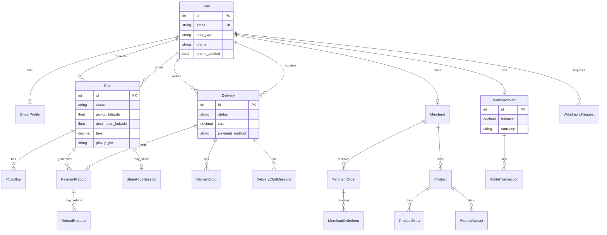
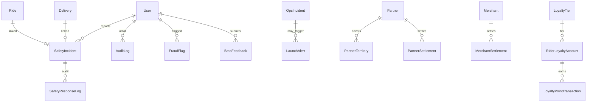
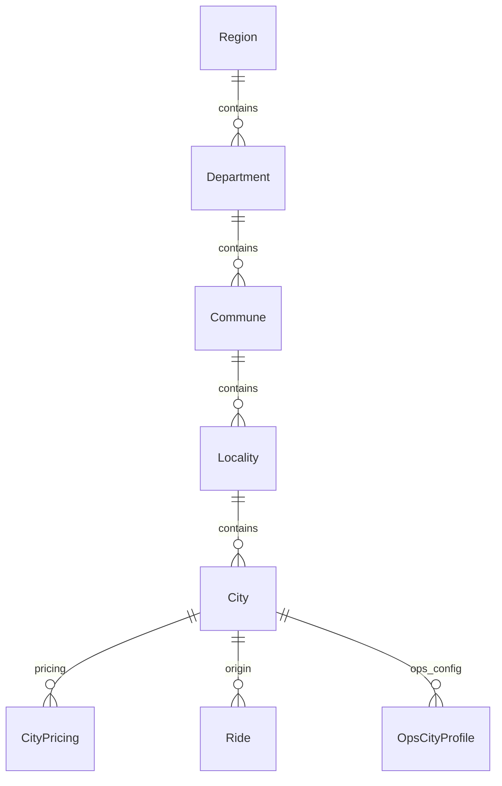

# YALA — Database Reference

**Document ID:** YALA-ENG-DB-003  
**Version:** 1.0.0  
**Effective:** 2026-07-21  
**Engine:** PostgreSQL 15

---

## 1. Overview

| Attribute | Value |
|-----------|-------|
| **Models** | ~130 across 25+ Django apps |
| **Canonical ride model** | `taxi.rides.models.Ride` |
| **User model** | `authapp.User` (email-based) |
| **Geo hierarchy** | `locations` app (Region → City) + `cities` app (simpler layer) |
| **Connection** | `DATABASE_URL` · max 250 connections |

---

## 2. Entity-relationship diagrams

### Core platform ER



### Operations & safety ER



### Location hierarchy ER



---

## 3. Tables by domain

### Identity — `authapp`

| Table | Key fields | Relationships |
|-------|-----------|---------------|
| `authapp_user` | email (unique), user_type, phone, national_id | FK → `locations_city` |
| `authapp_phoneverificationcode` | code_hash, expires_at | FK → User |
| `authapp_devicesession` | device_id, ip, user_agent | FK → User; **UNIQUE** (user, device_id) |
| `authapp_passwordresetcode` | identifier, code_hash | FK → User |

### Rides — `taxi.rides`

| Table | Key fields | Relationships |
|-------|-----------|---------------|
| `rides_ride` | status, dispatch_status, coords, fare, pickup_pin | FK → User (rider, driver), City, ShareRideSession |
| `rides_ridestop` | stop_order, lat/lng | FK → Ride |
| `rides_dispatchofferlog` | dispatch_round, score, result | FK → Ride, User (driver) |
| `rides_shareridesession` | status, total_fare | FK → User (driver) |
| `rides_sharesessionstop` | stop_type, stop_order | FK → ShareRideSession |

**Ride status values:** `requested`, `accepted`, `arrived`, `in_progress`, `completed`, `cancelled`

### Drivers — `taxi.drivers`

| Table | Key fields | Relationships |
|-------|-----------|---------------|
| `drivers_driverprofile` | status, is_available, driver_code, level | **OneToOne** → User |
| `drivers_driverdocument` | doc_type, file, expiry_date | FK → DriverProfile |
| `drivers_verificationrecord` | scan_result | FK → User (rider, driver) |
| `drivers_supportticket` | subject, status | FK → User |

### Deliveries — `deliveries`

| Table | Key fields | Relationships |
|-------|-----------|---------------|
| `deliveries_delivery` | status, coords, PINs, service_category | FK → User (customer, driver), BusinessAccount |
| `deliveries_deliverystop` | stop_order | FK → Delivery |
| `deliveries_deliverydispute` | reason, resolution | FK → Delivery, User |
| `deliveries_deliverychatmessage` | message, is_read | FK → Delivery, User |
| `deliveries_businessaccount` | company_name, payment_terms | — |

### Payments — `payments`

| Table | Key fields | Relationships |
|-------|-----------|---------------|
| `payments_walletaccount` | balance, currency | **OneToOne** → User |
| `payments_wallettransaction` | amount, type, balance_after | FK → WalletAccount |
| `payments_paymentrecord` | amount, status, source | FK → User, Ride, Delivery, MerchantOrder |
| `payments_withdrawalrequest` | amount, status, idempotency_key | FK → User; **UNIQUE** (driver, idempotency_key) |
| `payments_refundrequest` | amount, status, reason | FK → PaymentRecord |
| `payments_riderpaymentmethod` | method_type, token | FK → User |
| `payments_commissionconfig` | ride_rate, delivery_rate | — |

### Merchants — `merchants`

| Table | Key fields | Relationships |
|-------|-----------|---------------|
| `merchants_merchant` | business_name, status | **OneToOne** → User |
| `merchants_product` | name, price, is_available | FK → Merchant |
| `merchants_menucategory` | name, sort_order | FK → Merchant |
| `merchants_productvariant` | name, price_delta | FK → Product |
| `merchants_productextra` | name, price | FK → Product |
| `merchants_cart` | — | FK → User, Merchant; **UNIQUE** (customer, merchant) |
| `merchants_merchantorder` | status, total | FK → User, Merchant, Delivery |
| `merchants_merchantsettlement` | gross, commission, net, status | FK → Merchant |

### Operations — `operations`

| Table | Purpose |
|-------|---------|
| `operations_platformsetting` | Key-value platform config (maintenance mode, caps, flags) |
| `operations_opsincident` | Operational incidents |
| `operations_launchalert` | Launch/beta alerts |
| `operations_betafeedback` | Beta feedback / support tickets |
| `operations_opscityprofile` | Per-city ops configuration |
| `operations_corporateinvoice` | B2B invoicing |
| `operations_marketingcampaign` | Marketing campaigns |
| `operations_airecommendation` | AI ops recommendations |
| `operations_policydocument` | Compliance policies |
| `operations_complianceaudit` | Compliance audit records |
| `operations_compliancerisk` | Risk register entries |

### Safety — `safety`

| Table | Key fields | Relationships |
|-------|-----------|---------------|
| `safety_safetyincident` | incident_type, severity, status, GPS | FK → User, Ride, Delivery |
| `safety_emergencyalert` | — | **OneToOne** → SafetyIncident |
| `safety_tripshare` | token, expires_at | FK → Ride |
| `safety_triplocationping` | lat, lng, recorded_at | FK → Ride |
| `safety_tripsafetyevent` | event_type | FK → Ride |
| `safety_safetyresponselog` | action, notes | FK → SafetyIncident, User |
| `safety_emergencycontact` | name, phone | FK → User; **UNIQUE** (user, phone_number) |

### Security & audit — `security`

| Table | Purpose |
|-------|---------|
| `security_auditlog` | Platform-wide audit trail |
| `security_fraudflag` | Fraud investigations |
| `security_customersavedaddress` | Rider saved addresses |
| `security_deliveryverificationevent` | Delivery verification audit |

### Loyalty — `loyalty`

| Table | Relationships |
|-------|---------------|
| `loyalty_loyaltytier` | Tier definitions (Bronze–Platinum) |
| `loyalty_riderloyaltyaccount` | **OneToOne** → User; FK → LoyaltyTier |
| `loyalty_loyaltypointtransaction` | FK → RiderLoyaltyAccount |
| `loyalty_loyaltyreward` | Redeemable rewards catalog |

### Partners — `partners`

| Table | Relationships |
|-------|---------------|
| `partners_partner` | FK → User (contact) |
| `partners_partnerterritory` | FK → Partner, City |
| `partners_partnersettlement` | FK → Partner |

### API Gateway — `api_gateway`

| Table | Purpose |
|-------|---------|
| `api_gateway_partnerorganization` | B2B org |
| `api_gateway_partnerapplication` | Registered apps |
| `api_gateway_apikey` | API keys (hashed) |
| `api_gateway_webhooksubscription` | Webhook endpoints |
| `api_gateway_apigatewaylog` | Request audit log |

---

## 4. Indexes

### Ride indexes

| Index | Fields |
|-------|--------|
| `rides_ride_status_idx` | status |
| `rides_ride_rider_status_idx` | rider_id, status |
| `rides_ride_driver_status_idx` | driver_id, status |
| `rides_ride_city_status_idx` | city_id, status |
| `rides_ride_completed_at_idx` | -completed_at |
| `rides_ride_created_at_idx` | -created_at |

### Delivery indexes

| Index | Fields |
|-------|--------|
| `deliveries_delivery_status_created_idx` | status, created_at |
| `deliveries_delivery_customer_status_idx` | customer_id, status |
| `deliveries_delivery_driver_status_idx` | driver_id, status |

### Payment indexes

| Index | Fields |
|-------|--------|
| `payments_wallettransaction_wallet_created_idx` | wallet_id, -created_at |
| `payments_paymentrecord_status_created_idx` | status, -created_at |
| `payments_withdrawalrequest_driver_status_idx` | driver_id, status |

### Safety indexes

| Index | Fields |
|-------|--------|
| `safety_safetyincident_status_idx` | status |
| `safety_safetyincident_type_created_idx` | incident_type, -created_at |
| `safety_safetyincident_ride_idx` | ride_id |
| `safety_safetyincident_delivery_idx` | delivery_id |

### Audit indexes

| Index | Fields |
|-------|--------|
| `security_auditlog_entity_idx` | entity_type, entity_id |
| `security_auditlog_action_created_idx` | action, -created_at |
| `security_fraudflag_status_created_idx` | status, -created_at |

### Operations indexes

| Index | Fields |
|-------|--------|
| `operations_opsincident_status_created_idx` | status, -created_at |
| `operations_launchalert_status_idx` | status, -created_at |
| `operations_betafeedback_status_created_idx` | status, -created_at |

---

## 5. Constraints

### Unique constraints

| Model | Constraint |
|-------|------------|
| User | email (unique) |
| DeviceSession | (user, device_id) |
| WithdrawalRequest | (driver, idempotency_key) conditional |
| Cart | (customer, merchant) |
| CartItem | (cart, product) |
| EmergencyContact | (user, phone_number) |
| CityPricing | (city, ride_type) |
| DriverIncentiveProgress | (driver, program) |
| IntercityRoute | (origin, destination) |
| PolicyDocument | (category, version) |

### Check constraints

| Model | Constraint |
|-------|------------|
| DriverFavoriteArea | radius_km > 0 |

### Foreign key cascade behavior

| Pattern | On delete |
|---------|-----------|
| Ride → User (rider) | PROTECT / SET_NULL per field |
| WalletTransaction → WalletAccount | CASCADE |
| Order items → Order | CASCADE |
| Audit logs | PROTECT (preserve history) |

---

## 6. Audit tables

| Table | App | Events captured |
|-------|-----|-----------------|
| `security_auditlog` | security | Admin actions, payment, refund, status changes |
| `legal_legalcompliancelog` | legal | E-signatures, terms acceptance |
| `safety_safetyresponselog` | safety | SOS/incident response actions |
| `drivers_qrcodeauditlog` | drivers | QR scan/regenerate events |
| `rides_dispatchofferlog` | rides | Dispatch offer decisions |
| `api_gateway_apigatewaylog` | api_gateway | Partner API requests |
| `operations_complianceaudit` | operations | Compliance audit findings |

### AuditLog schema (representative)

| Column | Type | Description |
|--------|------|-------------|
| id | bigint | PK |
| actor_id | FK → User | Who performed action |
| action | varchar | Action code |
| entity_type | varchar | Model name |
| entity_id | varchar | Object ID |
| ip_address | inet | Client IP |
| details | jsonb | Before/after, amounts |
| created_at | timestamptz | Timestamp |

**Retention:** 7 years (per compliance policy). Export via Finance Ops audit tab or Compliance module.

---

## 7. Migration management

```bash
cd backend/taxi
python manage.py makemigrations
python manage.py migrate
python manage.py migrate --check   # CI verification
python manage.py showmigrations
```

**Production:** Run migrations during maintenance window. Phases 29–33 migrations may be pending on production per project tracker.

---

## 8. Known schema notes

| Note | Detail |
|------|--------|
| Legacy Ride model | `taxi/models.py` contains old `Ride`; use `taxi.rides.models.Ride` |
| Dual geo models | `locations.City` (rides) vs `cities.City` (incentives/intercity) |
| Read replica | Not configured; CEO/BI dashboards query primary DB |

---

## 9. Document control

| Version | Date | Changes |
|---------|------|---------|
| 1.0.0 | 2026-07-21 | Initial database reference |

**Cross-references:** `01_SYSTEM_ARCHITECTURE.md` · `04_SECURITY_ARCHITECTURE.md`
