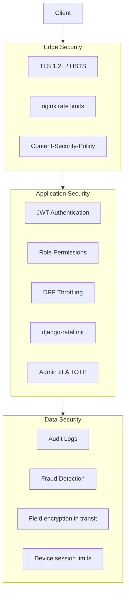
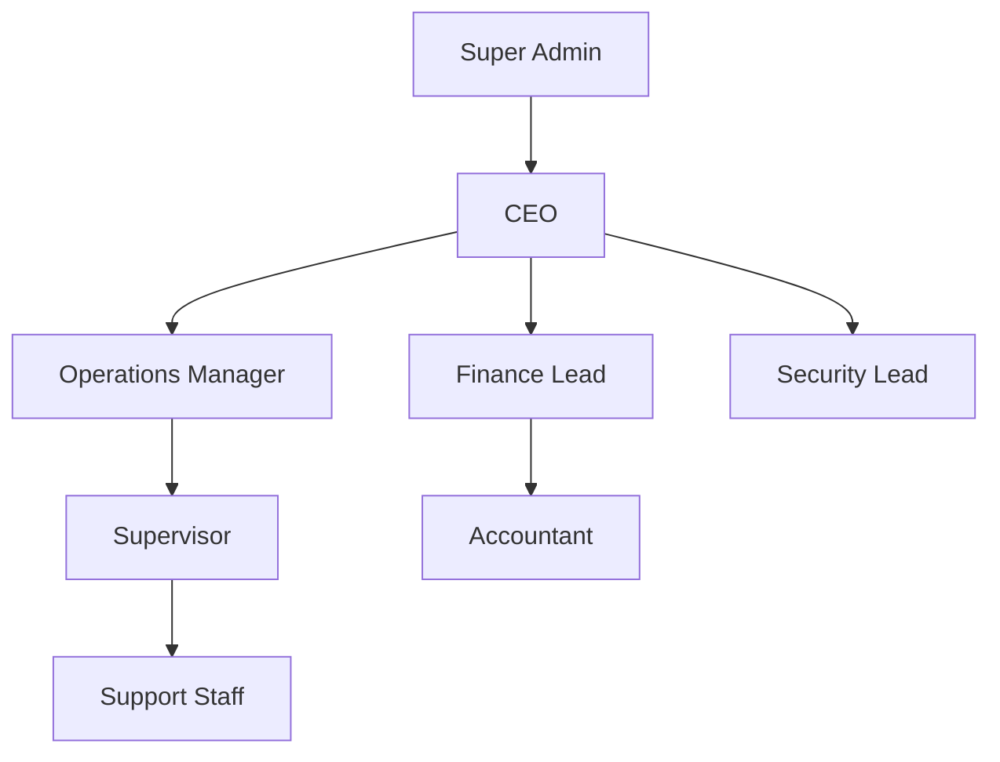

# YALA — Security Architecture

**Document ID:** YALA-ENG-SEC-004  
**Version:** 1.0.0  
**Effective:** 2026-07-21

---

## 1. Security overview



---

## 2. JWT authentication

**Library:** `djangorestframework-simplejwt`  
**Config:** `backend/taxi/taxi/settings.py`

| Setting | Default | Env override |
|---------|---------|--------------|
| Access token lifetime | 15 minutes | `JWT_ACCESS_TOKEN_MINUTES` |
| Refresh token lifetime | 7 days | `JWT_REFRESH_TOKEN_DAYS` |
| Algorithm | HS256 | — |
| Rotate refresh tokens | Yes | — |
| Blacklist after rotation | Yes | — |
| Header | `Authorization: Bearer <token>` | — |

### Token lifecycle

```
Login → access + refresh tokens
         │
         ▼
API calls with access token (15 min)
         │
         ▼
Access expired → POST /auth/token/refresh/
         │
         ▼
New access + refresh (old refresh blacklisted)
         │
         ▼
Logout all → blacklist all refresh tokens
```

### WebSocket authentication

File: `backend/taxi/taxi/websocket_auth.py`

- Access token passed as query parameter: `?token=<access_token>`
- Validated on connection; connection rejected (code 4001) if invalid

---

## 3. Permissions

### Default DRF permissions

```python
DEFAULT_PERMISSION_CLASSES = ("rest_framework.permissions.IsAuthenticated",)
```

Views override with `AllowAny`, `IsAdminUser`, or custom classes.

### Executive permission groups

File: `backend/taxi/operations/executive_permissions.py`

| Group constant | Django groups included |
|----------------|------------------------|
| `EXECUTIVE_GROUPS` | CEO, Super Admin, Accountant, Finance, Operations Manager, Supervisor |
| `FINANCE_GROUPS` | CEO, Super Admin, Accountant, Finance |
| `OPS_GROUPS` | CEO, Super Admin, Operations Manager, Supervisor |
| `CEO_ONLY_GROUPS` | CEO, Super Admin |

### Permission classes

| Class | Grants access to |
|-------|------------------|
| `IsExecutiveStaff` | Executive dashboard, operations center |
| `IsFinanceStaff` | Finance Operations Center |
| `IsFleetStaff` | Fleet & Performance |
| `IsLaunchCommandStaff` | Operations Command Center |
| `IsCeoStaff` | CEO Master Command Center |
| `IsBoardOrCeoStaff` | Board & Investor Reports |
| `IsComplianceOrCeoStaff` | Compliance & Governance |
| `IsAnalyticsStaff` | Business Intelligence |
| `IsMultiCityStaff` | Multi-City Operations |
| `IsOperationsDispatcher` | Force-assign, cancel (with dispatch flag) |

### Domain-specific permissions

| Module | Classes | File |
|--------|---------|------|
| Merchants | `IsMerchantOwner`, `IsApprovedMerchant` | `merchants/permissions.py` |
| Corporate | `IsCorporateAdmin` | `features/corporate_permissions.py` |
| Partners | `IsPartnerPortalUser`, `IsPartnerFinanceStaff` | `partners/permissions.py` |
| API Gateway | `HasAPIKey`, `HasScope` | `api_gateway/permissions.py` |

### Role hierarchy



**Rule:** Higher roles inherit lower-role dashboard access where permission classes use group sets (e.g., CEO in `FINANCE_GROUPS`).

---

## 4. Rate limiting

Four layers protect the API:

| Layer | Mechanism | Limits |
|-------|-----------|--------|
| **nginx** | `limit_req_zone` | Auth: 10/min · API: 3000/min |
| **DRF throttling** | AnonRateThrottle / UserRateThrottle | Anon: 60/min · User: 300/min |
| **django-ratelimit** | View decorators | Auth views: 60/min · Anon: 20/min |
| **Application** | Cache-based OTP throttles | Phone/withdrawal OTP: 60s cooldown |
| **API Gateway** | Redis counter per API key | Default 100/min per app |

### nginx zones

File: `nginx/nginx.conf`

| Zone | Applies to |
|------|------------|
| `auth_limit` | `/auth/login/`, `/auth/register/`, token refresh |
| `api_limit` | General API traffic |

**Response:** HTTP 429 when exceeded.

---

## 5. Audit logs

### Primary audit system

| Component | Location |
|-----------|----------|
| Model | `security.models.AuditLog` |
| Service | `security/services/audit_service.py` |
| API | `security/views.py` (staff-only) |

### Logged events

| Category | Examples |
|----------|----------|
| Payment | Create, confirm, refund |
| Withdrawal | Approve, reject, mark paid |
| Admin | User block, driver approve, wallet adjustment |
| Document | Approve, reject |
| Fraud | Flag open, resolve |
| Operations | Force assign, cancel, incident action |
| Safety | SOS trigger, incident status change |

### Audit record fields

| Field | Purpose |
|-------|---------|
| actor | User who performed action |
| action | Action code |
| entity_type / entity_id | Target object |
| ip_address | Client IP |
| details | JSON before/after, amounts |
| created_at | Timestamp |

### Secondary audit trails

| System | Model |
|--------|-------|
| Legal compliance | `legal.LegalComplianceLog` |
| Safety response | `safety.SafetyResponseLog` |
| QR verification | `drivers.QRCodeAuditLog` |
| Dispatch | `rides.DispatchOfferLog` |
| API Gateway | `api_gateway.APIGatewayLog` |

**Export:** Finance Ops audit tab · Compliance & Governance module.

---

## 6. Fraud detection

### FraudFlag model

File: `security/models.py`

| Reason code | Description |
|-------------|-------------|
| ride_farming | Artificial ride completion |
| pin_brute_force | Repeated PIN failures |
| multi_account_device | Same device, multiple accounts |
| referral_abuse | Self-referral patterns |
| payment_anomaly | Unusual payment patterns |
| withdrawal_fraud | Suspicious payout requests |

### Detection sources

| Source | Trigger |
|--------|---------|
| Automated rules | Referral validation, dispatch patterns |
| Trust & Safety monitoring | `POST /operations/trust-safety/monitoring/` |
| Manual review | Support/Finance escalation |
| Referral admin | `/referrals/admin/flagged/` |

### Response workflow

```
FraudFlag opened
         │
         ▼
Security review
         │
         ▼
Soft suspend → Hard block → Permanent ban
         │
         ▼
Finance: hold withdrawals
Audit log + Compliance export
```

---

## 7. Password policy

| Rule | Implementation |
|------|----------------|
| Minimum length | Django validators (default ≥ 8) |
| Common password check | `CommonPasswordValidator` |
| Numeric-only rejected | `NumericPasswordValidator` |
| Reset flow | OTP/code via email or phone |
| Admin passwords | Strong passwords required; 2FA recommended |

### Password reset endpoints

| Endpoint | Auth |
|----------|------|
| `/auth/forgot-password/` | AllowAny |
| `/auth/verify-reset-code/` | AllowAny |
| `/auth/reset-password/` | AllowAny |

**Rate limited** on auth endpoints (nginx + django-ratelimit).

---

## 8. Data encryption

| Data state | Protection |
|------------|------------|
| In transit | TLS 1.2+ (nginx termination) |
| At rest (DB) | PostgreSQL on encrypted volume (host/provider) |
| Passwords | Django PBKDF2 hash |
| JWT | HS256 signed with `SECRET_KEY` |
| API keys | Hashed storage in `api_gateway_apikey` |
| OTP codes | Hashed (`code_hash` fields) |
| GPS in transit | HTTPS/WSS encrypted channels |
| Media files | Served via nginx; access controlled by auth |

### Production hardening (when `DEBUG=False`)

| Setting | Value |
|---------|-------|
| `SECURE_SSL_REDIRECT` | True |
| `SECURE_HSTS_SECONDS` | 31536000 |
| `SESSION_COOKIE_SECURE` | True |
| `CSRF_COOKIE_SECURE` | True |
| Secret key validation | Required non-default |

---

## 9. Secrets management

### Environment variables (never commit)

| Secret | Location |
|--------|----------|
| `DJANGO_SECRET_KEY` | `backend/taxi/.env.production` |
| `DATABASE_URL` | `.env.production` |
| `POSTGRES_PASSWORD` | Root `.env` / compose |
| `STRIPE_SECRET_KEY` | `.env.production` |
| `YALA_SMS_API_KEY` | `.env.production` |
| `FIREBASE_CREDENTIALS_PATH` | Mounted secret file |
| `GOOGLE_MAPS_API_KEY` | `.env.production` / mobile config |
| `SENTRY_DSN` | `.env.production` |

### Practices

| Practice | Detail |
|----------|--------|
| Template files | `.env.production.template` with placeholders |
| Git ignore | `.env`, `.env.production`, `secrets/` |
| Rotation | After breach per BCP (`operations/09_BUSINESS_CONTINUITY_PLAN.md`) |
| CI secrets | GitHub Actions secrets for iOS builds (`.github/workflows/`) |

---

## 10. Admin 2FA

| Component | Detail |
|-----------|--------|
| App | `admin_2fa` |
| Model | `AdminTOTP` (OneToOne → User) |
| Endpoints | `/auth/2fa/setup/`, `confirm/`, `verify/`, `status/` |
| Policy | TOTP mandatory when confirmed for admin staff |
| Integrity | `/auth/integrity/verify/` for device attestation |

---

## 11. Device sessions

| Rule | Value |
|------|-------|
| Max concurrent devices | 5 (`MAX_CONCURRENT_DEVICE_SESSIONS`) |
| Model | `DeviceSession` with unique (user, device_id) |
| Revoke all | `/auth/logout-all-devices/` |
| Play Integrity | Android attestation (`PLAY_INTEGRITY_*` env) |

---

## 12. CORS & CSRF

| Setting | Purpose |
|---------|---------|
| `CORS_ALLOWED_ORIGINS` | Admin SPA, mobile web origins |
| `CSRF_TRUSTED_ORIGINS` | Trusted form origins |
| `x-app-type` header | Allowed for app identification |

API clients use JWT (not cookies) for most mobile flows; CSRF applies to cookie-based admin sessions.

---

## 13. Security headers (nginx)

| Header | Value |
|--------|-------|
| Strict-Transport-Security | max-age=31536000 |
| X-Frame-Options | DENY |
| X-Content-Type-Options | nosniff |
| Content-Security-Policy | Configured on frontend host |

---

## 14. Document control

| Version | Date | Changes |
|---------|------|---------|
| 1.0.0 | 2026-07-21 | Initial security architecture |

**Cross-references:** `02_API_CATALOG.md` · `04_SECURITY` → `operations/07_TRUST_AND_SAFETY_MANUAL.md` · `handover/07_LICENSE_AND_COMPLIANCE.md`
