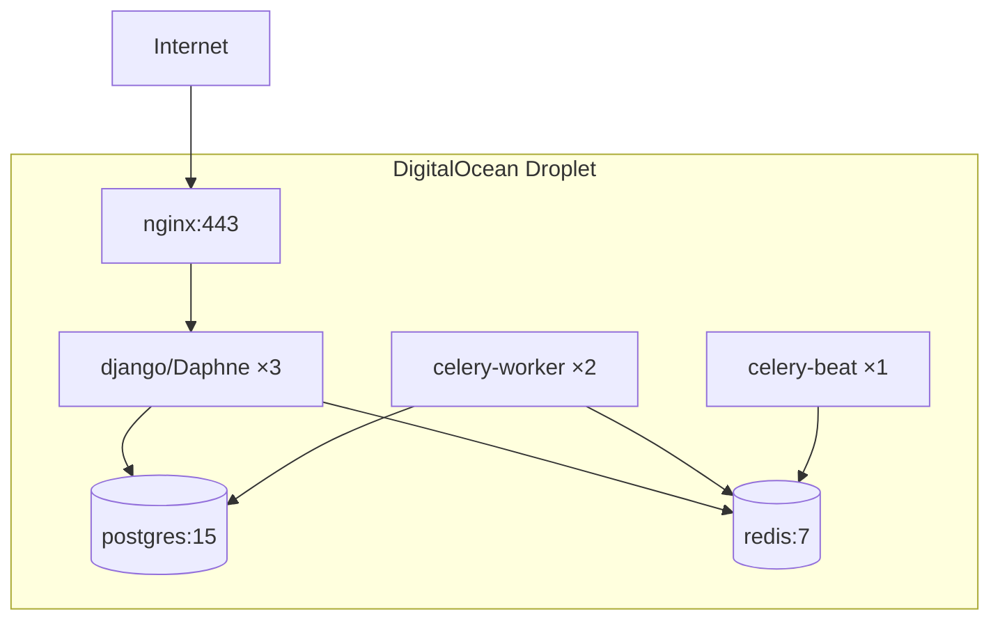
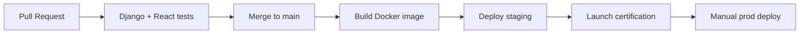

# YALA — Deployment Guide

**Document ID:** YALA-ENG-DEPLOY-005  
**Version:** 1.0.0  
**Effective:** 2026-07-21  
**Related:** `DEPLOYMENT.md` · `handover/04_ENVIRONMENT_REGISTER.md`

---

## 1. Environments

| Environment | Purpose | Infrastructure | URL |
|-------------|---------|----------------|-----|
| **Development** | Local feature work | SQLite or local PostgreSQL, optional Redis | `http://localhost:8000` |
| **Testing** | CI / Django tests | SQLite in-memory, Celery eager | — |
| **Staging** | Pre-prod validation | Docker Compose (recommended) | Not configured — suggest `staging.yalataxi.live` |
| **Production** | Live closed beta | DigitalOcean Droplet, Docker Compose | `api.yalataxi.live` |

---

## 2. Architecture (production)



**Host:** `142.93.99.142` · **Path:** `/opt/yala`

---

## 3. Development setup

### Prerequisites

- Python 3.11+
- Node.js 18+
- Docker & Docker Compose (recommended)
- Git

### Quick start (Docker)

```bash
git clone <repo-url> taxi-booking
cd taxi-booking

# Frontend build
cd frontend && npm install && npm run build && cd ..

# Environment
cp backend/taxi/.env.production.template backend/taxi/.env.production
# Edit secrets for local use; set DJANGO_DEBUG=True for dev

# Start stack
docker compose up --build -d

# Migrations & superuser
docker compose exec django python manage.py migrate
docker compose exec django python manage.py createsuperuser
```

### Quick start (local Django)

```bash
cd backend/taxi
python -m venv venv
source venv/bin/activate   # Windows: venv\Scripts\activate
pip install -r requirements.txt

export DJANGO_DEBUG=True
export DATABASE_URL=sqlite:///db.sqlite3
python manage.py migrate
python manage.py runserver
```

### Frontend dev server

```bash
cd frontend
npm install
npm start   # http://localhost:3000
# Set REACT_APP_API_URL=http://localhost:8000
```

---

## 4. Staging deployment

Staging is **not currently deployed**. Recommended setup:

| Item | Recommendation |
|------|----------------|
| Domain | `staging.yalataxi.live`, `api-staging.yalataxi.live` |
| Infrastructure | Separate Droplet or same host, different compose project |
| Database | Separate PostgreSQL instance |
| Secrets | Separate `.env.staging` |
| Data | Anonymized production snapshot or seed data |

```bash
docker compose -p yala-staging -f docker-compose.staging.yml up -d
```

---

## 5. Production deployment (DigitalOcean)

### Prerequisites

- DigitalOcean account + SSH key
- Domain DNS → Droplet IP
- Secrets prepared in `.env.production`

### Step-by-step

| Step | Command / action |
|------|------------------|
| 1. Create Droplet | Docker on Ubuntu 22.04 · 4GB RAM recommended |
| 2. SSH | `ssh root@142.93.99.142` |
| 3. Clone | `git clone <repo> /opt/yala && cd /opt/yala` |
| 4. Checkout | `git checkout release/v1.0.0` (or target tag) |
| 5. Configure env | `cp backend/taxi/.env.production.template backend/taxi/.env.production` |
| 6. Build frontend | `cd frontend && npm ci && npm run build && cd ..` |
| 7. Deploy | `docker compose -p yala up --build -d` |
| 8. Migrate | `docker compose -p yala exec django python manage.py migrate` |
| 9. Collect static | `docker compose -p yala exec django python manage.py collectstatic --noinput` |
| 10. Verify | `curl -fsS https://api.yalataxi.live/api/health/ready/` |

### Production compose services

| Service | Replicas | Notes |
|---------|----------|-------|
| nginx | 1 | TLS, static, reverse proxy |
| django (Daphne) | 3 | ASGI HTTP + WebSocket |
| postgres | 1 | `max_connections=250` |
| redis | 1 | AOF persistence |
| celery-worker | 2 | 4 concurrency each |
| celery-beat | 1 | DatabaseScheduler |

---

## 6. Docker

### Key files

| File | Purpose |
|------|---------|
| `docker-compose.yml` | Full production stack |
| `backend/taxi/Dockerfile` | Django/Daphne image |
| `nginx/nginx.conf` | Reverse proxy config |

### Common commands

```bash
# Status
docker compose -p yala ps

# Logs
docker compose -p yala logs django --tail 200 -f
docker compose -p yala logs celery-worker --tail 100

# Restart service
docker compose -p yala restart django
docker compose -p yala up -d django nginx celery-worker

# Shell
docker compose -p yala exec django python manage.py shell

# Stop
docker compose -p yala down
```

### Database SSL note

| Deployment | `DATABASE_SSL_REQUIRE` |
|------------|-------------------------|
| Docker Compose (internal postgres) | `False` |
| Managed PostgreSQL (RDS, DO Managed DB) | `True` |

`docker-compose.yml` pins `DATABASE_SSL_REQUIRE=False` for internal postgres.

---

## 7. Nginx

File: `nginx/nginx.conf`

| Host | Purpose |
|------|---------|
| `api.yalataxi.live` | API + WebSocket upstream |
| `www.yalataxi.live` / `yalataxi.live` | React SPA + same-origin API proxy |

| Feature | Config |
|---------|--------|
| Upstream | 3 Django instances, `least_conn` |
| WebSocket | `/ws/` proxy, 86400s timeout |
| Rate limits | Auth 10/min · API 3000/min |
| Static | React build served from volume |
| Media | `/media/` proxied to Django |
| Security headers | HSTS, X-Frame-Options, CSP |

### Reload nginx after config change

```bash
docker compose -p yala exec nginx nginx -t
docker compose -p yala exec nginx nginx -s reload
```

---

## 8. SSL

| Item | Detail |
|------|--------|
| Provider | Let's Encrypt (certbot) |
| Termination | nginx |
| Domains | `api.yalataxi.live`, `www.yalataxi.live`, `yalataxi.live` |
| Renewal | certbot cron (verify weekly) |
| Minimum validity alert | 30 days |

### Certificate renewal

```bash
certbot renew --dry-run
docker compose -p yala exec nginx nginx -s reload
```

---

## 9. CI/CD workflow

### Current state

| Pipeline | File | Trigger |
|----------|------|---------|
| iOS Rider build | `.github/workflows/ios-rider.yml` | Manual / push |
| iOS Driver build | `.github/workflows/ios-driver.yml` | Manual / push |
| iOS Delivery build | `.github/workflows/ios-delivery.yml` | Manual / push |

**Backend/frontend production deploy:** Currently manual via SSH + Docker Compose. No automated CD pipeline to production.

### Recommended CI/CD flow



### Pre-deploy checklist

- [ ] All tests pass locally / CI
- [ ] Migrations reviewed
- [ ] Frontend built (`npm run build`)
- [ ] `.env.production` secrets current
- [ ] Database backup taken
- [ ] Maintenance window communicated (if breaking)

### Deploy command sequence

```bash
cd /opt/yala
git pull origin release/v1.0.0
cd frontend && npm ci && npm run build && cd ..
docker compose -p yala up --build -d
docker compose -p yala exec django python manage.py migrate
curl -fsS https://api.yalataxi.live/api/health/ready/
python scripts/launch-certification-prod.py
```

---

## 10. Rollback process

### Application rollback

| Step | Action |
|------|--------|
| 1 | Enable maintenance mode (Executive Dashboard) |
| 2 | `git checkout <previous-tag>` |
| 3 | Rebuild frontend if needed |
| 4 | `docker compose -p yala up --build -d` |
| 5 | **Do not** run new migrations if rolling back code |
| 6 | Verify health endpoints |
| 7 | Disable maintenance mode |
| 8 | Create incident post-mortem |

### Database rollback

| Scenario | Action |
|----------|--------|
| Migration failed mid-deploy | Fix forward or restore DB backup |
| Bad migration applied | Restore pre-deploy backup; never `migrate --back` in prod without review |

```bash
# Restore backup (see release/BACKUP_RESTORE_GUIDE.md)
gunzip < yala_YYYYMMDD.sql.gz | psql -U yala_user -d yala_db
docker compose -p yala restart django celery-worker
```

### Rollback decision matrix

| Condition | Rollback type |
|-----------|---------------|
| P0 bug in new code | App rollback to previous tag |
| Migration data loss | DB restore + app rollback |
| Frontend-only bug | Rebuild previous frontend commit |
| Config error | Revert `.env.production` + restart |

---

## 11. Post-deploy verification

```bash
# Health
curl -fsS https://api.yalataxi.live/api/health/ready/
curl -fsS https://api.yalataxi.live/health/

# Certification script
python scripts/launch-certification-prod.py

# Admin status page
# https://www.yalataxi.live/admin/status
```

---

## 12. Document control

| Version | Date | Changes |
|---------|------|---------|
| 1.0.0 | 2026-07-21 | Initial deployment guide |

**Cross-references:** `06_MONITORING_RUNBOOK.md` · `08_ENGINEERING_ONBOARDING.md` · `release/BACKUP_RESTORE_GUIDE.md`
