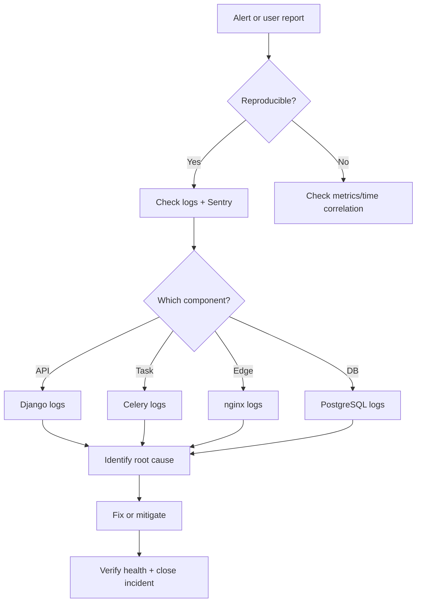

# YALA — Monitoring Runbook

**Document ID:** YALA-ENG-MON-006  
**Version:** 1.0.0  
**Effective:** 2026-07-21  
**Related:** `release/PRODUCTION_MONITORING_RC1.md` · `operations/08_SYSTEM_MAINTENANCE_MANUAL.md`

---

## 1. Monitoring surfaces

| Surface | URL | Purpose |
|---------|-----|---------|
| Production Status | https://www.yalataxi.live/admin/status | Component health dashboard |
| Launch Hub | https://www.yalataxi.live/admin/launch | Incidents, alerts, KPIs |
| Operations Command | https://www.yalataxi.live/admin/operations-command | Live ops metrics |
| Executive Dashboard | https://www.yalataxi.live/admin/executive | Platform overview |
| Health API | https://api.yalataxi.live/health/ | Public readiness |
| Ready probe | https://api.yalataxi.live/api/health/ready/ | Load balancer / cron |
| Staff status | https://api.yalataxi.live/api/health/status/ | Detailed (admin JWT) |
| Sentry | Configured via `SENTRY_DSN` | Error tracking (production) |

---

## 2. Health checks

### Endpoints

| Endpoint | Auth | Checks |
|----------|------|--------|
| `/health/` | AllowAny | Database + Redis |
| `/api/health/live/` | AllowAny | Process alive |
| `/api/health/ready/` | AllowAny | DB + Redis ready |
| `/api/health/status/` | Admin | Full production status |

### Expected response (`/api/health/ready/`)

```json
{
  "status": "ok",
  "database": "ok",
  "redis": "ok"
}
```

### Automated health cron

| Schedule | Command |
|----------|---------|
| Every 15 min | `curl -f https://api.yalataxi.live/health/` |
| Daily 08:00 UTC | `scripts/backup-monitor.sh` |
| Daily | `scripts/launch-certification-prod.py` |

### Daily server checklist

See `operations/08_SYSTEM_MAINTENANCE_MANUAL.md` §2 — 14 checks at 06:00 and 18:00 UTC.

---

## 3. Logging

### Log sources

| Service | Command |
|---------|---------|
| Django | `docker compose -p yala logs django --tail 200` |
| Celery | `docker compose -p yala logs celery-worker --tail 200` |
| nginx | `docker compose -p yala logs nginx --tail 100` |
| PostgreSQL | `docker compose -p yala logs postgres --tail 50` |
| Redis | `docker compose -p yala logs redis --tail 50` |

### Log levels

| Level | Action |
|-------|--------|
| ERROR / CRITICAL | Investigate immediately if novel |
| WARNING | Review in daily log sweep |
| INFO | Normal operations |

### What to grep for

```bash
docker compose -p yala logs django --tail 500 | grep -iE "error|exception|traceback|500"
docker compose -p yala logs celery-worker --tail 200 | grep -iE "failed|retry|error"
docker compose -p yala logs nginx --tail 200 | grep -E " 5[0-9]{2} "
```

### Sentry

- Enabled in production when `SENTRY_DSN` is set
- Captures unhandled exceptions and performance traces
- Review new issues daily during beta

---

## 4. Metrics

### Alert thresholds

| Metric | Warning | Critical |
|--------|---------|----------|
| `/health/` uptime | < 99.5% / 15m | < 99% / 15m |
| HTTP 5xx rate | > 0.5% / 5m | > 2% / 5m |
| API p95 latency | > 3000 ms | > 8000 ms |
| CPU | > 75% / 10m | > 90% / 5m |
| Memory | > 80% | > 92% |
| Disk | > 80% | > 90% |
| PG connections | > 180 / 250 | > 230 |
| Celery workers | < 2 | 0 |
| Backup age | > 26 h | > 48 h |

### Business metrics (beta)

Source: `release/BETA_SUCCESS_METRICS.md`

| Metric | Green | Red |
|--------|-------|-----|
| Ride completion rate | > 95% | < 90% |
| Driver acceptance rate | ≥ 70% | < 60% for 2 days |
| Delivery completion rate | > 95% | < 90% |
| Payment success rate | > 92% | < 85% |
| SOS ack time | < 2 min | > 5 min |

### Infrastructure metrics collection

| Metric | How to check |
|--------|--------------|
| Container status | `docker compose -p yala ps` |
| Disk | `df -h` on host |
| PG connections | Admin status page or `SELECT count(*) FROM pg_stat_activity` |
| Redis memory | `redis-cli INFO memory` |
| Celery workers | `celery -A taxi inspect ping` (inside worker container) |

---

## 5. Alerting

### Severity definitions

| Severity | Examples | Response time |
|----------|----------|---------------|
| **S1 / P0** | API down > 2 min, DB unreachable, 0 Celery workers, SOS down, backup fail 2 nights | 5–15 min |
| **S2 / P1** | p95 > 8s, disk > 85%, Celery queue > 100, payment failures spike | 1 hour |
| **S3 / P2** | Single 429 burst, analytics delay, minor UX | Next business day |

### Notification channels

| Channel | Audience |
|---------|----------|
| WhatsApp war room | Engineering on-call, CEO (P0) |
| WhatsApp ops group | Operations, Support |
| Launch Hub incidents | All staff |
| Sentry | Engineering |

### S1 response procedure

```
Alert received
         │
         ▼
Acknowledge within 15 min
         │
         ▼
Create OpsIncident in Launch Hub (critical)
         │
         ▼
Check /admin/status + health endpoints
         │
         ▼
SSH → docker compose ps → logs
         │
         ▼
Mitigate (restart, maintenance mode)
         │
         ▼
Escalate to CEO if unresolved > 30 min
         │
         ▼
Resolve + post-mortem within 72 h
```

---

## 6. Error investigation

### Investigation workflow



### Common error patterns

| Symptom | Likely cause | First action |
|---------|--------------|--------------|
| 502 Bad Gateway | Django container down | `docker compose restart django` |
| 503 on /health/ | DB or Redis unreachable | Check postgres/redis containers |
| 500 on payments | Provider webhook failure | Check payments logs + Finance Ops |
| WebSocket disconnect | JWT expired or nginx timeout | Verify token lifetime, nginx `/ws/` config |
| Celery tasks stuck | Worker OOM or broker down | Restart celery-worker, check Redis |
| Slow API p95 | DB connection exhaustion | Check PG connections, query slow logs |

### Useful diagnostic commands

```bash
ssh root@142.93.99.142
cd /opt/yala

docker compose -p yala ps
docker compose -p yala logs django --tail 200
docker compose -p yala logs celery-worker --tail 100
docker compose -p yala exec django python manage.py shell -c "from django.db import connection; connection.ensure_connection(); print('DB OK')"
curl -fsS https://api.yalataxi.live/api/health/ready/
```

---

## 7. Incident response

### Roles

| Role | Responsibility |
|------|----------------|
| Incident commander | Engineering Lead or on-call |
| Communications | Operations Manager |
| Finance impact | Finance Lead (payment incidents) |
| CEO | P0 decisions, external comms |

### Incident lifecycle

| Phase | Actions |
|-------|---------|
| Detect | Monitoring, support, status page |
| Triage | Assign severity, incident commander |
| Mitigate | Restart, maintenance mode, rollback |
| Resolve | Fix deployed, health green |
| Review | Post-mortem within 72 h |

### Maintenance mode

Enable when mitigation requires blocking user traffic:

- Executive Dashboard → Maintenance Mode
- Or `PlatformSetting` key `maintenance_mode`

**Always** communicate to Support before enabling.

---

## 8. Performance monitoring

### Key performance indicators

| Area | Metric | Target |
|------|--------|--------|
| API | p95 response time | < 3000 ms |
| Database | Active connections | < 180 |
| Redis | Memory usage | < 80% maxmemory |
| Celery | Queue depth | Stable, not growing |
| WebSocket | Connection count | Stable during peak |
| Frontend | Admin dashboard load | < 5 s |

### Performance investigation

| Step | Tool |
|------|------|
| Identify slow endpoint | nginx access logs, Sentry performance |
| Check DB queries | Django debug toolbar (dev), `connection.queries` |
| Check cache hit rate | Redis INFO stats |
| Load test reference | RC1: 335 concurrent, 0 5xx |

### Optimization levers

| Lever | When |
|-------|------|
| Scale Daphne replicas | Connection exhaustion |
| Add DB indexes | Slow query patterns |
| Redis caching | Repeated expensive reads |
| Celery offload | Slow synchronous tasks |
| Read replica (future) | CEO/BI dashboard load on primary DB |

---

## 9. Backup monitoring

| Schedule | Script | Alert if |
|----------|--------|----------|
| 02:00 UTC | `scripts/backup-encrypted.sh` | Failure |
| 08:00 UTC | `scripts/backup-monitor.sh` | Age > 26 h |

**P0 blocker:** Offsite backups not configured — monitor local backup age until offsite certified.

---

## 10. Runbook quick reference

| Scenario | Doc section |
|----------|-------------|
| API down | §7 Incident response, §6 Error investigation |
| Payment failures | `operations/03_FINANCE_OPERATIONS_MANUAL.md` |
| SOS down | `operations/07_TRUST_AND_SAFETY_MANUAL.md` |
| Database failure | `operations/09_BUSINESS_CONTINUITY_PLAN.md` §5 |
| Rollback | `05_DEPLOYMENT_GUIDE.md` §10 |

---

## 11. Document control

| Version | Date | Changes |
|---------|------|---------|
| 1.0.0 | 2026-07-21 | Initial monitoring runbook |

**Cross-references:** `05_DEPLOYMENT_GUIDE.md` · `operations/08_SYSTEM_MAINTENANCE_MANUAL.md` · `operations/09_BUSINESS_CONTINUITY_PLAN.md`
