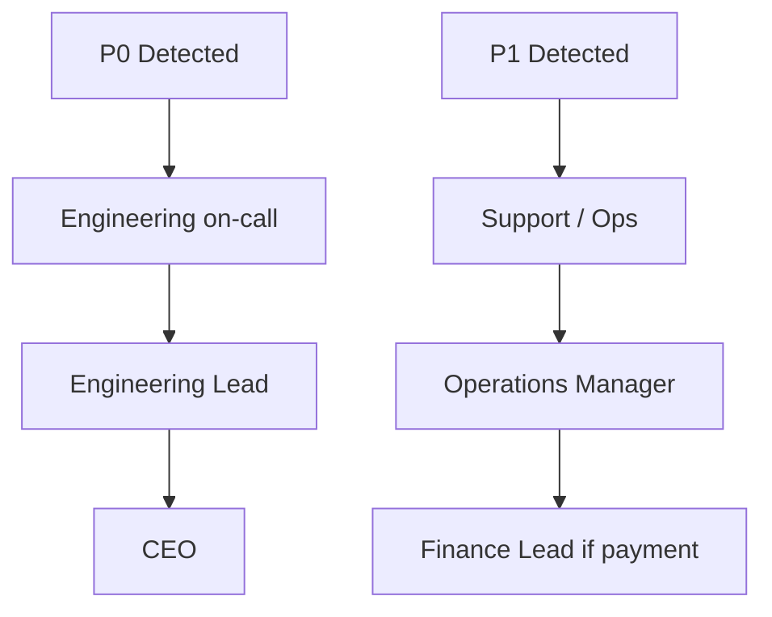

# Yala Enterprise Handover — Support Matrix

**Document ID:** HANDOVER-06  
**Version:** 1.1.0  
**Date:** 2026-07-21

---

## Team structure

| Role | Responsibilities | Primary tools / documents |
|------|------------------|---------------------------|
| **CEO** | Final GO/NO-GO, P0 escalation, investor/board reporting, strategy | CEO Master Command Center, Board Reports, Launch Decision |
| **CTO / Engineering Lead** | Architecture, backend, mobile pipeline, production health, team onboarding | `engineering/`, Docker, health endpoints |
| **DevOps / SRE** | Deployments, monitoring, backups, SSL, incident response | `engineering/06_MONITORING_RUNBOOK.md`, Docker, nginx |
| **QA Lead** | Test strategy, device QA, release certification, defect triage | Test suites, QA device lab |
| **Operations Manager** | Driver/courier onboarding, dispatch, live ops, incident triage | Operations Command Center, `operations/02_*` |
| **Support Lead** | Rider/driver support, ticket routing, escalation | Support Center, `operations/04_*` |
| **Finance Lead** | Reconciliation, payouts, withdrawals, settlements | Finance Ops, `operations/03_*` |
| **Security Lead** | Fraud, audit, permissions, incident investigation | Trust & Safety, `engineering/04_*` |
| **Product Lead** | Roadmap, store submissions, feature acceptance | App store consoles, release docs |
| **Growth / Marketing** | Campaigns, acquisition, promos, loyalty | Customer Growth Center, `operations/06_*` |

---

## Engineering

| Area | Owner | Scope | Key documents |
|------|-------|-------|---------------|
| Backend API | Engineering Lead | Django apps, REST, Celery, migrations | `engineering/02_API_CATALOG.md` |
| Database | Engineering Lead + DevOps | Models, indexes, migrations | `engineering/03_DATABASE_REFERENCE.md` |
| WebSocket / real-time | Engineering Lead | Channels/Daphne, ride tracking | `engineering/01_SYSTEM_ARCHITECTURE.md` |
| Mobile builds | Engineering Lead + Mobile | Ionic/Capacitor, Gradle, signing | `engineering/08_ENGINEERING_ONBOARDING.md` |
| Admin portal frontend | Engineering Lead | React admin dashboards | `engineering/07_CODING_STANDARDS.md` |
| Infrastructure | DevOps | Docker Compose, nginx, SSL | `engineering/05_DEPLOYMENT_GUIDE.md` |
| CI/CD | DevOps | GitHub Actions (iOS); manual prod deploy | `.github/workflows/` |
| Security implementation | Security + Engineering | JWT, rate limiting, audit | `engineering/04_SECURITY_ARCHITECTURE.md` |
| On-call (beta) | Engineering on-call | 24/7 P0 response | `engineering/06_MONITORING_RUNBOOK.md` |

---

## QA

| Area | Owner | Scope | Key documents |
|------|-------|-------|---------------|
| Automated backend tests | QA Lead | Django test suite (~93 test files) | `backend/taxi/**/tests/` |
| API certification | QA Lead | RC2-style endpoint verification | `release/RC2_*` |
| Physical device QA | QA Lead | Android devices — rider/driver/delivery | `release/SPRINT1_MOBILE_DEVICE_QA.md` |
| Beta bug triage | QA Lead | P0/P1/P2 classification | `release/UAT_KNOWN_ISSUES_REGISTER.md` |
| Release sign-off | QA Lead | Final QA before store promotion | `handover/09_GO_LIVE_READINESS.md` §3 |

---

## Operations

| Area | Owner | Scope | Key documents |
|------|-------|-------|---------------|
| Driver/courier onboarding | Operations Manager | Document review, approval | `operations/05_*`, `operations/06_*` |
| Live dispatch monitoring | Operations Manager | Operations Command Center | `operations/02_OPERATIONS_TEAM_MANUAL.md` |
| City expansion | Operations Manager | Multi-City Platform | `operations/01_CEO_OPERATIONS_MANUAL.md` §9 |
| Trust & Safety | Ops + Security | SOS, incident queue | `operations/07_TRUST_AND_SAFETY_MANUAL.md` |
| Merchant coordination | Operations Manager | Merchant Platform | `operations/06_DELIVERY_OPERATIONS_MANUAL.md` |
| Daily reporting | Operations Manager | CEO summary, EOD brief | `operations/02_*` §9 |
| Shift handover | Duty officers | Incident and supply brief | `operations/02_*` §8 |

---

## Finance

| Area | Owner | Scope | Key documents |
|------|-------|-------|---------------|
| Daily reconciliation | Finance Lead | Finance Operations Center | `operations/03_FINANCE_OPERATIONS_MANUAL.md` |
| Driver withdrawals | Finance Lead | Approve/reject/mark paid | Finance Ops → Withdrawals tab |
| Incentive payouts | Finance Lead | Incentive Engine queue | `/admin/incentives` |
| Merchant settlements | Finance Lead | Merchant Platform settlements | Phase 31 finance endpoints |
| Partner settlements | Finance Lead | Partner Platform settlements | Phase 32 finance endpoints |
| Payment provider reconciliation | Finance Lead | Stripe, mobile money | Finance Ops → Providers tab |
| Monthly close | Finance Lead | Accounting reports, CEO pack | `operations/03_*` §8 |

---

## Customer support

| Channel | Owner | SLA (beta) | Document |
|---------|-------|------------|----------|
| In-app tickets | Support Lead | First response 30 min | `operations/04_CUSTOMER_SUPPORT_MANUAL.md` |
| WhatsApp | Support Lead | First response 15 min | Same |
| SOS / safety | Support → Ops → CEO | Immediate | `operations/07_*` |
| Payment disputes | Support → Finance | Same day | `operations/03_*` §6 |
| Refunds | Support Lead → Finance | 24h response / 48h process | `operations/04_*` §6 |

---

## Executives

| Role | Responsibilities | Key documents |
|------|------------------|---------------|
| **CEO** | Launch GO/NO-GO, daily KPI review, P0 escalation, expansion decisions | `operations/01_CEO_OPERATIONS_MANUAL.md`, `release/CEO_DAILY_DASHBOARD_TEMPLATE.md` |
| **CTO** | Technical strategy, architecture, production health, engineering hiring | `engineering/01_SYSTEM_ARCHITECTURE.md`, handover package |
| **COO / Operations Manager** | Daily ops, supply, city rollout | `operations/02_*` |
| **CFO / Finance Lead** | Reconciliation, ROI, investor metrics | `operations/03_*`, Board Reports |

---

## Escalation path

| Severity | Definition | First response | Escalate to | Authority |
|----------|------------|----------------|-------------|-----------|
| **P0** | Service down, safety, data loss | 5 min | Eng Lead → CEO | CEO |
| **P1** | Feature degraded, payment failure | 15 min | Ops Mgr / Finance Lead | Eng Lead |
| **P2** | Minor UX, analytics delay | Same day | Product Lead | Product Lead |

---

## On-call rotation (closed beta)

| Layer | Coverage | Contact |
|-------|----------|---------|
| Engineering on-call | 24/7 | Page / WhatsApp |
| Operations duty | 06:00–24:00 UTC | WhatsApp ops group |
| Finance on-call | Business hours + payout windows | WhatsApp |
| CEO escalation | P0 only | WhatsApp / phone |

---

## Key documents by role

| Role | Start here |
|------|------------|
| **New CTO** | `handover/README.md` → `engineering/01_*` → `handover/10_*` |
| **Engineering** | `engineering/08_ENGINEERING_ONBOARDING.md`, `engineering/05_DEPLOYMENT_GUIDE.md` |
| **DevOps** | `engineering/06_MONITORING_RUNBOOK.md`, `operations/08_SYSTEM_MAINTENANCE_MANUAL.md` |
| **QA** | `release/UAT_*`, `handover/09_GO_LIVE_READINESS.md` §3 |
| **Operations** | `operations/02_OPERATIONS_TEAM_MANUAL.md`, `release/BETA_OPERATIONS_RUNBOOK.md` |
| **Finance** | `operations/03_FINANCE_OPERATIONS_MANUAL.md` |
| **Support** | `operations/04_CUSTOMER_SUPPORT_MANUAL.md` |
| **CEO** | `operations/01_CEO_OPERATIONS_MANUAL.md`, `release/LAUNCH_DECISION.md` |
| **Security** | `engineering/04_SECURITY_ARCHITECTURE.md`, `operations/07_*` |

---

## Cross-references

- Operations SOPs: `operations/README.md`
- Engineering handbook: `engineering/README.md`
- Risk register: `handover/05_RISK_REGISTER.md`
- Go-live readiness: `handover/09_GO_LIVE_READINESS.md`
- BCP: `operations/09_BUSINESS_CONTINUITY_PLAN.md`
