# YALA Project Portfolio

**Document ID:** PM-01  
**Version:** 1.0.0  
**Last updated:** 2026-07-21  
**Scope:** Full Yala ecosystem — Rider, Driver, Delivery, Admin, and operations platforms  
**Synchronized with:** `02_MASTER_FEATURE_MATRIX.md` · `06_PROJECT_DASHBOARD.md`

---

## Portfolio summary

| Metric | Value |
|--------|------:|
| Platforms tracked | 14 |
| Platforms complete (≥90%) | 12 |
| Platforms in progress | 2 |
| Weighted portfolio completion | **94%** |
| Current release train | v1.0.0 Closed Beta |
| Production API | https://api.yalataxi.live |
| Admin portal | https://www.yalataxi.live/admin |

---

## Platform register

| Platform | Purpose | Current version | Completion % | Owner | Dependencies | Risk | Priority | Status |
|----------|---------|:---------------:|:------------:|-------|--------------|:----:|:--------:|--------|
| **Rider** | Consumer ride-hailing: request, track, pay, rate, wallet, SOS, share rides, promos | 1.2.7 (AAB) | 95% | Product / Mobile | Driver dispatch, Payments, Maps, Push | Medium — physical QA unsigned | P0 | **Closed Beta ready** |
| **Driver** | Driver onboarding, compliance, online/offline, dispatch, earnings, wallet, cash-out, SOS | 1.2.23 (AAB) | 95% | Product / Mobile | Operations, Payments, Documents | Medium — RC3 APK rebuild pending | P0 | **Closed Beta ready** |
| **Delivery** | Courier onboarding, package/food delivery, PIN flows, proof-of-delivery, earnings | 1.0.4 (AAB) | 92% | Product / Mobile | Merchants, Payments, Dispatch | High — prod E2E not certified | P0 | **Closed Beta conditional** |
| **Merchant** | Merchant register, menu, orders, analytics, settlements, portal (Phase 31) | 1.0.0 | 90% | Product / Ops | Delivery dispatch, Payments, Legal | Low | P1 | **Complete — beta ops** |
| **Admin** | Core admin: users, drivers, riders, dispatch, cities, documents, payments | 1.0.0 | 96% | Engineering | Auth, RBAC, Audit | Low | P0 | **Complete** |
| **Operations** | Live ops center, trips, deliveries, fleet map, incidents, broadcasts (Phases 19–25) | 1.0.0 | 97% | Operations | WebSocket, Rides, Deliveries | Low | P0 | **Complete** |
| **Executive** | CEO KPIs, revenue, live map, maintenance mode, exports | 1.0.0 | 96% | CEO / Finance | Payments, Operations | Low | P1 | **Complete** |
| **Finance** | Reconciliation, withdrawals, payouts, revenue analytics, audit trail (Phase 24) | 1.0.0 | 95% | Finance | Payments, Wallet, Audit | Medium — p95 latency on finance charts | P0 | **Complete** |
| **Trust & Safety** | SOS, incident queue, monitoring, driver/rider safety profiles (Phase 29) | 1.0.0 | 94% | Operations / Security | Safety app, Launch alerts | Medium — ops training | P0 | **Complete** |
| **Fleet** | Driver documents, performance, training, rewards, CEO fleet view | 1.0.0 | 95% | Operations | Drivers, Documents | Low | P1 | **Complete** |
| **AI Operations** | Smart insights, surge, hotspots, recommendations, dispatch analytics | 1.0.0 | 93% | Operations / Engineering | Redis cache, Rides, Deliveries | Medium — prod perf re-measure | P2 | **Complete** |
| **Business Operations** | CRM, marketing, corporate, partners, compliance, BI hub (Phase 20) | 1.0.0 | 92% | Business / Ops | Features, Merchants, Referrals | Low | P1 | **Complete** |
| **Customer Loyalty** | Referrals, loyalty tiers, promos, growth analytics, finance liability (Phase 33) | 1.0.0 | 88% | Growth / Marketing | Referrals, Loyalty, Promotions, Wallet | Medium — referral flow consolidation | P1 | **In progress** |
| **Partner Platform** | Franchise partners, territories, settlements, CEO growth view (Phase 32) | 1.0.0 | 87% | CEO / Regional Ops | Locations, Payments, Multi-city | Low | P2 | **In progress** |

---

## Extended modules (post v1.0 core portfolio)

These modules are built and tracked in the feature matrix but sit adjacent to the 14 core platforms above.

| Module | Purpose | Version | Completion % | Owner | Status |
|--------|---------|:-------:|:------------:|-------|--------|
| CEO Master Command Center (Phase 34) | Unified CEO dashboard across finance, ops, growth, fleet, AI, readiness | 1.0.0 | 95% | CEO | Complete |
| Board & Investor Reporting (Phase 35) | Executive, financial, operational, growth, risk reports + export | 1.0.0 | 90% | CEO / Finance | Complete |
| Compliance & Governance (Phase 36) | Policy documents, compliance audits, governance workflows | 1.0.0 | 85% | Legal / Security | Complete |
| Business Intelligence (Phase 37) | Unified analytics layer; data warehouse design documented | 1.0.0 | 75% | Engineering / Finance | Design + partial impl |
| Multi-City Operations (Phase 27) | Per-city ops profiles, city managers, national overview | 1.0.0 | 94% | Regional Ops | Complete |
| Smart Pricing & Dispatch (Phase 28) | Surge rules, dispatch analytics, simulator, CEO view | 1.0.0 | 93% | Product / Ops | Complete |
| Driver Incentive Engine (Phase 30) | Campaigns, progress, finance-approved payouts | 1.0.0 | 94% | Operations / Finance | Complete |
| Growth & Expansion (Phase 26) | Market analytics, CEO forecast, expansion KPIs | 1.0.0 | 92% | CEO / Growth | Complete |
| Merchant Portal (web) | Self-service merchant login, orders, products, settings | 1.0.0 | 88% | Product | Complete |
| Wallet & Cash Out | Rider/driver/courier/merchant wallets, withdrawals, OTP | 1.0.0 | 96% | Finance | Complete |

---

## Dependency map (high level)

```mermaid
flowchart TB
  subgraph mobile [Mobile Apps]
    Rider
    Driver
    Delivery
  end
  subgraph core [Core Backend]
    Auth[Auth & RBAC]
    Rides[Rides API]
    Deliv[Deliveries API]
    Pay[Payments & Wallet]
  end
  subgraph ops [Operations Platforms]
    OpsCenter[Operations Center]
    Exec[Executive Dashboard]
    FinanceOps[Finance Operations]
    Trust[Trust & Safety]
    Fleet[Fleet Performance]
    AI[AI Operations]
  end
  subgraph growth [Growth & Partners]
    Loyalty[Customer Loyalty]
    Partner[Partner Platform]
    Merchant[Merchant Platform]
    BizOps[Business Operations]
  end
  Rider --> Auth
  Rider --> Rides
  Rider --> Pay
  Driver --> Rides
  Driver --> Pay
  Delivery --> Deliv
  Delivery --> Pay
  Merchant --> Deliv
  OpsCenter --> Rides
  OpsCenter --> Deliv
  Exec --> Pay
  FinanceOps --> Pay
  Trust --> Rides
  Trust --> Deliv
  Loyalty --> Pay
  Partner --> Pay
  Merchant --> Pay
```

---

## Risk summary by platform

| Risk level | Platforms affected | Primary concern |
|:----------:|-------------------|-----------------|
| **High** | Delivery | Production E2E certification incomplete |
| **Medium** | Rider, Driver, Customer Loyalty, AI Operations, Finance | Physical QA, perf, referral consolidation |
| **Low** | Admin, Operations, Executive, Fleet, Merchant, Partner, Business Ops | Deploy and ops training only |

---

## Priority definitions

| Priority | Meaning |
|:--------:|---------|
| **P0** | Required for Closed Beta / launch |
| **P1** | Required for public launch or revenue growth |
| **P2** | Important but can follow public launch |
| **P3** | Future / v2 backlog |

---

## Cross-references

| Document | Link |
|----------|------|
| Feature-level detail | [02_MASTER_FEATURE_MATRIX.md](./02_MASTER_FEATURE_MATRIX.md) |
| Release history | [03_RELEASE_HISTORY.md](./03_RELEASE_HISTORY.md) |
| Bugs & tech debt | [04_BUG_AND_TECH_DEBT.md](./04_BUG_AND_TECH_DEBT.md) |
| Future backlog | [05_VERSION_2_BACKLOG.md](./05_VERSION_2_BACKLOG.md) |
| Executive KPIs | [06_PROJECT_DASHBOARD.md](./06_PROJECT_DASHBOARD.md) |
| Launch decision | `release/LAUNCH_DECISION.md` |
| Known issues | `release/KNOWN_ISSUES_v1.0.0.md` |

---

*Maintained by Yala Engineering · Update when a platform crosses 90% completion or changes release status*
