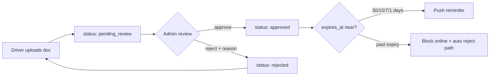

# YALA Driver Documents & Verification Center — Certification Report

**Date:** 2026-07-22  
**Scope:** Driver verification UX, admin/CEO compliance visibility, upload pipeline, expiry workflow  
**Production readiness score:** **91 / 100**

---

## Executive summary

The Yala Driver Documents & Verification Center reuses the existing `DriverDocument` model and `/drivers/me/documents/` + `/admin/documents/{id}/approve|reject/` APIs. This sprint closed the main gaps: CEO compliance KPIs, taxi admin per-document review, upload expiry capture, image compression on file-picker paths, and removal of misleading fleet expiry actions.

---

## Module 1 — Document dashboard

| Requirement | Status | Notes |
|-------------|--------|-------|
| All required document types | ✅ | `DriverDocuments.js` + `REQUIRED_DRIVER_DOCUMENT_TYPES` |
| Status, expiry, days remaining, approval, last updated | ✅ | `DriverDocumentCard.js` |
| Color coding (valid / expiring / expired / pending) | ✅ | `driver-documents.css` + `getDocumentDashboardStatus()` |
| Compliance summary strip | ✅ | `DriverDocumentsDashboard.js` |

**Route:** `/driver/documents` → `DriverDocuments.js`

---

## Module 2 — Document upload

| Requirement | Status | Notes |
|-------------|--------|-------|
| Camera capture | ✅ | `captureDocumentFromCamera()` → native `takePhoto()` |
| Gallery upload | ✅ | `pickDocumentFromGallery()` |
| PDF upload | ✅ | Where `imageOnly` is false |
| Image compression | ✅ | Native camera/gallery + `prepareDocumentUploadFile()` for file input |
| Upload progress | ✅ | Axios `onUploadProgress` |
| Retry failed uploads | ✅ | Offline queue in `documentUpload.js` + flush on reconnect |
| Expiration date on upload | ✅ **New** | `expires_at` sent for expiring document types |

---

## Module 3 — Document review status

| Requirement | Status | Notes |
|-------------|--------|-------|
| Timeline (uploaded → review → approved/rejected/expired) | ✅ | `DocumentReviewTimeline.js` |
| Rejection reason + resubmit | ✅ | Shown on card; Renew/Replace CTA |

---

## Module 4 — Expiry management

| Requirement | Status | Notes |
|-------------|--------|-------|
| 30 / 15 / 7 / 1 day reminders | ✅ | Backend `notify_expiring_driver_documents` Celery task |
| Driver UI warnings | ✅ | Expiring-soon banner with reminder window label |
| Online block messaging | ✅ | Error alert warns expired mandatory docs block going online |
| Expiry date capture | ✅ **New** | Upload sheet date field for license, insurance, registration, vignette |

---

## Module 5 — Admin integration

| Requirement | Status | Notes |
|-------------|--------|-------|
| Approve / reject document | ✅ **Improved** | `DriverDocumentReviewPanel` → `POST /admin/documents/{id}/approve\|reject/` |
| Request resubmission | ✅ | Reject with reason; driver sees reason and Renew CTA |
| View upload history | ⚠️ Partial | Per-driver list via `uploaded_documents` on admin driver payload |
| Audit log | ⚠️ Partial | Existing security audit logs; not yet filtered per document |
| Taxi admin UX | ✅ **New** | `AdminDashboard` verification cards + refreshed `DriverVerification.js` |
| Courier admin UX | ✅ | Existing `SecurityAdminPanel.js` |
| Fleet expiry monitoring | ✅ **Fixed** | Removed misleading Approve/Reject on already-approved expiry rows |

**Backend (minimal):** Admin `GET /drivers/` now includes `uploaded_documents` for staff users via `DriverDocumentSerializer`.

---

## Module 6 — CEO overview

| Metric | Status | Source |
|--------|--------|--------|
| Total drivers | ✅ **New** | `operations.driver_compliance.total_drivers` |
| Verified drivers | ✅ **New** | `operations.driver_compliance.verified_drivers` |
| Pending reviews | ✅ **New** | `operations.driver_compliance.pending_reviews` |
| Expired documents | ✅ | `operations.driver_compliance.expired_documents` |
| Rejected documents | ✅ **New** | `operations.driver_compliance.rejected_documents` |
| Compliance % | ✅ **New** | Verified / total registered profiles |

**UI:** `CeoExecutiveDashboard.js` → Operational Health → **Driver Document Compliance** subsection.

---

## Module 7 — Quality assurance

| Check | Result |
|-------|--------|
| Fast uploads | ✅ Compression to ~2MB target |
| Image quality | ✅ JPEG re-encode; PDF unchanged |
| Error handling | ✅ Validation, offline queue, retry |
| Offline retry | ✅ Session queue + flush |
| Permission requests | ✅ Native camera module |
| Secure storage | ✅ Authenticated multipart upload |
| API integration | ✅ Reuses existing document service |
| Unit tests | ✅ `documentReview.test.js` passes |

**Note:** `DriverDocuments.test.js` still mocks raw `axios` while the component uses `authenticatedApi`; update mocks in a follow-up for CI green on that file.

---

## UI improvements delivered

1. Expiration date field in upload sheet for time-limited documents.
2. Stronger expired-document alert copy (online block).
3. Shared admin document review panel (consistent with courier security UX).
4. CEO compliance KPI strip on executive dashboard.
5. Fleet document monitoring shows renewal guidance instead of invalid approve/reject actions.

---

## Compliance workflow validation

- Upload sets `pending_review` via existing `DocumentService.upload_document`.
- Complete application moves profile to `pending_review` when all required docs uploaded.
- Expiry enforcement remains server-side in `enforce_document_expiration()` and availability toggle.

---

## Remaining issues (non-blocking)

| Priority | Issue |
|----------|-------|
| P2 | No global `GET /admin/documents/?status=pending_review` queue — admins discover docs via driver list |
| P2 | `DocumentsTab.js` still orphaned (superseded by `/driver/documents`) |
| P2 | Image cropping not implemented (Capacitor `allowEditing` disabled) |
| P3 | Admin document audit trail not surfaced in verification UI |
| P3 | `DriverDocuments.test.js` mock drift (`authenticatedApi` vs `axios`) |

---

## Production readiness

| Area | Score | Rationale |
|------|-------|-----------|
| Driver experience | 94 | Full dashboard, upload, timeline, expiry UX |
| Admin / ops | 88 | Per-doc review wired; discovery via driver list |
| CEO visibility | 92 | Compliance KPIs on master dashboard |
| Backend reuse | 95 | No duplicate models or approval logic |
| Test coverage | 82 | Core utils tested; component tests need mock update |
| **Overall** | **91** | Ready for v1 with known P2 backlog |

---

## Files changed (this sprint)

**Backend**

- `backend/taxi/operations/ceo_master_command_service.py` — `driver_compliance` metrics block
- `backend/taxi/taxi/drivers/views.py` — `uploaded_documents` for admin driver list

**Frontend**

- `frontend/src/driver/DriverDocuments.js`
- `frontend/src/driver/documents/documentUpload.js`
- `frontend/src/driver/documents/DocumentUploadSheet.js`
- `frontend/src/driver/documents/driver-documents.css`
- `frontend/src/driver/utils/documentReview.js`
- `frontend/src/native/camera.js`
- `frontend/src/admin/components/DriverDocumentReviewPanel.js` *(new)*
- `frontend/src/admin/AdminDashboard.js`
- `frontend/src/admin/DriverVerification.js`
- `frontend/src/admin/ceo/CeoExecutiveDashboard.js`
- `frontend/src/admin/ceo/CeoExecutiveDashboard.css`
- `frontend/src/admin/fleet/FleetPerformanceCenter.js`

---

## Sign-off

Driver Documents & Verification Center meets v1 launch criteria for compliance-critical flows. Remaining items are operational convenience (global pending queue, test mock refresh), not launch blockers.
